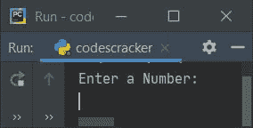
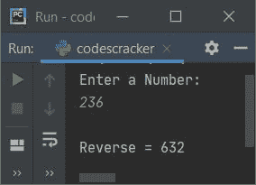
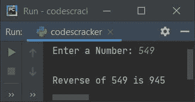

# Python 程序：反转一个数字

> 原文：<https://codescracker.com/python/program/python-program-find-reverse-of-number.htm>

创建这篇文章是为了介绍 Python 中的一些程序，这些程序查找并打印用户输入的数字的倒数。以下是使用的方法列表:

*   在循环时使用**求一个数的倒数**
*   使用**进行**循环
*   使用列表
*   使用功能
*   使用递归

## 使用 while 循环反转数字

要在 Python 中找到一个给定数字的倒数，你必须要求用户输入一个数字，然后像下面给出的程序中所示的那样进行反转和打印。问题是，**写一个 Python 程序来倒一个数**。以下是它的答案:

```
print("Enter a Number: ")
num = int(input())

rev = 0
while num!=0:
  rem = num%10
  rev = rem + (rev*10)
  num = int(num/10)

print("\nReverse =", rev)
```

下面是它的运行示例:



现在提供输入如 **236** 作为数字，按`ENTER`键查找并打印其反码，如下图所示:



使用 **236** 作为用户输入的上述程序的试运行如下:

*   当用户输入数字，比如说 **236** ，它被存储在 **num** 中。所以 **num=236**
*   的条件**而**循环) **num！=0** 或者 **236！=0** 评估为真，因此程序 流程进入循环内部，并执行该循环块中存在的所有三条语句
*   所以 **num%10** 或 **236%10** 或 **6** 被初始化为 **rem**
*   然后 **rem + (rev*10)** 或 **6 + (0*10)** (rev=0 初始)或 **6** 被初始化为 **rev**
*   最后 **int(num/10)** 或 **int(236/10)** 或 **int(23.6)** 或 **23** 被初始化为 **num**。现在，循环中的**的条件再次用 **num** 的新值进行评估**
*   也就是条件 **num！=0** 或 **23！=0** 再次评估为真，因此程序流再次 进入循环内部
*   这个过程一直持续到条件评估为假
*   这样，退出循环后，变量 **rev** 保持给定数的倒数
*   因此，在退出循环后，将 **rev** 的值打印在输出上，作为数字的反码

#### 先前程序的修改版本

我在这个程序中包含了 **try-except** 块，用来处理无效输入。这里使用的**结尾**用于 跳过自动换行符的插入。而 **str()** 方法转换成一个字符串类型的值。

```
print("Enter a Number: ", end="")
try:
  num = int(input())
  rev = 0
  temp = num
  while num!=0:
    rev = (num%10) + (rev*10)
    num = int(num/10)
  print("\nReverse of " +str(temp)+ " is " +str(rev))
except ValueError:
  print("\nInvalid Input!")
```

下面是用户输入 **549** 的运行示例:



## 使用 for 循环反转数字

这个程序使用**代替**循环来做同样的工作，也就是反转一个数。让我们先来看看这个程序:

```
print("Enter a Number: ", end="")
num = int(input())

rev = 0
numlen = len(str(num))
temp = num

for i in range(numlen):
  rev = (num%10) + (rev*10)
  num = int(num/10)

print("\nReverse of " +str(temp)+ " is " +str(rev))
```

产生与前一个程序相同的输出。下面的代码(来自上面的程序):

```
for i in range(numlen):
```

用于执行以下语句(出现在循环的**块内):**

```
rev = (num%10) + (rev*10)
num = int(num/10)
```

**numlen** 次数。例如，如果给定的数字是 **549** ，那么使用下面的语句:

```
numlen = len(str(num))
```

**str(549)** 或**“549”**的长度被初始化为 **numlen** ，即 **3** 。所以 **numlen=3** 。 因此在**内出现的两个语句对于**循环的块，执行 **3** 次。

**注-**循环的**内的语句被执行 **x** 次。 **x** 的值表示给定数字的总位数。**

## 使用列表反转数字

现在这个程序使用 list 来反转一个给定的数字。 **append()** 用于在列表末尾添加或追加新元素(此处为数字)。

```
print("Enter a Number: ", end="")
num = int(input())

temp = num
nums = []
while num!=0:
  rem = num%10
  nums.append(rem)
  num = int(num/10)

print(end="\nReverse of " +str(temp)+ " is ")
for i in range(len(nums)):
  print(nums[i], end="")
print()
```

## 使用函数反转数字

这个程序使用了一个名为 **rev()** 的用户定义函数，该函数返回作为其参数传递的数字的倒数。

```
def rev(n):
  r = 0
  while n!=0:
    r = (n%10) + (r*10)
    n = int(n/10)
  return r

print("Enter a Number: ", end="")
num = int(input())

print("\nReverse of " +str(num)+ " is " +str(rev(num)))
```

## 使用递归反转一个数

这是本文的最后一个程序，使用递归函数创建。也就是说，这里实现了一个名为 **rev()** 的递归函数来返回一个数的倒数。传递给该函数的第二个参数是 ，该参数对应于 **rev** (如前面程序中所定义的)，其初始值为 **0**

```
def rev(n, r):
  if n==0:
    return r
  else:
    return rev(int(n/10), (n%10)+(r*10))

print("Enter a Number: ", end="")
num = int(input())

print("\nReverse of " +str(num)+ " is " +str(rev(num, 0)))
```

#### 其他语言的相同程序

*   [Java 寻找数字的倒数](/java/program/java-program-reverse-numbers.htm)
*   [C 求数的倒数](/c/program/c-program-reverse-numbers.htm)
*   [C++ 寻找数字的倒数](/cpp/program/cpp-program-reverse-numbers.htm)

[Python 在线测试](/exam/showtest.php?subid=10)

* * *

* * *