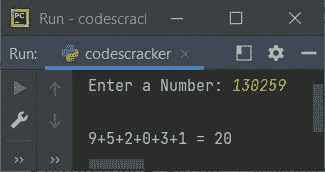

# Python 程序：添加数字的位数

> 原文：<https://codescracker.com/python/program/python-program-add-digits-of-number.htm>

在本文中，您将学习并获得 Python 代码，以查找并打印用户在运行时输入的数字的总和。以下是完成该任务的方法列表:

*   使用**增加数字的位数，同时循环**
*   使用**进行循环**
*   使用**功能**
*   使用**类**

例如，如果用户输入一个数字，比如说 **235** ，那么输出将是 **2+3+5** ，即 **10** 。

## 使用 while 循环添加数字的位数

下面给出的程序从用户处接收一个数字作为输入，并使用一个 **while 循环**来计算给定数字的位数总和:

```
print("Enter a Number")
num = int(input())
sum = 0
while num>0:
    rem = num%10
    sum = sum+rem
    num = int(num/10)
print("\nSum of Digits of Given Number: ", sum)

```

下面是这个 Python 程序产生的初始输出:


现在提供输入，比如说 **123** ，按`ENTER`键查找并打印其数字 1、2 和 3 的总和，如下图所示:


具有用户输入 **123** 的上述程序的试运行如下:

*   由于用户输入 **123** ，那么它被存储在**号**中。因此 **num=123** (用户输入) 和 **sum=0** (初始值初始化为 0)
*   现在，while 循环的条件得到评估。也就是说，条件 **num > 0** 或 **123 > 0** 评估为真，因此程序流程转到其主体并评估所有三个语句
*   所以 **num%10** 或 **123%10** 或 **3** 被初始化为 **rem** 。现在 **rem=3**
*   并且 **sum+rem** 或 **0+3** 或 **3** 被初始化为 **sum** 。现在**总和=3**
*   最后 **int(num/10)** 或 **int(123/10)** 或 **int(12.3)** 或 **12** 被初始化为 **num** 的 新值。现在 **num=12**
*   现在，while 循环的条件再次得到评估。因为这一次条件**num>0**T7】或 **12 > 0** 也评估为真，因此再次执行所有三个语句。该过程继续 直到条件评估为假
*   这样，在退出循环后，我们将拥有一个名为 **sum** 的变量，它保存给定数字的 **6** 和 位的总和
*   因此，只需打印**和**的值作为输出

#### 先前程序的修改版本

这是前一个程序的修改版本。在这个程序中，如果用户输入一个数字，比如说 **124** ，那么 的输出看起来就像 **1+2+4=7**

```
print(end="Enter a Number: ")
num = int(input())

sum = 0
print(end="\n")
while num>0:
    rem = num%10
    sum = sum+rem
    num = int(num/10)
    if num==0:
        print(end=str(rem))
    else:
        print(end=str(rem)+ "+")

print(" = " +str(sum))
```

下面是用户输入的运行示例， **130259** :



**注意-****结束**用于跳过使用 **print()** 添加自动换行符。

## 使用 for 循环添加数字的位数

现在这个程序用**代替**来循环**，而**完成同样的任务，即找到并打印给定数字的位数之和。

```
print("Enter a Number: ", end="")
num = int(input())

sum = 0
temp = num

for i in range(len(str(temp)), 0, -1):
    rem = num%10
    sum = sum+rem
    num = int(num/10)

print("\nSum of Digits of " +str(temp)+ " = " +str(sum))
```

下面是用户输入的示例运行， **4052** :


**注**——循环 (-1)的**的第三个参数用于与循环变量(I)反向循环。 即给定数目的大小为 1(比 0 大 1(第二个参数))**

由于**“4052”**(一个字符串)的长度是 **4** ，所以这三条语句都执行了三次。

**注意-****str()**用于将 **int** 值转换为字符串类型值

**注-****len()**用于查找字符串的长度。

## 使用函数将数字相加

这个程序使用一个名为 **addNumDig()** 的用户自定义函数来计算一个给定数字的位数总和。 该函数接收一个数字作为参数，并返回该数字的和。

```
def addNumDig(n):
    sum = 0
    while n>0:
        rem = n%10
        sum = sum+rem
        n = int(n/10)
    return sum

print("Enter a Number: ", end="")
num = int(input())

res = addNumDig(num)
print("\nSum of Digits of " +str(num)+ " = " +str(res))
```

这个程序产生与前一个程序相同的输出。

## 使用类添加数字的位数

这是本文的最后一个程序。这个程序是使用类和对象创建的，这是 Python 的一个面向对象的特性。

```
class CodesCracker:
    def addNumDig(self, n):
        sum = 0
        while n>0:
            rem = n%10
            sum = sum+rem
            n = int(n/10)
        return sum

print("Enter a Number: ", end="")
num = int(input())

ccObj = CodesCracker()
res = ccObj.addNumDig(num)

print("\nSum of Digits of " +str(num)+ " = " +str(res))
```

下面是用户输入的示例运行， **1046** :


使用以下语句:

```
ccObj = CodesCracker()
```

名为 **CodesCracker** 的类的所有属性被分配给一个名为 **ccObj** 的对象。现在这个对象可以用 来访问类 **CodesCracker** 的成员函数。)运算符。

#### 其他语言的相同程序

*   [Java 添加数字的位数](/java/program/java-program-add-digits-of-number.htm)
*   [C 添加数字的位数](/c/program/c-program-add-number-digits.htm)
*   [C++ 添加数字的位数](/cpp/program/cpp-program-add-number-digits.htm)

[Python 在线测试](/exam/showtest.php?subid=10)

* * *

* * *