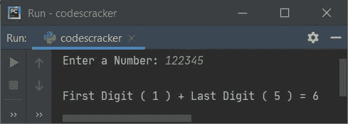

# Python 程序：求出第一个和最后一个数字的总和

> 原文：<https://codescracker.com/python/program/python-sum-of-first-last-digit.htm>

创建这篇文章是为了介绍 Python 中的一些程序，这些程序查找并打印用户在运行时输入的数字的第一位和最后一位的和。例如，如果用户输入一个数字，比如说 **2493** ，那么输出 将是**第一个数字(2) +最后一个数字(3)** 或 **5** 。

## 一个数的第一位和最后一位之和

问题是，*写一个 Python 程序，打印一个给定数字的第一位和最后一位的和。* 下面给出的程序是对这个问题的回答:

```
print("Enter a Number: ")
num = int(input())

count = 0
while num!=0:
    if count==0:
        last = num%10
        count = count+1
    rem = num%10
    num = int(num/10)

sum = rem + last
print("\nSum of first and last digit =", sum)
```

下面给出的快照显示了上述 Python 程序产生的初始输出:


现在提供输入，比如说 **1203** 作为数字，按`ENTER`键查找并打印给定数字的第一(1)和最后(3)个数字的和，如下图所示:


### 如果用户输入了无效的输入怎么办？

来处理当用户输入一个无效输入时的事情。也就是说，当用户没有输入整数时，下面给出的程序会产生一个错误消息。

```
print("Enter a Number: ", end="")
try:
    num = int(input())

    count = 0
    while num != 0:
        if count == 0:
            last = num % 10
            count = count + 1
        rem = num % 10
        num = int(num / 10)

    print("\nFirst Digit (", rem, ") + Last Digit (", last, ") =", rem + last)

except ValueError:
    print("\nInvalid Input!")
```

下面是用户输入的运行示例， **122345** :



下面是另一个使用用户输入 **codescracker** 运行的示例:


[Python 在线测试](/exam/showtest.php?subid=10)

* * *

* * *