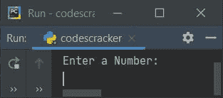
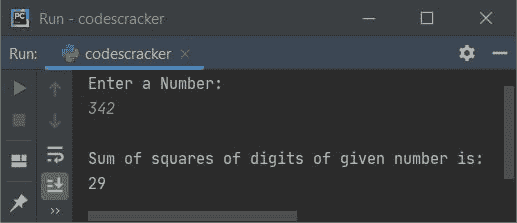
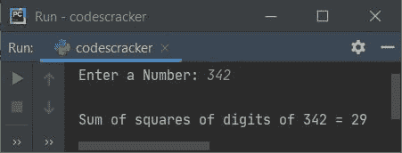
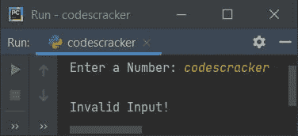

# Python 程序：计算一个数字的平方和

> 原文：<https://codescracker.com/python/program/python-sum-of-squares-of-digits-of-number.htm>

本文介绍了一个用 Python 编写的程序，该程序查找并打印用户输入的数字的平方和。例如，如果用户输入的数字是 342，则计算如下:

```
342
= 32 + 42 + 22
= 9 + 16 + 4
= 29
```

也就是说， **29** 是下面给出的程序在提供完全相同的输入后产生的输出。

## 求一个数字的平方和

问题是，*写一个 Python 程序，打印给定数字的位数平方和。下面给出的程序 是这个问题的答案:*

```
print("Enter a Number: ")
num = int(input())

sum = 0
while num!=0:
    rem = num%10
    sqr = rem*rem
    sum = sum+sqr
    num = int(num/10)

print("\nSum of squares of digits of given number is: ")
print(sum)
```

下面给出的快照显示了这个 Python 程序产生的初始输出:



现在输入任意一个数字，比如说 **342** ，按`ENTER`键查找并打印这个数字的 平方的总和，如下图所示:



#### 先前程序的修改版本

创建这个程序是为了在用户输入无效输入时产生手动错误信息。 **try-except** 程序块用于完成如下程序及其运行示例所示的工作:

```
print("Enter a Number: ", end="")
try:
    num = int(input())
    temp = num
    sum = 0
    while temp!=0:
        rem = temp%10
        sqr = rem*rem
        sum = sum+sqr
        temp = int(temp/10)
    print("\nSum of squares of digits of", num, "=", sum)

except ValueError:
    print("\nInvalid Input!")
```

以下是其示例运行，输入与之前程序的示例运行完全相同:



这是另一个使用用户输入而不是整数值运行的示例，比如说 **codescracker** :



[Python 在线测试](/exam/showtest.php?subid=10)

* * *

* * *