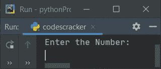
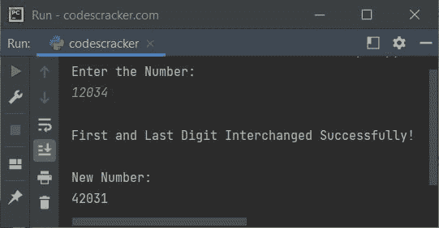
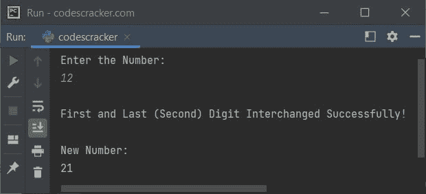
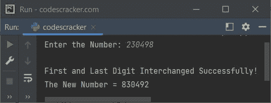
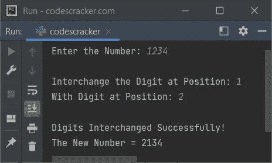

# Python 程序交换数字的位数

> 原文：<https://codescracker.com/python/program/python-interchange-digits-of-number.htm>

本文涵盖了 Python 中的一些程序，这些程序在运行时交换用户输入的数字。下面是本文涉及的 Python 程序列表:

*   交换给定数字的第一位和最后一位
*   使用列表交换给定数字的位数
*   交换给定数字的任意两个数字

## 交换数字的第一位和最后一位

问题是，*编写一个 Python 程序来交换用户*给出的数字的第一位和最后一位。以下是它的答案:

```
print("Enter the Number: ")
num = int(input())
rev = 0
noOfDigit = 0
temp = num
while temp>0:
  temp = int(temp/10)
  noOfDigit = noOfDigit+1
if noOfDigit<2:
  print("\nIt is a Single-digit Number!")
elif noOfDigit==2:
  temp = num
  while temp>0:
    rem = temp%10
    rev = (rev*10)+rem
    temp = int(temp/10)
  print("\nFirst and Last (Second) Digit Interchanged Successfully!")
  print("\nNew Number: ")
  print(rev)
else:
  temp = num
  while temp>0:
    rem = temp%10
    rev = (rev*10)+rem
    temp = int(temp/10)
  revNum = rev
  rev = 0
  temp = num
  noOfDigitTemp = noOfDigit
  while temp>0:
    remTemp = revNum%10
    if noOfDigitTemp==noOfDigit:
      rem = temp%10
      rev = (rev*10)+rem
    elif noOfDigitTemp==1:
      rem = temp%10
      rev = (rev*10)+rem
    else:
      rev = (rev*10)+remTemp
    temp = int(temp/10)
    revNum = int(revNum/10)
    noOfDigitTemp = noOfDigitTemp-1
  print("\nFirst and Last Digit Interchanged Successfully!")
  print("\nNew Number: ")
  print(rev)
```

下面是它的运行示例:



现在提供输入，比如说 **12034** 作为交换给定数字的第一(1)位和最后一(4)位的数字:



下面是另一个使用用户输入运行的示例， **12** :



## 使用列表交换第一个和最后一个数字

这个程序与上一个相似。唯一的区别是，这个程序使用 Python list 来完成这项工作。

```
print(end="Enter the Number: ")
num = int(input())
rev = 0
noOfDigit = 0
temp = num
while temp>0:
  temp = int(temp/10)
  noOfDigit = noOfDigit+1
temp = num
while temp>0:
  rem = temp%10
  rev = (rev*10)+rem
  temp = int(temp/10)
nums = []
for i in range(noOfDigit):
  rem = rev%10
  nums.insert(i, rem)
  rev = int(rev/10)
if noOfDigit==1:
  print("\nIt's a single-digit number!")
elif noOfDigit==2:
  temp = nums[0]
  nums[0] = nums[1]
  nums[1] = temp
  print("\nFirst and Last (Second) Digit Interchanged Successfully!")
  print(end="The New Number = " +str(nums[0])+str(nums[1]))
else:
  i = 0
  temp = nums[i]
  nums[i] = nums[noOfDigit-1]
  nums[noOfDigit-1] = temp
  print("\nFirst and Last Digit Interchanged Successfully!")
  print(end="The New Number = ")
  for i in range(noOfDigit):
    print(end=str(nums[i]))
```

下面是用户输入的运行示例， **230498** :



## 互换任意两个所需的数字

以上两个程序自动交换一个给定数字的第一个和最后一个数字。但是，如果用户想要交换他/她输入的数字的任意两个特定数字，该怎么办呢？

为了解决这个问题，我们有另一个程序，它可以交换给定数字的任意两个所需的数字。程序如下:

```
print(end="Enter the Number: ")
num = int(input())
rev = 0
noOfDigit = 0
temp = num
while temp>0:
  temp = int(temp/10)
  noOfDigit = noOfDigit+1
if noOfDigit==1:
  print("\nIt's a single-digit number!")
else:
  print(end="\nInterchange the Digit at Position: ")
  posFirst = int(input())
  print(end="With Digit at Position: ")
  posSecond = int(input())
  if posFirst>noOfDigit or posSecond>noOfDigit:
    print("\nInvalid Input!")
  else:
    temp = num
    while temp>0:
      rem = temp%10
      rev = (rev*10)+rem
      temp = int(temp/10)
    arr = []
    for i in range(noOfDigit):
      rem = rev%10
      arr.insert(i, rem)
      rev = int(rev/10)
    i = 0
    temp = arr[posFirst-1]
    arr[posFirst-1] = arr[posSecond-1]
    arr[posSecond-1] = temp
    print("\nDigits Interchanged Successfully!")
    print(end="The New Number = ")
    for i in range(noOfDigit):
      print(end=str(arr[i]))
```

以下是用户输入的运行示例， **1234** 作为数字， **1** 作为第一个数字的位置，与位置 **2** 的数字交换:



[Python 在线测试](/exam/showtest.php?subid=10)

* * *

* * *