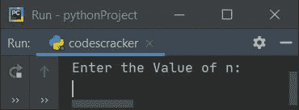
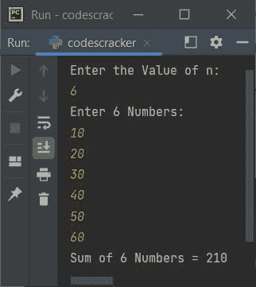
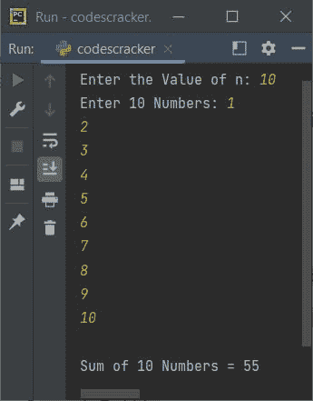
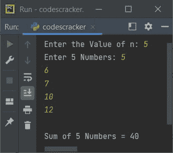
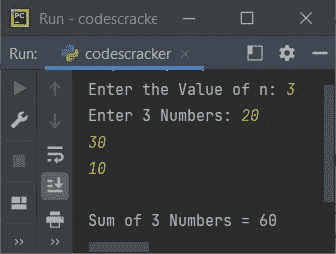

# Python 程序求 n 个数的和

> 原文：<https://codescracker.com/python/program/python-add-n-numbers.htm>

在本文中，您将学习并获得代码来查找用户使用 Python 程序输入的 **n** 个数字的总和。 以下是节目单:

*   使用循环的**求 **n** 个数的和**
*   使用 **while 循环**
*   使用**列表**
*   使用用户自定义的**功能**

例如，如果用户输入 **n** 的值作为 **3** ，然后输入三个数字作为 **1、2、3** 。那么 答案就会是 **1+2+3** 或者 **6** 。

## 使用 for 循环对 n 个数求和

这个程序使用循环的**找到 **n** 个数字的和。这里，用户必须输入 **n** 的值，然后输入 T6】n**的值，如下面给出的程序所示:

```
sum = 0
print("Enter the Value of n: ")
n = int(input())
print("Enter " + str(n) + " Numbers: ")
for i in range(n):
    num = int(input())
    sum = sum+num
print("Sum of " + str(n) + " Numbers = " + str(sum))
```

下面是它的运行示例:



现在提供输入，比如说 **6** 作为 **n** 的值，然后输入 **6** 数字，比如说 **10、20、30、40、50、60** 。 以下是这些输入的输出示例:



**注-****str()**用于将整数转换为字符串。因为 python 中的 **+** 运算符仅用于连接相同类型的值。以下代码:

```
for i in range(n):
```

用于执行以下代码块:

```
num = int(input())
sum = sum+num
```

**n** 从 0 到 **n-1** 从 **i** 的值开始的次数。例如，如果用户输入 **n** 的值 为 10，那么这段代码将被执行 10 次。使用这个模块，我们已经接收了 10 个数字，并且 一个接一个地添加该值并初始化为 **sum** 。

## 使用 while 循环对 n 个数求和

该程序执行与前一程序相同的工作，使用 **while 循环**代替的**:**

```
sum = 0
i=0
print(end="Enter the Value of n: ")
n = int(input())
print(end="Enter " + str(n) + " Numbers: ")
while i<n:
    num = int(input())
    sum = sum+num
    i = i+1
print("\nSum of " + str(n) + " Numbers = " + str(sum))
```

下面是它的运行示例，用户输入的 **10** 作为 **n** 的值， **1，2，3，4，5，6，7，8，9，10** 作为 10 个数字:



## 使用列表(数组)对 n 个数求和

该程序使用**列表**查找并打印用户在运行时输入的 **n** 个数字的相加结果(或总和)。列表就像一个数组:

```
num = []
sum = 0
print(end="Enter the Value of n: ")
n = int(input())

print(end="Enter " + str(n) + " Numbers: ")
for i in range(n):
    num.insert(i, int(input()))

for i in range(n):
    sum = sum+num[i]

print("\nSum of " + str(n) + " Numbers = " + str(sum))
```

下面是用户输入的示例运行，其中 **5** 作为 **n** 的值， **5，6，7，10，12** 作为 5 个数字:



以下代码:

```
for i in range(n):
```

用于执行以下语句:

```
num.insert(i, int(input()))
```

**n** 第 **i** 的值从 0 到 **n-1** 的次数。因此，通过使用 **insert()** ，用户输入的值 被逐一插入到列表 **num[]** 中，这样:

*   第一个值存储在**数字[i]** 或**数字[0]** 中
*   第二个值存储在 **num[1]** 中
*   第三个值存储在 **num[2]** 中
*   等等

## 使用函数对 n 个数求和

这是本文的最后一个程序。这个程序也像以前的 程序一样，使用不同的方法找到了 **n** 个数字的和。像那些一样，这个程序也以另一种方式(使用用户定义的函数)来完成同样的任务:

```
def SumOfNNums(arr, tot):
    s = 0
    for i in range(tot):
        s = s+arr[i]
    return s

num = []
print(end="Enter the Value of n: ")
n = int(input())
print(end="Enter " + str(n) + " Numbers: ")
for i in range(n):
    num.insert(i, int(input()))

sum = SumOfNNums(num, n)
print("\nSum of " + str(n) + " Numbers = " + str(sum))
```

下面是用户输入的示例运行，其中 **3** 作为 **n** 的值， **20，30，10** 作为 3 个数字:



使用以下语句:

```
sum = SumOfNNums(num, n)
```

我们调用了函数 **SumOfNNums()** 。所以在执行这个语句之后，函数被执行，函数返回的值就是结果，也就是用户输入的 **n** 个数字的总和。所以返回值 被初始化为**和**，并且它的值被打印出来。

[Python 在线测试](/exam/showtest.php?subid=10)

* * *

* * *