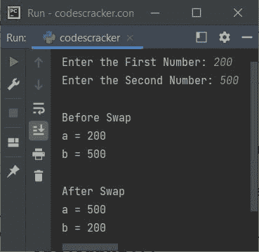

# Python 程序交换两个数

> 原文：<https://codescracker.com/python/program/python-program-swap-two-numbers.htm>

本文介绍了一个用 Python 编写的程序，它交换用户在程序运行时输入的两个数字。

## Python 使用第三个变量交换两个数

问题是，*写一个 Python 程序来交换两个数。用户必须收到这两个号码。*下面给出的 节目就是它的答案:

```
print("Enter the First Number: ", end="")
a = int(input())
print("Enter the Second Number: ", end="")
b = int(input())

print("\nBefore Swap")
print("a =", a)
print("b =", b)

x = a
a = b
b = x

print("\nAfter Swap")
print("a =", a)
print("b =", b)
```

下面给出的快照显示了上述 Python 程序的示例运行，用户输入的 **200** 作为第一个数字，而 **500** 作为第二个数字:



## Python 在不使用第三个变量的情况下交换两个数

问题是，*写一个 Python 程序，在不使用第三个变量的情况下交换两个数。*创建一个程序 对于这个问题，只替换下面的语句，来自上面的程序:

```
x = a
a = b
b = x
```

有了这三句话:

```
a = a + b
b = a - b
a = a - b
```

所有代码的其余部分与之前的程序保持相同。

## Python 使用按位运算符交换两个数

这是本文的最后一个程序，它的工作与前两个程序相同，但是使用了[位操作符](/computer-fundamental/bitwise-operators.htm)。本程序中使用的按位运算符是， **按位异或(&帽子；)**。我还没有写完整的代码，主要的三个语句，我已经写在这里了。所有代码的其余部分 也是相同的。

```
a = a &Hat; b
b = a &Hat; b
a = a &Hat; b
```

#### 其他语言的相同程序

*   [Java 交换两个数](/java/program/java-program-swap-two-numbers.htm)
*   [C 交换两个数](/c/program/c-program-swap-two-numbers.htm)
*   [C++交换两个数](/cpp/program/cpp-program-swap-two-numbers.htm)

[Python 在线测试](/exam/showtest.php?subid=10)

* * *

* * *