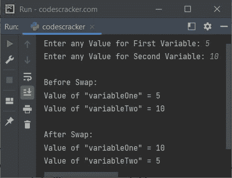

# Python 程序：交换两个变量

> 原文：<https://codescracker.com/python/program/python-program-swap-two-variables.htm>

本文将介绍一个用 Python 编写的交换两个变量的程序。交换两个变量的程序，创建时使用和不使用第三个变量。

## Python 使用第三个变量交换两个变量

问题是，*写一个 Python 程序交换两个变量。*这个问题的答案，是下面 给出的方案:

```
print("Enter any Value for First Variable: ", end="")
variableOne = input()
print("Enter any Value for Second Variable: ", end="")
variableTwo = input()

print("\nBefore Swap:")
print("Value of \"variableOne\" =", variableOne)
print("Value of \"variableTwo\" =", variableTwo)

x = variableOne
variableOne = variableTwo
variableTwo = x

print("\nAfter Swap:")
print("Value of \"variableOne\" =", variableOne)
print("Value of \"variableTwo\" =", variableTwo)
```

下面给出的快照显示了上述 Python 程序的示例运行，用户输入 **5** 和 **10** 作为第一个和第二个变量的两个值，即**变量一**和**变量二**



## Python 交换两个变量而不使用第三个变量

在 Python 中交换两个变量，但不使用第三个变量。然后替换前面程序中的下列语句:

```
x = variableOne
variableOne = variableTwo
variableTwo = x
```

下面给出了一个声明:

```
variableOne, variableTwo = variableTwo, variableOne
```

也就是说，**变量二**的值被初始化为**变量一**，而**变量一** 的值被初始化为**变量二**。

[Python 在线测试](/exam/showtest.php?subid=10)

* * *

* * *