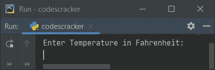
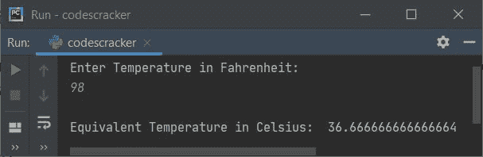
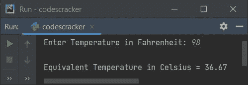

# Python 程序将华氏温度转换为摄氏温度

> 原文：<https://codescracker.com/python/program/python-program-convert-fahrenheit-to-celsius.htm>

创建本文是为了介绍 Python 中的一些程序，将温度从华氏温度(由用户输入)转换为摄氏温度。以下是程序列表:

*   华氏温度到摄氏温度没有作用
*   使用功能
*   使用类

### 华氏至摄氏公式

华氏温度到摄氏温度的公式是:

```
C = (F-32)/1.8
```

这里 **F** 表示以**华氏度**为单位的温度值，而 **C** 表示以**摄氏度**为单位的 温度值

**注-** 如果你很好奇想了解这个公式，那么就参考 [摄氏到华氏的公式解释](/nonprog/celsius-to-fahrenheit-formula.htm)。

## 华氏温度到摄氏温度没有作用

要在 Python 中将温度从华氏温度转换为摄氏温度，您必须要求用户输入华氏温度，然后将该温度转换为摄氏温度，如下面给出的程序所示。

```
print("Enter Temperature in Fahrenheit: ")
fah = float(input())

cel = (fah-32)/1.8
print("\nEquivalent Temperature in Celsius: ", cel)
```

下面是这个 Python 程序产生的初始输出:



现在提供输入，比如说 **98** 为华氏温度，按`ENTER`键转换并打印 其等效摄氏温度值，如下图所示:



**注-** 要将**摄氏度**的数值格式化到小数点后两位，请参考下面给出的程序。这是上述程序的修改版本。

#### 先前程序的修改版本

这个程序使用 **end=** 来跳过自动换行的打印。用 **format()** 方法 **{:.2f}** 打印作为 **format()** 自变量写入的变量值，最多两位小数。

```
print("Enter Temperature in Fahrenheit: ", end="")
fah = float(input())

cel = (fah-32)/1.8
print("\nEquivalent Temperature in Celsius = {:.2f}".format(cel))
```

下面是它的示例运行，用户输入与前一个程序的示例运行相同:



## 使用函数将华氏温度转换为摄氏温度

这个程序是使用名为 **FahToCel()** 的用户定义函数创建的。该函数将值 作为其参数，并返回其等价的摄氏温度值。因此 **fah** 的 值的等效摄氏度值被初始化为 **cel** 。运行时，用户将 **cel** 的值打印为给定 温度的摄氏当量(华氏):

```
def FahToCel(f):
    return (f-32)/1.8

print("Enter Temperature in Fahrenheit: ", end="")
fah = float(input())

cel = FahToCel(fah)
print("\nEquivalent Temperature in Celsius = {:.2f}".format(cel))
```

这个程序产生与前一个程序相同的输出。

## 使用类别将华氏温度转换为摄氏温度

这是最后一个程序，使用 Python 的面向对象特性**类**创建。

```
class CodesCracker:
    def FahToCel(self, f):
        return (f-32)/1.8

print("Enter Temperature in Fahrenheit: ", end="")
fah = float(input())

ob = CodesCracker()
cel = ob.FahToCel(fah)
print("\nEquivalent Temperature in Celsius = {:.2f}".format(cel))
```

一个名为 **ob** 的对象在 **CodesCracker** 类中创建，以使用**点(.)**运算符。

#### 其他语言的相同程序

*   [Java 将华氏温度转换为摄氏温度](/java/program/java-program-convert-fahrenheit-to-centigrade.htm)
*   将华氏温度转换为摄氏温度
*   [C++将华氏温度转换为摄氏温度](/cpp/program/cpp-program-convert-fahrenheit-to-centigrade.htm)

[Python 在线测试](/exam/showtest.php?subid=10)

* * *

* * *