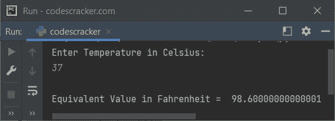
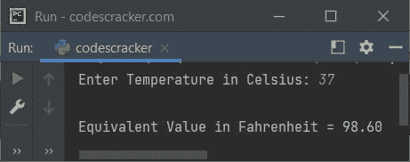

# Python 程序：将摄氏温度转换为华氏温度

> 原文：<https://codescracker.com/python/program/python-program-convert-celsius-to-fahrenheit.htm>

在这篇文章中，我们用 Python 创建了一些程序，将用户输入的摄氏温度转换成其等价的华氏温度。以下是程序列表:

*   简单的摄氏到华氏转换程序
*   使用函数将摄氏温度转换为华氏温度
*   使用类

**注意-** 在创建这些程序之前，我们先来看看用于转换的公式。

### 摄氏至华氏公式

摄氏到华氏的公式是:

```
F = (C * 1.8) + 32
```

这里的 **C** 表示用户输入的**摄氏度**的值。并且 **F** 指示华氏温度值。

## 简单的摄氏到华氏转换

要在 Python 中将温度从摄氏温度转换为华氏温度，您必须要求用户输入摄氏温度，然后将该温度转换为等价的华氏温度值，如下面给出的程序所示:

```
print("Enter Temperature in Celsius: ")
cel = float(input())

fah = (cel*1.8)+32
print("\nEquivalent Value in Fahrenheit = ", fah)

```

下面是它的运行示例:


现在输入摄氏温度值，比如说 **37** ，按`ENTER`键转换并打印 其华氏等效温度，如下图所示:



**注-** 要将华氏温度值的输出格式化到小数点后两位，请参考以下程序。

#### 先前程序的修改版本

**{:.2f}** 用于使用 **format()** 方法将任意浮点值格式化到小数点后两位。 **end=** 用于跳过使用 **print()** 自动打印换行符

```
print("Enter Temperature in Celsius: ", end="")
cel = float(input())

fah = (cel*1.8)+32
print("\nEquivalent Value in Fahrenheit = {:.2f}" .format(fah))
```

下面是它的示例运行，用户输入与前一个程序的示例运行相同:



## 使用函数将摄氏温度转换为华氏温度

该程序使用一个名为 **CelToFah()** 的用户自定义函数来完成与上一个程序相同的工作。也就是说 是，该函数以摄氏温度值作为参数，并返回其等价的华氏温度值。因此，返回值被初始化为 **fah** 变量。并且 **fah** 变量的值作为等效华氏温度值打印在输出上:

```
def CelToFah(c):
    return (c*1.8)+32

print("Enter Temperature in Celsius: ", end="")
cel = float(input())

fah = CelToFah(cel)
print("\nEquivalent Value in Fahrenheit = {:.2f}" .format(fah))
```

这个程序产生与前一个程序完全相同的输出。

## 使用类别将摄氏温度转换为华氏温度

这是使用名为 **CodesCracker** 的类创建的最后一个程序。类是 Python 面向对象的特性。

```
class CodesCracker:
    def CelToFah(self, c):
        return (c*1.8)+32

print("Enter Temperature in Celsius: ", end="")
cel = float(input())

ob = CodesCracker()
fah = ob.CelToFah(cel)
print("\nEquivalent Value in Fahrenheit = {:.2f}" .format(fah))
```

在这个程序中，创建了一个类 **CodesCracker()** 的对象 **ob** ，使用**点(.)**运算符。

#### 其他语言的相同程序

*   [Java 将摄氏温度转换为华氏温度](/java/program/java-program-convert-centigrade-to-fahrenheit.htm)
*   [C 将摄氏温度转换为华氏温度](/c/program/c-program-convert-centigrade-to-fahrenheit.htm)
*   [C++将摄氏温度转换为华氏温度](/cpp/program/cpp-program-convert-centigrade-to-fahrenheit.htm)

[Python 在线测试](/exam/showtest.php?subid=10)

* * *

* * *