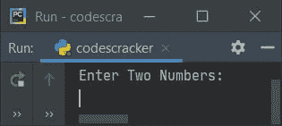
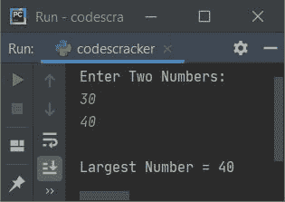
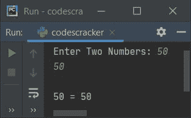
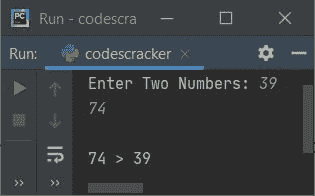
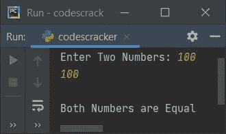

# Python 程序寻找两个数中的最大值

> 原文：<https://codescracker.com/python/program/python-program-find-largest-of-two-numbers.htm>

创建这篇文章是为了涵盖 Python 中的一些程序，这些程序查找并打印用户输入的两个数字之间的最大值。以下是完成这项工作的方法列表:

*   如果 - **否则**，使用**找到两个数中最大的一个**
*   仅使用时使用
***   使用用户定义的函数**

 **## 使用 if-else 查找两个数字中最大的一个

要在 Python 中找到两个数字中最大的一个，你必须要求用户输入任意两个数字，然后使用 **if-else** 语句，找到并打印最大的一个，如下面给出的程序所示:

问题是，**写一个 Python 程序，用 if-else 找出两个数之间的最大值。**下面是它的回答:

```
print("Enter Two Numbers: ")
numOne = int(input())
numTwo = int(input())

if numOne>numTwo:
    print("\nLargest Number =", numOne)
else:
    print("\nLargest Number =", numTwo)
```

下面是它的运行示例:



现在输入说 **30** 作为第一个数字，按`ENTER`键，然后输入 **40** 作为第二个数字 ，按`ENTER`键查找并打印两个数字中最大的一个，如下图所示:



使用与示例运行中提供的相同用户输入对上述程序进行模拟运行，如下所示:

*   初始值， **numOne=30** (由用户输入)， **numTwo=40** (也由用户输入)
*   现在条件(of**if**)**numOne>numTwo**或 **30 > 40** 评估为假，因此 程序流程进入其对应物的主体内部，即 **else** ，并将 **numTwo** 的值打印为最大值

#### 先前程序的修改版本

这是前一个程序的修改版本。这个程序处理无效和相等的输入。即当用户输入两个数字如 **c** 和 **$** 或 **4** 作为第一个和第二个数字时:

```
print("Enter Two Numbers: ", end="")
try:
    numOne = int(input())
    try:
        numTwo = int(input())
        print()
        if numOne>numTwo:
            print(numOne, ">", numTwo)
        elif numTwo>numOne:
            print(numTwo, ">", numOne)
        else:
            print(numOne, "=", numTwo)
    except ValueError:
        print("\nInvalid Input!")
except ValueError:
    print("\nInvalid Input!")
```

以下是用户输入的示例运行，第一个和第二个数字分别为 **50** 和 **50** :



这里是另一个示例运行，输入两个数字作为 **39** 和 **74** :



## 使用 if Only 查找两个数中最大的一个

这个程序是仅使用 **if** 语句创建的。这里使用 **if** ，我已经应用了所有三个条件。也就是说，第一个 数是否大于第二个，第二个数是否大于第一个，或者两个数是否相等。

```
print("Enter Two Numbers: ", end="")
numOne = int(input())
numTwo = int(input())

if numOne>numTwo:
    print("\nLargest Number =", numOne)
if numTwo>numOne:
    print("\nLargest Number =", numTwo)
if numOne==numTwo:
    print("\nBoth Numbers are Equal")
```

以下是用户输入 100 和 100**作为两个数字的运行示例:**



## 用函数求两个数中的最大值

这是本文的最后一个程序，使用名为 **FindLargOfTwo()** 的用户定义函数创建。它 接受两个参数并返回 1，如果第一个参数的值更大，返回 2，如果第二个参数的值更大。

```
def FindLargOfTwo(x, y):
    if x>y:
        return 1
    elif x<y:
        return 2

print("Enter Two Numbers: ", end="")
numOne = int(input())
numTwo = int(input())

res = FindLargOfTwo(numOne, numTwo)
if res==1:
    print("\nLargest Number =", numOne)
elif res==2:
    print("\nLargest Number =", numTwo)
else:
    print("\nBoth Numbers are Equal")
```

#### 其他语言的相同程序

*   [Java 寻找两个数中最大的一个](/java/program/java-program-find-largest-of-two-numbers.htm)
*   [C 找出两个数中最大的一个](/c/program/c-program-find-greatest-of-two-numbers.htm)
*   [C++寻找两个数中最大的一个](/cpp/program/cpp-program-find-greatest-of-two-numbers.htm)

[Python 在线测试](/exam/showtest.php?subid=10)

* * *

* * ***