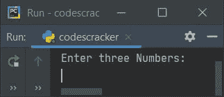
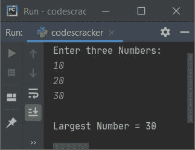
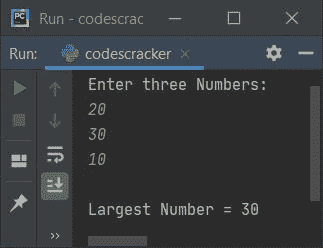
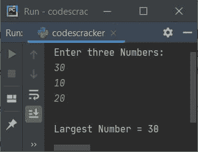
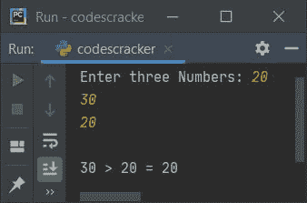
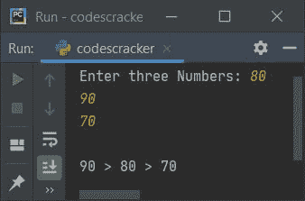
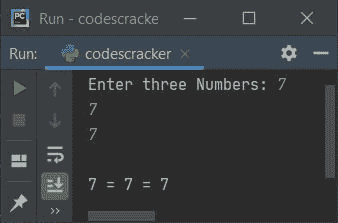

# Python 程序：寻找三个数中最大的一个

> 原文：<https://codescracker.com/python/program/python-program-find-largest-of-three-numbers.htm>

创建本文是为了介绍 Python 中的一些程序，这些程序在运行时查找并打印用户输入的三个数字中最大的一个。以下是使用的方法列表:

*   如果 - **否则**，使用嵌套的**找到三个数中最大的**
*   使用用户定义的函数
*   仅使用时使用**。这个程序是最短的，非常容易理解**

## 使用嵌套 if-else 查找 3 个数中的最大值

这个程序使用 **if-else** 语句来查找并打印用户给定的三个数字中最大的一个。 的问题是，**写一个 Python 程序，用 if-else 找出三个数中最大的。**下面是它的回答:

```
print("Enter three Numbers: ")
numOne = int(input())
numTwo = int(input())
numThr = int(input())

if numOne>numTwo:
    if numTwo>numThr:
        large = numOne
    else:
        if numThr>numOne:
            large = numThr
        else:
            large = numOne
else:
    if numTwo>numThr:
        large = numTwo
    else:
        large = numThr

print("\nLargest Number =", large)
```

下面是它的运行示例:



现在输入说 **10** 作为第一个数字，按`ENTER`键，然后输入 **20** 作为第二个 数字，按`ENTER`键，最后输入 **30** 作为第三个数字，现在按`ENTER`键找到 并打印出这三个数字中最大的一个，如下图所示:



这是另一个运行示例，用户输入 20、30、10 作为第一、第二和第三个数字。在这种情况下，第二个数字是最大的:



这是最后一次样本运行，有三个数字输入，比如 **30，10，20** :



上面的程序在用户输入的情况下，以 **10，20，30** 作为三个数字，试运行如下:

*   初始值 **numOne=10** 、 **numTwo=20** 、 **numThr=30** (这三个数字都是由 用户输入的
*   现在条件(第一个**if**)**numOne>numTwo**或 **10 > 20** 评估为假， 因此程序流不进入它的主体，而是进入它的对应物，也就是它的 **else** 的 主体(最外面的 **else**
*   在 **else** 内部，【T2 if)**numTwo>numThr**或 **20 > 30** 的条件评估为 假，因此程序流程转到其对应的 **else** 体，并且 **numThr** (30)的值 被初始化为**大**
*   因此，只需将**大**变量的值打印为给定三个变量中的最大值

关于之前的节目，我有两个问题:

*   如果用户输入了无效的输入怎么办？
*   如果用户输入任意两个相等的数字会怎样？

为了解决与这两个问题相关的问题，我为你创建了另一个程序。让我们看看下面给出的程序。

#### 先前程序的修改版本

这是前一个程序的修改版本。该程序使用 **try-except** 来处理无效的 输入。这个程序中使用的**结束**，跳过插入一个自动换行符。这个程序包含一些 嵌套 **if** ，嵌套 **elif** 和嵌套 **else** 语句来完成这项工作。

```
print("Enter three Numbers: ", end="")
try:
  numOne = int(input())
  try:
    numTwo = int(input())
    try:
      numThr = int(input())
      print()
      if numOne>numTwo:
        if numTwo>numThr:
          print(numOne, ">", numTwo, ">", numThr)
        elif numThr>numTwo:
          if numThr>numOne:
            print(numThr, ">", numOne, ">", numTwo)
          elif numOne>numThr:
            print(numOne, ">", numThr, ">", numTwo)
          else:
            print(numOne, "=", numThr, ">", numTwo)
        else:
          print(numOne, ">", numTwo, "=", numThr)
      elif numTwo>numOne:
        if numTwo>numThr:
          if numOne>numThr:
            print(numTwo, ">", numOne, ">", numThr)
          elif numThr>numOne:
            print(numTwo, ">", numThr, ">", numOne)
          else:
            print(numTwo, ">", numOne, "=", numThr)
        elif numThr>numTwo:
          print(numThr, ">", numTwo, ">", numOne)
        else:
          print(numTwo, "=", numThr, ">", numOne)
      else:
        if numOne>numThr:
          print(numOne, "=", numTwo, ">", numThr)
        elif numThr>numOne:
          print(numThr, ">", numOne, "=", numTwo)
        else:
          print(numOne, "=", numTwo, "=", numThr)
    except ValueError:
      print("\nInvalid Input!")
  except ValueError:
    print("\nInvalid Input!")
except ValueError:
  print("\nInvalid Input!")
```

下面是用户输入的示例运行， **20，30，20** 作为三个数字，其中第一个和第三个数字 相等，而第二个数字最大:



这是另一个使用用户输入运行的示例， **80，90，70** :



这是最后一次样本运行，输入三个数字作为 **7，7，7** :



## 用函数找出三个数中最大的一个

这个程序是使用名为 **FindLargeOfThr()** 的用户定义函数创建的。这个函数接收三个 参数并返回最大的一个。

```
def FindLargeOfThr(a, b, c):
    if a > b:
        if b > c:
            return a
        else:
            if c > a:
                return c
            else:
                return a
    else:
        if b > c:
            return b
        else:
            return c

print("Enter three Numbers: ", end="")
numOne = int(input())
numTwo = int(input())
numThr = int(input())

large = FindLargeOfThr(numOne, numTwo, numThr)
print("\nLargest Number =", large)
```

## 使用 if Only 查找三个数中最大的一个

这个程序是寻找三个数中最大的最短的程序。这个程序只使用 **if** 语句 来完成这项工作。我在 **if** 语句的两个条件之间应用了**和**，这样当两个条件都为真时，程序流 只进入 **if** 的主体:

```
print("Enter three Numbers: ")
nOne = int(input())
nTwo = int(input())
nThr = int(input())

if nOne>nTwo and nOne>nThr:
    print("\nLargest =", nOne)
if nTwo>nOne and nTwo>nThr:
    print("\nLargest =", nTwo)
if nThr>nOne and nThr>nTwo:
    print("\nLargest =", nThr)
```

#### 其他语言的相同程序

*   [Java 寻找三个数字中最大的一个](/java/program/java-program-find-largest-of-three-numbers.htm)
*   [C 找出三个数中最大的一个](/c/program/c-program-find-greatest-of-three-numbers.htm)
*   [C++ 寻找三个数中最大的一个](/cpp/program/cpp-program-find-greatest-of-three-numbers.htm)

[Python 在线测试](/exam/showtest.php?subid=10)

* * *

* * *