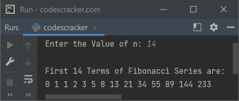

# Python 程序打印斐波那契数列

> 原文：<https://codescracker.com/python/program/python-program-print-fibonacci-series.htm>

创建这篇文章是为了涵盖 Python 中的多个程序，打印斐波那契数列。本文涵盖的程序列表包括:

*   用 Python 编写的斐波那契数列程序，最多有 **n** 项
*   Python 中的斐波那契数列程序使用**进行**循环
*   Python 中使用 **while** 循环的斐波那契数列程序
*   Python 中的斐波那契数列程序使用**列表**

斐波纳契数列是这样形成的，前两项是 0 和 1，其余的项是这样形成的，下一项是前两项的和。比如斐波那契数列的前 8 项是:0，1，1，2，3，5，8，13。

## 用 Python 打印最多 N 项的斐波那契数列

问题是，*写一个 Python 程序来打印斐波那契数列直到给定的项数。*下面给出的节目 就是它的回答:

```
a = 0
b = 1
c = 0
print("Enter the Value of n: ", end="")
n = int(input())
print("\nFibonacci Series:", a, b, end=" ")
c = a+b
n = n-2
while n>0:
    print(c, end=" ")
    a = b
    b = c
    c = a+b
    n = n-1
```

下面给出的快照显示了上述程序的示例运行，用户输入 **10** 作为 **n** 的值，以 打印 Fibonacci 数列的前 10 项:


但问题是，如果用户输入 **0** 或 **1** 作为 **n** 的值，不打印或者只打印 1 项 斐波那契数列呢？
由于斐波那契数列的前两项，已经是手工打印的，因此程序还不完善。它需要被修改。因此，在修改了上面的程序之后，我创建了另一个程序。

## 使用 for 循环在 Python 中打印斐波那契数列

这个程序基本上是前一个程序的修改版本。但是这个项目并不完美。本文最后给出了完整而完善的斐波那契数列的打印程序。

```
b = 1
c = 0
print("Enter the Value of n: ", end="")
n = int(input())

print("\nFirst", n, "Terms of Fibonacci Series are:")
for i in range(1, n+1):
    if i == 1:
        c = 0
    elif i == 2 or i == 3:
        c = 1
    else:
        a = b
        b = c
        c = a+b
    if i == n:
        print(c)
    else:
        print(c, end=" ")
```

带有用户输入 **14** 的上述程序的示例运行显示在下面给出的快照中:



## 使用 while 循环在 Python 中打印斐波那契数列

这是与之前相同的程序，但是使用 **while** 循环创建，而不是使用 **for** :

```
print("Enter the Value of n: ", end="")
n = int(input())

print("\nFirst", n, "Terms of Fibonacci Series are:")
b = 1
c = 0
i = 1
while i <= n:
    if i == 1:
        c = 0
    elif i == 2 or i == 3:
        c = 1
    else:
        a = b
        b = c
        c = a+b
    if i == n:
        print(c)
    else:
        print(c, end=" ")
    i = i+1
```

## 使用列表在 Python 中打印斐波那契数列

这是本文的最后一个程序，使用 **list** 创建，用 Python 打印斐波那契数列。这个程序使用 列表来存储斐波那契数列的所有项，打印列表中的所有元素，更进一步，也就是 当然是斐波那契数列。

```
print("Enter the Value of n: ", end="")
n = int(input())

fib = list()
b = 1
c = 0
i = 1
while i <= n:
    if i == 1:
        c = 0
    elif i == 2 or i == 3:
        c = 1
    else:
        a = b
        b = c
        c = a+b
    fib.append(c)
    i = i+1

if len(fib) == 0:
    print("\nOk!")
else:
    print("\nFirst", n, "Terms of Fibonacci Series are:")
    for i in fib:
        print(i, end=" ")
```

#### 其他语言的相同程序

*   [Java 打印斐波那契数列](/java/program/java-program-print-fibonacci-series.htm)
*   [C 打印斐波那契数列](/c/program/c-program-print-fabonacci-series.htm)
*   [C++打印斐波那契数列](/cpp/program/cpp-program-print-fabonacci-series.htm)

[Python 在线测试](/exam/showtest.php?subid=10)

* * *

* * *