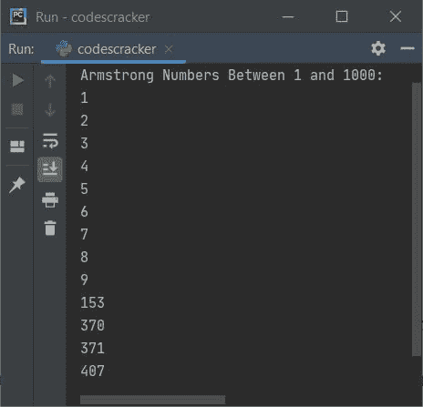
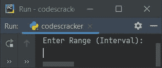
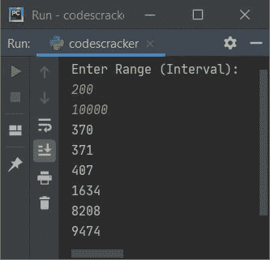
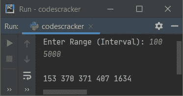

# Python 程序：生成阿姆斯特朗数

> 原文：<https://codescracker.com/python/program/python-program-generate-armstrong-numbers.htm>

创建这篇文章是为了介绍 Python 中的一些生成阿姆斯特朗数的程序。以下是程序列表:

*   生成并打印从 1 到 1000 的阿姆斯特朗数
*   生成并打印给定范围或区间内的阿姆斯特朗数

在创建这些程序之前，让我们提醒一下阿姆斯特朗数字。

#### 什么是阿姆斯特朗数？

任何等于其自身数字之和的数，其中每个数字都是其位数的幂。例如， **1634** 就是一个阿姆斯特朗数。因为:

```
14 + 64 + 34 + 44
= 1 + 1296 + 81 + 256
= 1297 + 337
= 1634
```

**注-** 由于 **1634** 是一个 4 位数，因此它的每一位数都是 4 的幂

## 生成并打印从 1 到 1000 的阿姆斯特朗数

要在 python 中生成 Armstrong 数字，您必须要求用户输入区间(起始和结束数字)，然后生成并打印给定范围内的 Armstrong 数字，如下面给出的程序所示。

问题是，**写一个 Python 程序生成 1 到 1000 的阿姆斯特朗数**。以下是它的答案:

```
print("Armstrong Numbers Between 1 and 1000:")
first = 1
last = 1000
while first<=last:
  res = 0
  temp = first
  noOfDigit = 0
  while temp>0:
    temp = int(temp/10)
    noOfDigit = noOfDigit + 1
  num = first
  while num>0:
    rem = num%10
    pow = 1
    i = 0
    while i<noOfDigit:
      pow = pow*rem
      i = i+1
    res = res+pow
    num = int(num/10)
  if res == first:
    print(res)
  first = first+1
```

下面给出的快照显示了这个 Python 程序产生的示例输出:



上述程序的预演如下:

*   初始值，**第一个= 1** ，**最后一个= 1000**
*   现在条件 **while** 循环**第一个<=最后一个**或者 **1 < =1000** 评估为真， 因此程序流程进入循环内部或者在 **while** 循环的块内部
*   并且 **0** 被初始化为 **res** ，然后 **first** 或 **1** 被初始化为 **temp** ， 和 **0** 被初始化为 **noOfDigit**
*   现在条件(当循环时的内部**)**温度> 0** 或 **1 > 0** 评估为真， 因此程序流程进入该循环的块内**
*   并且 **int(temp/10)** 或 **int(1/10)** 或 **0** 被初始化为 **temp** 。然后 **noOfDigit+1**或 **0+1** 或 **1** 被初始化为 **noOfDigit**
*   **首先**或 **1** 被初始化为 **num** 并且条件 **num > 0** 或**1>0**T12】被评估为真，因此程序流程进入该循环的块内
*   **num%10** 或 **1%10** 或 **1** 被初始化为 **rem** ， **1** 被初始化为 **pow**和 **0** 被初始化为 **i**
*   条件 **i < noOfDigit** 或 **0 < 1** 评估为真，因此程序流进入 该循环块并评估其所有语句
*   即 **pow*rem** 或 **1*1** 或 **1** 被初始化为 **pow** ， **i+1** 或 **0+1** 或 T12】1 被初始化为 **i**
*   **res+pow** 或 **0+1** 或 **1** 被初始化为 **res** ，并且 **int(num/10)** 或 **int(1/10)**或 **0** 被初始化为 **num**
*   现在**的条件如果**，即 **res == first** 或 **0 == 1** 评估为假，因此 程序流程不进入它的主体。此条件适用于检查和打印阿姆斯特朗号。
*   然后 **first+1** 或 **1+1** 或 **2** 被初始化为 **first**
*   现在程序流程再次评估第二个内部**的条件，同时**循环
*   也就是说，条件 **num > 0** 或 **0 > 0** 评估为假，因此程序流不 进入该循环的块内。相反，它会在循环中评估最外层(第一个)**的条件**
*   也就是说，条件**第一个<=最后一个**或 **2 < =1000** 再次评估为真，因此程序 流程再次进入循环。
*   这个过程一直持续到条件评估为假

## 在给定范围内生成阿姆斯特朗数

这个程序接收用户的区间(范围),生成并打印给定范围内的阿姆斯特朗数。

```
print("Enter Range (Interval): ")
first = int(input())
last = int(input())

if first>last:
  temp = first
  first = last
  last = temp

while first<=last:
  res = 0
  temp = first
  noOfDigit = 0
  while temp>0:
    temp = int(temp/10)
    noOfDigit = noOfDigit + 1
  num = first
  while num>0:
    rem = num%10
    pow = 1
    i = 0
    while i<noOfDigit:
      pow = pow*rem
      i = i+1
    res = res+pow
    num = int(num/10)
  if res == first:
    print(res)
  first = first+1
```

下面是它的运行示例:



现在提供输入，比如说 **200** 和 **10000** 作为范围或区间，查找并打印该范围内的所有 Armstrong 编号 ，如下图所示:



#### 先前程序的修改版本

这是先前程序的修改版本，使用 **try-except** 来处理无效输入。 **str()** 将任何 类型的值转换为字符串类型。本程序中使用的 **len()** 用于查找字符串的长度(间接用于计算位数):

```
print("Enter Range (Interval): ", end="")
try:
  first = int(input())
  try:
    last = int(input())
    if first>last:
      temp = first
      first = last
      last = temp
    print()
    while first<=last:
      res = 0
      noOfDigit = len(str(first))
      num = first
      while num>0:
        rem = num%10
        res = res + (rem ** noOfDigit)
        num = int(num/10)
      if res == first:
        print(res, end=" ")
      first = first+1
    print()
  except ValueError:
    print("\nInvalid Input!")
except ValueError:
  print("\nInvalid Input!")
```

以下是其示例运行，范围输入为 **100** 和 **5000** :



#### 其他语言的相同程序

*   [Java 生成阿姆斯特朗数字](/java/program/java-program-generate-armstrong-number.htm)
*   [C 生成阿姆斯特朗数字](/c/program/c-program-generate-armstrong-number.htm)
*   [C++生成阿姆斯特朗数](/cpp/program/cpp-program-generate-armstrong-number.htm)

[Python 在线测试](/exam/showtest.php?subid=10)

* * *

* * *