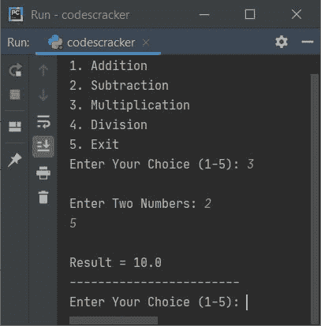

# Python 程序：制作计算器

> 原文：<https://codescracker.com/python/program/python-program-make-calculator.htm>

在本文中，我用 Python 创建了一些程序，来制作一个简单的计算器。以下是 Python 中的计算器程序列表:

*   计算器程序使用 **while** 循环和 **if-else**
*   使用用户定义的函数
*   使用类和对象

## 使用 while 循环和 if-else 的计算器程序

这个程序用 Python 制作了一个简单的计算器，它执行四个基本的数学运算，如用户输入的两个数字的[加、减、乘、除](/python/program/python-program-addition-subtraction-multiplication-division.htm) 。这里我给用户提供了 5 个选项，第五个选项是退出。

```
while True:
   print("1\. Addition")
   print("2\. Subtraction")
   print("3\. Multiplication")
   print("4\. Division")
   print("5\. Exit")
   print("Enter Your Choice (1-5): ", end="")
   ch = int(input())
   if ch>=1 and ch<=4:
      print("\nEnter Two Numbers: ", end="")
      numOne = float(input())
      numTwo = float(input())
   if ch==1:
      res = numOne + numTwo
      print("\nResult =", res)
   elif ch==2:
      res = numOne - numTwo
      print("\nResult =", res)
   elif ch==3:
      res = numOne * numTwo
      print("\nResult =", res)
   elif ch==4:
      res = numOne / numTwo
      print("\nResult =", res)
   elif ch==5:
      break
   else:
      print("\nInvalid Input!..Try Again!")
   print("------------------------")
```

下面是这个简单计算器的 Python 程序产生的初始输出:


现在提供输入。例如键入 **1** 作为选择，并按`ENTER`键，下面是您将看到的输出:


现在输入任意两个数字，首先说 **32** ，按下`ENTER`和 **44** 作为第二个数字，再次 按下`ENTER`。这里是您将看到的输出，它显示了结果，并再次向操作员进一步显示选项:


要退出，键入 **5** 作为选择，然后按`ENTER`。程序执行终止，如下图所示:


上述程序的预演如下:

*   由于我已经给出了**真**(布尔)作为**而**循环的条件，因此程序流直接 进入循环而不评估任何东西(条件)，因为条件已经写成了**真**
*   在循环内部，我提供了 5 个选项。前四个选项是数学运算，而第五个选项是退出循环并终止程序
*   现在通过 **input()** ，用户输入的选项(1-5)被接收并初始化为 **ch** 变量。 例如，如果用户输入 **1** 作为选项，那么 **ch=1**
*   条件(如果**的第一个条件) **ch > =1** 或 **1 > =1** 评估为真，因此 评估第二个条件，即条件 **ch < =4** 或 **ch < =4** 也评估为 真，因此程序流程进入如果**的主体内
*   在 **if** 体内，我收到了两个数字，分别初始化为两个变量 **numOne** 和 T4】numTwo。例如，如果用户输入 **32** 和 **44** 作为第一个和第二个数字。然后 **numOne = 32**和 **numTwo=44**
*   现在条件(下一个 **if** ) **ch==1** 或 **1==1** 评估为真，因此如果的主体和 **numOne+numTwo** 或 **32+44** 或 **76** 被初始化为 **res** ，程序流程进入此 内部。所以 **res=76**
*   并且 **res** 的值被打印为输出
*   由于**如果**的条件评估为真，因此没有任何即将到来的 **elif** 或 **else** 的 语句被执行
*   所以使用最后一个语句，我打印了一些破折号(-)
*   现在又显示了 5 个选项，用户必须再次输入他/她的选项才能进一步操作。这个过程还在继续，因为我已经使用了 **True** 作为 **while** 循环的条件，所以结果总是 True
*   退出循环的唯一方法，是当用户输入 **5** 作为选择，这样最后一个 **elif**的条件，即 **ch==5** 或 **5==5** 评估为真，并使用 **break** 关键字，在循环结束的同时**的 执行**

#### 先前程序的修改版本

这个程序是前一个程序的修改版本。这个程序使用 **try-except** 来处理无效输入。也就是说，当 用户输入任何无效输入，如 **c** 、 **#** 作为数字时，程序会发出(打印)错误信息并继续要求输入有效的 。让我们来看看:

```
print("1\. Addition")
print("2\. Subtraction")
print("3\. Multiplication")
print("4\. Division")
print("5\. Exit")
while True:
   while True:
      print("Enter Your Choice (1-5): ", end="")
      try:
         ch = int(input())
         if ch>=1 and ch<=4:
            print("\nEnter Two Numbers: ", end="")
            numOne = float(input())
            numTwo = float(input())

         if ch==1:
            print("\nResult =", numOne+numTwo)
         elif ch==2:
            print("\nResult =", numOne-numTwo)
         elif ch==3:
            print("\nResult =", numOne*numTwo)
         elif ch==4:
            print("\nResult =", numOne/numTwo)
         elif ch==5:
            break
         else:
            print("\nInvalid Input!..Try Again!")
         print("------------------------")
      except ValueError:
         print("\nInvalid Input!..Try Again!")
         print("------------------------")
         continue
   if ch==5:
      break
```

下面是它的示例运行，用户输入 **3** 作为选择，然后 **2** 和 **5** 作为两个数字:



从上面的示例运行中可以看出，菜单只显示了一次。后来，我只显示了要求输入选项以继续操作的消息。下面是使用无效和有效输入继续运行的示例:


退出程序的唯一方法是使用 **5** 作为选择。

**注意-** 在上述程序中，当用户输入无效输入时，则程序流程转到**除值错误**的 正文并打印错误信息。然后使用 **continue** 关键字，程序流程转到**的初始(第一)语句 ，而**循环的主体再次接收**尝试**内部的输入

## 计算器程序使用函数

这个程序是使用四个用户定义的函数创建的。所有函数都接收两个参数并返回相应的结果。

```
def add(a, b):
   return a+b
def sub(a, b):
   return a-b
def mul(a, b):
   return a*b
def div(a, b):
   return a/b

print("1\. Addition")
print("2\. Subtraction")
print("3\. Multiplication")
print("4\. Division")
print("5\. Exit")
while True:
   while True:
      print("Enter Your Choice (1-5): ", end="")
      try:
         ch = int(input())

         if ch>=1 and ch<=4:
            print("\nEnter Two Numbers: ", end="")
            nOne = float(input())
            nTwo = float(input())

         if ch==1:
            print("\nResult =", add(nOne, nTwo))
         elif ch==2:
            print("\nResult =", sub(nOne, nTwo))
         elif ch==3:
            print("\nResult =", mul(nOne, nTwo))
         elif ch==4:
            print("\nResult =", div(nOne, nTwo))
         elif ch==5:
            break
         else:
            print("\nInvalid Input!..Try Again!")
         print("------------------------")

      except ValueError:
         print("\nInvalid Input!..Try Again!")
         print("------------------------")
         continue
   if ch==5:
      break
```

这个程序产生与前一个程序相同的输出。

## 使用类的计算器程序

这是 Python 中最后一个计算器程序，使用**类**创建。要访问一个类的成员函数，需要一个对象。因此，一个名为 **CodesCracker** 的类创建了一个对象 **ob** ，其中我必须使用**点 来访问成员函数。)**运算符。

```
class CodesCracker:
   def add(self, a, b):
      return a+b
   def sub(self, a, b):
      return a-b
   def mul(self, a, b):
      return a*b
   def div(self, a, b):
      return a/b

print("1\. Add")
print("2\. Subtract")
print("3\. Multiply")
print("4\. Divide")
print("5\. Exit")

while True:
   while True:
      print("Enter Your Choice (1-5): ", end="")

      try:
         ch = int(input())

         if ch>=1 and ch<=4:
            print("\nEnter Two Numbers: ", end="")
            nOne = float(input())
            nTwo = float(input())
            ob = CodesCracker()

         if ch==1:
            print("\n" +str(nOne)+ " + " +str(nTwo)+ " = " + str(ob.add(nOne, nTwo)))
         elif ch==2:
            print("\n" +str(nOne)+ " - " +str(nTwo)+ " = " + str(ob.sub(nOne, nTwo)))
         elif ch==3:
            print("\n" +str(nOne)+ " * " +str(nTwo)+ " = " + str(ob.mul(nOne, nTwo)))
         elif ch==4:
            print("\n" +str(nOne)+ " / " +str(nTwo)+ " = " + str(ob.div(nOne, nTwo)))
         elif ch==5:
            break
         else:
            print("\nInvalid Input!..Try Again!")
         print("------------------------")

      except ValueError:
         print("\nInvalid Input!..Try Again!")
         print("------------------------")
         continue

   if ch==5:
      break
```

下面是一些用户输入的运行示例:


#### 其他语言的相同程序

*   [Java 制作计算器](/java/program/java-program-make-calculator.htm)
*   [C 制作计算器](/c/program/c-program-make-calculator.htm)
*   [C++ 制作计算器](/cpp/program/cpp-program-make-calculator.htm)

[Python 在线测试](/exam/showtest.php?subid=10)

* * *

* * *