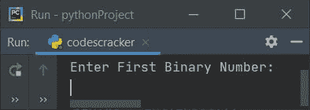
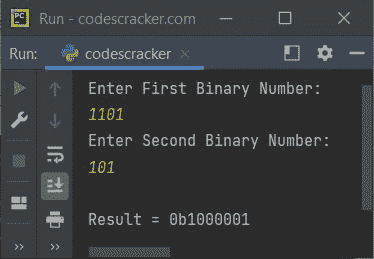
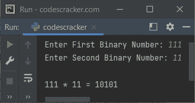
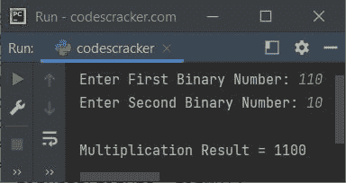

# Python 程序：将两个二进制数相乘

> 原文：<https://codescracker.com/python/program/python-multiply-two-binary-numbers.htm>

创建这篇文章是为了介绍 Python 中一个著名的程序，即将用户输入的两个二进制数相乘。下面是本文涉及的程序列表:

*   使用预定义的函数将两个二进制数相乘
*   将两个二进制数相乘，不使用任何预定义的函数，而是使用基于用户或自己使用的代码

## 使用函数的二进制数乘法

问题是，编写一个 Python 程序，将用户在运行时输入的两个二进制数相乘。 即将播出的节目就是对这个问题的回答:

```
print("Enter First Binary Number: ")
binOne = int(input())
print("Enter Second Binary Number: ")
binTwo = int(input())

binOne = str(binOne)
binTwo = str(binTwo)

decMul = int(binOne, 2) * int(binTwo, 2)
binMul = bin(decMul)

print("\nResult = " + binMul)
```

下面是它的运行示例:



现在输入第一个二进制数为 **1101** ，第二个二进制数为 **101** ，将这两个给定的 二进制数相乘，并将相乘结果打印在输出上，如下图所示:



#### 先前程序的修改版本

这个程序是前一个程序的修改版本。本程序中使用的**结束**，是使用 **print()** 跳过 插入自动换行符。 **str()** 从任何类型转换成字符串 类型。 **int()** 方法转换成十进制数字格式。

```
print(end="Enter First Binary Number: ")
binOne = int(input())
print(end="Enter Second Binary Number: ")
binTwo = int(input())

binOne = str(binOne)
binTwo = str(binTwo)
decMul = int(binOne, 2) * int(binTwo, 2)
binMul = bin(decMul)

print("\n" + binOne + " * " + binTwo + " = " + binMul[2:])
```

以下是用户输入的运行示例， **111** 作为第一个二进制数， **11** 作为第二个二进制数:



## 不使用函数的二进制数乘法

这是本文的主要程序。在编程世界中，使用自己创建的或基于用户的代码进行任何事情都是更好的学习方法。也就是说，使用任何预定义的函数来完成任务不会让您学到更多。更确切地说，这就像回忆往事。

但是使用或理解基于用户的代码来完成相同的任务会让你对逻辑、流程、循环以及所有这些有更多更深刻的理解。因此，总是尝试为每个任务创建基于用户的代码。比如这个程序将用户输入的两个二进制数相乘，使用一个 **codescracker** 程序员自己创建的代码。让我们来看看这个程序及其运行示例:

```
def binProd(binOne, binTwo):
  i = 0
  rem = 0
  sum = []
  bProd = 0
  while binOne != 0 or binTwo != 0:
    sum.insert(i, (((binOne % 10) + (binTwo % 10) + rem) % 2))
    rem = int(((binOne % 10) + (binTwo % 10) + rem) / 2)
    binOne = int(binOne/10)
    binTwo = int(binTwo/10)
    i = i+1
  if rem != 0:
    sum.insert(i, rem)
    i = i+1
  i = i-1
  while i >= 0:
    bProd = (bProd * 10) + sum[i]
    i = i-1
  return bProd

binMul = 0
factr = 1
print(end="Enter First Binary Number: ")
binOne = int(input())
print(end="Enter Second Binary Number: ")
binTwo = int(input())
while binTwo != 0:
  digit =  binTwo % 10
  if digit == 1:
    binOne = binOne * factr
    binMul = binProd(binOne, binMul)
  else:
    binOne = binOne * factr
  binTwo = int(binTwo/10)
  factr = 10
print("\nMultiplication Result = " +str(binMul))
```

以下是用户输入的示例运行，第一个是 **110** ，第二个是 **10** :



[Python 在线测试](/exam/showtest.php?subid=10)

* * *

* * *