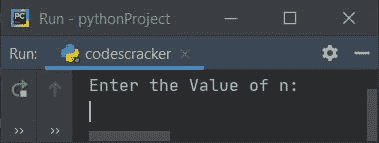
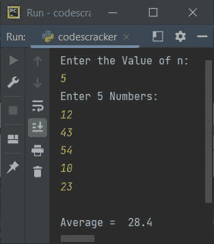
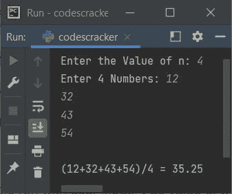
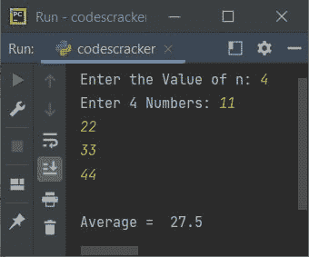

# Python 程序：求 n 个数的平均值

> 原文：<https://codescracker.com/python/program/python-program-calculate-average-of-numbers.htm>

在本文中，我们用 Python 创建了一些程序，来查找并打印由 用户在运行时输入的 **n** 个数字的平均值。以下是程序列表:

*   使用循环的**找到 **n** 个数字的平均值**
*   使用 **while 循环**
*   使用**功能**
*   使用**类和对象**

例如，如果用户输入的 **n** 的值是 **5** 。五个数字输入为 **10，20，30，40，50** 。 然后这些数字的平均值计算如下:

```
average = (10+20+30+40+50)/5
        = (150/5)
        = 30
```

## 使用 for 循环求 n 个数的平均值

要找到用户在 Python 中输入的 **n** 个数字的平均值或算术平均值，你必须让用户 输入 **n** 的值，然后 **n** 组数字，找到并打印所有这些数字的平均值或算术平均值，如下面给出的程序所示:

```
print("Enter the Value of n: ")
n = int(input())
print("Enter " +str(n)+ " Numbers: ")
nums = []
for i in range(n):
    nums.insert(i, int(input()))

sum = 0
for i in range(n):
    sum = sum+nums[i]

avg = sum/n
print("\nAverage = ", avg)
```

以下是该程序产生的初始输出:



现在提供输入说 **5** 作为 **n** 的值，然后输入任意五个数字说 **12、43、54、10** 和 **23** 一个接一个 。按`ENTER`键查找并打印给定数字的平均值，如下图所示:



**注意-****str()**方法将任何类型的值转换为字符串类型的值。

以下代码块的预演:

```
for i in range(n):
    nums.insert(i, int(input()))
```

是这样的:

*   循环变量 **i** 从 0 开始，因为只有一个参数被赋予 **range()**
*   到 **range()** 的值就是 **n** 的值。因此，如果 **5** 是 **n** 的值，那么 循环执行 5 次，其中 **i** 的值从 0 到 4
*   因此，在第一次执行循环时， **nums.insert(i，int(input()))** 语句声明，用户输入的 值被插入到 **nums** 的**I<sup>th</sup>T5】索引处**
*   也就是说，第一个值存储在 **nums[0]** 中
*   以类似的方式，第二、第三、第四和第五个值分别存储在 **nums[1]** 、 **nums[2]** 、 **nums[3]**和 **nums[4]** 中

#### 先前程序的修改版本

该程序使用 **end=** ，用于跳过使用 **print()** 自动打印换行符。 **append()** 方法也用于向列表中插入元素。因为向列表中插入元素是从第一个(第零个)索引开始的 ，所以最好使用 **append()** ，而不是 **insert()**

```
print("Enter the Value of n: ", end="")
n = int(input())
print("Enter " +str(n)+ " Numbers: ", end="")
arr = []
for i in range(n):
    arr.append(int(input()))

sum = 0
for i in range(n):
    sum = sum+arr[i]
    if i==0:
        print(end="\n(" +str(arr[i]))
    elif i==(n-1):
        print(end="+" +str(arr[i])+ ")")
    else:
        print(end="+" +str(arr[i]))

print(end="/" +str(n)+ " = ")
avg = sum/n
print(end=str(avg))
```

下面是它在用户输入下的运行示例， **4** 作为 **n** 的值， **12、32、43、54** 作为四个数字:



## 使用 while 循环查找 n 个数的平均值

该程序使用 **while 循环**执行与前一程序相同的任务。在这个程序中，在开始循环之前，值 0 到 **i** 被初始化。它的值从体内开始递增。因为， *而循环*只包含条件检查部分。

```
print("Enter the Value of n: ", end="")
n = int(input())
print("Enter " +str(n)+ " Numbers: ", end="")
nums = []
i = 0
while i<n:
    nums.append(int(input()))
    i = i+1

sum = 0
i = 0
while i<n:
    sum = sum+nums[i]
    i = i+1

avg = sum/n
print("\nAverage = ", avg)
```

下面是用户输入的运行示例， **4** 作为 **n** 的值， **11，22，33，44** 作为四个数字:



## 用函数求 n 个数的平均值

这个程序使用一个名为 **avg()** 的用户定义函数来做同样的工作。这个函数有两个 参数。第一个参数指的是列表(包含 **n** 组数字)。而第二个参数 指的是链表的大小( **n** 的值)。它返回平均值。

```
def avg(arr, tot):
    sum = 0
    for i in range(n):
        sum = sum+arr[i]
    avg = sum/tot
    return avg

print("Enter the Value of n: ", end="")
n = int(input())
print("Enter " +str(n)+ " Numbers: ", end="")
nums = []
for i in range(n):
    nums.append(int(input()))

res = avg(nums, n)
print("\nAverage = ", res)
```

这个程序产生与前一个程序相同的输出。

## 用类求 n 个数的平均值

这是本文的最后一个程序，使用 Python 的面向对象特性 class and object 创建。

```
class CodesCracker:
    def avg(self, arr, tot):
        sum = 0
        for i in range(n):
            sum = sum+arr[i]
        avg = sum/tot
        return avg

print("Enter the Value of n: ", end="")
n = int(input())
print("Enter " +str(n)+ " Numbers: ", end="")
nums = []
for i in range(n):
    nums.append(int(input()))

obj = CodesCracker()
res = obj.avg(nums, n)

print("\nAverage = ", res)
```

从上面的程序中，下面的语句:

```
obj = CodesCracker()
```

用于将类 **CodesCracker** 的所有属性分配给对象 **obj** 。这样，这个对象 就可以用来访问同一个类的成员函数( **avg()** )，使用**点(。)**运算符。其余的事情类似于一个正常的功能。

#### 其他语言的相同程序

*   [Java 计算数字的平均值](/java/program/java-program-calculate-arithmetic-mean.htm)
*   [C 计算数字的平均值](/c/program/c-program-calculate-arithmetic-mean.htm)
*   [C++计算数字的平均值](/cpp/program/cpp-program-calculate-arithmetic-mean.htm)

[Python 在线测试](/exam/showtest.php?subid=10)

* * *

* * *