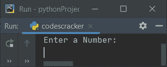

# Python 程序打印乘法表

> 原文：<https://codescracker.com/python/program/python-program-print-multiplication-table.htm>

创建这篇文章是为了介绍 Python 中的一些程序，这些程序打印用户在运行时输入的乘法表。下面是本文中可用的程序列表:

*   使用**为**循环打印一个数的乘法表
*   在循环时使用**打印乘法表**
*   打印给定范围内的乘法表

## 用 for 循环打印乘法表

问题是，*写一个 Python 程序，使用**为**循环打印一个数的乘法表。 号码必须由用户输入。下面给出的程序是这个问题的答案:*

```
print("Enter a Number: ")
num = int(input())
k = 1
print("\nMultiplication Table:")
for i in range(10):
  mul = num*k
  print(mul)
  k = k+1
```

以下是该程序产生的初始输出:



输入一个数字，比如说 **5** ，按`ENTER`键打印乘法表，如下图所示:


#### 先前程序的修改版本

本程序中使用的**结束**，使用 **print()** 跳过自动换行符的插入。 **str()** 方法将任何类型的值转换为字符串类型。

```
print(end="Enter a Number: ")
num = int(input())
print("\nMultiplication Table of " +str(num))
for i in range(1, 11):
  print(str(num)+ " * " +str(i)+ " = " +str(num*i))
```

下面是用户输入 **8** 的运行示例:


## 使用 while 循环打印数字表

这个程序没有使用**来代替**循环，而是使用**而**循环来完成与前一个程序相同的任务。

```
print(end="Enter a Number: ")
num = int(input())
print("\nMultiplication Table of " +str(num))
i = 1
while i<11:
  print(str(num)+ " * " +str(i)+ " = " +str(num*i))
  i = i+1
```

这个程序产生与前一个程序相同的输出。

## 打印给定范围内的乘法表

这个程序与上面的程序没有什么不同。是的，这个程序也打印乘法表，但不是单个数字的。这可以由用户决定。也就是说，程序允许用户输入范围来打印乘法表中所有在给定范围内的数字。

```
print(end="Enter the Range: ")
s = int(input())
e = int(input())
if s==e:
  num = s
  print("----Multiplication Table of " +str(num)+ "----")
  for i in range(1, 11):
    print(str(num)+ " * " +str(i)+ " = " +str(num*i))
elif s>e:
  num = e
  while num<=s:
    print("----Multiplication Table of " +str(num)+ "----")
    for i in range(1, 11):
      print(str(num)+ " * " +str(i)+ " = " +str(num*i))
    num = num+1
else:
  num = s
  while num<=e:
    print("----Multiplication Table of " +str(num)+ "----")
    for i in range(1, 11):
      print(str(num)+ " * " +str(i)+ " = " +str(num*i))
    num = num+1
```

下面是用户输入 **3** 和 **5** 的示例运行:


[Python 在线测试](/exam/showtest.php?subid=10)

* * *

* * *