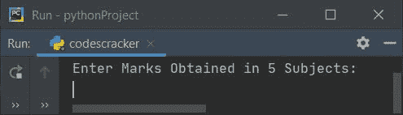

# Python 程序：计算平均分数和百分比分数

> 原文：<https://codescracker.com/python/program/python-program-calculate-average-percentage-marks.htm>

在本文中，您将学习并获得 Python 代码，根据用户在运行时输入的分数计算并打印平均分数和百分比分数。以下是程序列表:

*   根据 5 名受试者的成绩计算平均分和百分比
*   上述程序的修改版本。该程序使用循环的*来接收用户的标记*
*   允许用户定义科目的数量，最大分数以及在所有科目中获得的分数

## 用 Python 计算平均分数和百分比分数

要用 python 计算平均分和百分比分，你必须要求用户输入 5 个科目的分数。然后按照下面给出的程序计算并打印平均分和百分比分:

```
print("Enter Marks Obtained in 5 Subjects: ")
mOne = int(input())
mTwo = int(input())
mThree = int(input())
mFour = int(input())
mFive = int(input())

sum = mOne+mTwo+mThree+mFour+mFive
avg = sum/5
perc = (sum/500)*100

print(end="Average Mark = ")
print(avg)
print(end="Percentage Mark = ")
print(perc)
```

以下是上述 Python 程序的运行示例，展示了学生的平均分和百分比分数是如何打印在输出中的:



上面给出的截图显示了最初的输出。现在逐个输入 5 个科目的分数，然后按`ENTER`键，计算并打印平均分和百分比分，如下图所示:


在上面的程序中，下面的语句:

```
print(end="Average Mark = ")
```

用于打印**平均值 Mark =** 不带换行符。因为 **print()** 语句自动 在打印完大括号内的所有内容后打印一个换行符。

**注意-****end =**以其后的 **""** 内的事物结束一行。也就是下一个 的事情从同一行开始(上面程序中)。

**注意-** 在上面的程序中，如果我们要接收 10 个科目的分数，那么我们要反复写输入 代码 10 次。因此，让我们使用**循环**以动态方式执行相同的任务。

### 使用 for 循环接收标记

这个程序做的工作和前一个程序一样。唯一不同的是，这个程序使用**来循环**到 接收 5 个科目的分数。循环的**也用于计算所有科目分数的总和:**

```
mark = []
tot = 0
print("Enter Marks Obtained in 5 Subjects: ")
for i in range(5):
    mark.insert(i, int(input()))
for i in range(5):
    tot = tot + mark[i]

avg = tot/5
perc = (tot/500)*100

print(end="Average Mark = ")
print(avg)
print(end="Percentage Mark = ")
print(perc)
```

这个程序产生与前一个程序相同的输出。

**注意-****range()**函数返回一系列值。默认情况下，该值从 0 开始， 递增 1。它在一个指定为函数参数的数字前停止。

因此从上面的程序中，下面的代码:

```
for i in range(5):
```

用于执行以下语句:

```
mark.insert(i, int(input()))
```

五次，值从 0 到 4。也就是说，来自用户的输入被逐一接收并存储在列表 **【标记】**中，这样:

*   第一个值存储在**标记[0]** 中
*   第二个值存储在**标记[1]** 中
*   第三个值存储在**标记[2]** 中
*   依此类推，直到
*   第五个值存储在**标记[4]** 中

### 获取主题数量、获得的分数、用户的最高分数

现在让我们创建一个程序，根据在 **N** 个科目中获得的分数计算平均分和百分比。

这个程序允许用户提供或定义所有的事情，如科目总数，所有科目获得的分数，最高分。收到用户的输入后，程序计算并打印平均分和百分比分数:

```
mark = []
totMark = 0
print(end="Enter Number of Subjects: ")
totSub = int(input())

print(end="Enter Marks Obtained in " + str(totSub) + " Subjects: ")
for i in range(totSub):
    mark.insert(i, int(input()))

print(end="Enter Maximum Mark: ")
maxMark = int(input())

for i in range(totSub):
    totMark = totMark + mark[i]
avg = totMark/totSub
perc = (totMark/(totSub*maxMark))*100

print("Average Mark = " + str(avg))
print("Percentage Mark = " + str(perc) + "%")
```

下面是它的运行示例:


现在提供输入，比如说 **3** 为科目数， **10，20，30** 为 3 个科目的分数， 最后 **50** 为该科目的最高分数。以下是基于这些用户输入的示例输出:


**注-****str(totSub)**用于将 **totSub** 转换为字符串。因为 **+** 运算符相加相同类型的值，否则给出错误。

#### 其他语言的相同程序

*   [Java 计算平均值和百分比分数](/java/program/java-program-calculate-average-percentage.htm)
*   [C 计算平均值和百分比分数](/c/program/c-program-calculate-average-percentage.htm)
*   [C++ 计算平均分和百分号](/cpp/program/cpp-program-calculate-average-percentage.htm)

[Python 在线测试](/exam/showtest.php?subid=10)

* * *

* * *