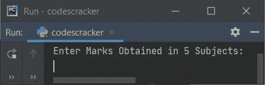
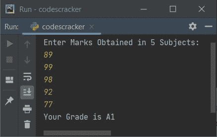
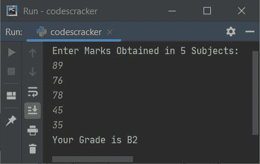
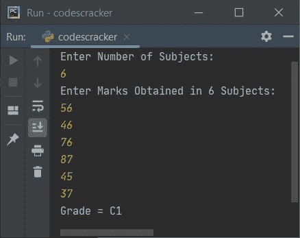
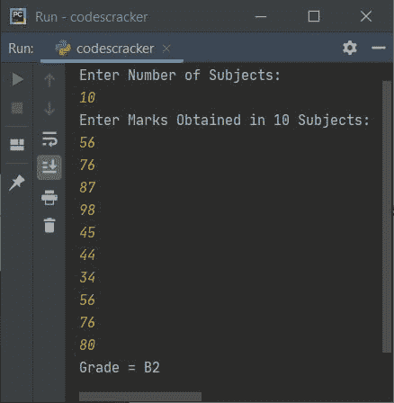

# Python 程序：计算学生成绩

> 原文：<https://codescracker.com/python/program/python-program-calculate-student-grade.htm>

在本文中，您将学习并获得用 Python 计算学生成绩的代码。以下是确定学生成绩的程序列表:

*   根据五科成绩计算学生成绩。
*   基于在 N 个受试者中获得的分数

必须按照以下规则计算等级:

| 平均分数 | 级别 |
| 91-100 | 一流的 |
| 81-90 | 主动脉第二声 |
| 71-80 | B1 |
| 61-70 | B2 |
| 51-60 | C1 |
| 41-50 | C2 |
| 33-40 | D |
| 21-32 | E1 |
| 0-20 | E2 |

## 用 Python 计算学生的成绩

这个程序根据用户在运行时输入的五个科目的分数查找并打印学生的成绩。

要用 Python 计算学生的分数，必须要求用户输入五门学科的分数。现在计算所有分数的总和，然后计算平均分数，根据学生获得的平均分数找到分数，如下面给出的程序所示:

以下 Python 程序要求用户输入在五个科目中获得的分数，以计算并打印学生的分数:

```
print("Enter Marks Obtained in 5 Subjects: ")
markOne = int(input())
markTwo = int(input())
markThree = int(input())
markFour = int(input())
markFive = int(input())

tot = markOne+markTwo+markThree+markFour+markFive
avg = tot/5

if avg>=91 and avg<=100:
    print("Your Grade is A1")
elif avg>=81 and avg<91:
    print("Your Grade is A2")
elif avg>=71 and avg<81:
    print("Your Grade is B1")
elif avg>=61 and avg<71:
    print("Your Grade is B2")
elif avg>=51 and avg<61:
    print("Your Grade is C1")
elif avg>=41 and avg<51:
    print("Your Grade is C2")
elif avg>=33 and avg<41:
    print("Your Grade is D")
elif avg>=21 and avg<33:
    print("Your Grade is E1")
elif avg>=0 and avg<21:
    print("Your Grade is E2")
else:
    print("Invalid Input!")
```

下面是上面 Python 程序的一些运行示例，演示了如何计算学生的成绩。

当您运行上面的代码时，您将看到下面的示例输出，它要求用户输入在 5 个科目中获得的分数:



现在输入 5 个科目的分数，比如 89、99、98、92 和 77，然后按回车键查看根据输入的分数获得的分数，如下图所示:



**注**:如果标记包含 98.6、86.9 等小数值。，然后用 float 替换 int。

也就是说，要处理浮点(包含十进制的值)值，请替换以下代码块:

```
markOne = int(input())
markTwo = int(input())
markThree = int(input())
markFour = int(input())
markFive = int(input())
```

下面给出了代码块:

```
markOne = float(input())
markTwo = float(input())
markThree = float(input())
markFour = float(input())
markFive = float(input())
```

### 使用循环接收标记并查找等级

这个程序使用一个循环来接收五个科目的分数。它还使用一个循环来查找总分:

```
mark = []
tot = 0
print("Enter Marks Obtained in 5 Subjects: ")
for i in range(5):
    mark.insert(i, input())

for i in range(5):
    tot = tot + int(mark[i])
avg = tot/5

if avg>=91 and avg<=100:
    print("Your Grade is A1")
elif avg>=81 and avg<91:
    print("Your Grade is A2")
elif avg>=71 and avg<81:
    print("Your Grade is B1")
elif avg>=61 and avg<71:
    print("Your Grade is B2")
elif avg>=51 and avg<61:
    print("Your Grade is C1")
elif avg>=41 and avg<51:
    print("Your Grade is C2")
elif avg>=33 and avg<41:
    print("Your Grade is D")
elif avg>=21 and avg<33:
    print("Your Grade is E1")
elif avg>=0 and avg<21:
    print("Your Grade is E2")
else:
    print("Invalid Input!")
```

以下是用户输入的样本运行:89、76、78、45 和 35 是在 5 个受试者中获得的分数:



**注意**:也可以用 append()代替 insert()。为此，只需替换以下语句:

```
mark.insert(i, input())
```

下面给出了声明:

```
mark.append(input())
```

以下代码块(来自上述程序):

```
for i in range(5):
    mark.insert(i, input())
```

用于执行以下语句:

```
mark.insert(i, input())
```

从 0 到 4 五次。也就是说，这条语句执行了五次，I 的值从 0 到 4。

当 I 的值为 0 时(第一次执行时)，用户输入的标记存储在列表中的 mark[0]处。现在，I 的值是 1，因此用户输入的标记存储在列表中的 mark[1]处，以此类推，最多五次。

### 获得 N 个科目的分数并确定等级

该程序允许用户输入科目数量以及所有科目的分数。也就是说，这个程序根据 N 个科目的分数查找并打印出一个学生的成绩。N 的值和 N 个科目中的标记必须由用户输入:

```
mark = []
tot = 0
print("Enter Number of Subjects: ")
subNo = int(input())
print("Enter Marks Obtained in " + str(subNo) + " Subjects: ")
for i in range(subNo):
    mark.append(input())

for i in range(subNo):
    tot = tot + int(mark[i])
avg = tot/subNo

if avg>=91 and avg<=100:
    print("Grade = A1")
elif avg>=81 and avg<91:
    print("Grade = A2")
elif avg>=71 and avg<81:
    print("Grade = B1")
elif avg>=61 and avg<71:
    print("Grade = B2")
elif avg>=51 and avg<61:
    print("Grade = C1")
elif avg>=41 and avg<51:
    print("Grade = C2")
elif avg>=33 and avg<41:
    print("Grade = D")
elif avg>=21 and avg<33:
    print("Grade = E1")
elif avg>=0 and avg<21:
    print("Grade = E2")
else:
    print("Invalid Input!")
```

以下是用户输入的样本运行，6 为受试者人数，56、46、76、87、45 和 37 为在 6 个受试者中获得的分数:



这是另一个由用户输入的运行示例，10 为受试者总数，56、76、87、90、45、44、34、56、76 和 80 为在 10 个受试者中获得的分数:



#### 其他语言的相同程序

*   [Java 计算学生成绩](/java/program/java-program-calculate-student-grade.htm)
*   [C 计算学生成绩](/c/program/c-program-calculate-student-grade.htm)
*   [C++计算学生成绩](/cpp/program/cpp-program-calculate-student-grade.htm)

[Python 在线测试](/exam/showtest.php?subid=10)

* * *

* * *