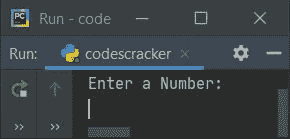
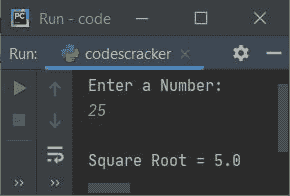
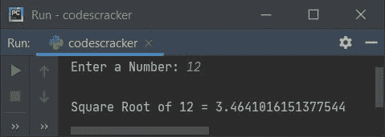
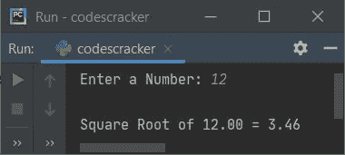

# Python 程序求一个数的平方根

> 原文：<https://codescracker.com/python/program/python-program-find-square-root.htm>

本文涵盖了 Python 中的一些程序，这些程序在运行时查找并打印用户输入的数字的平方根。以下是使用的方法列表:

*   使用 ****** 运算符计算一个数的平方根
*   使用 **math.sqrt()** 内置函数
*   使用 **math.pow()**
*   使用用户定义的函数
*   使用类

## 用**求一个数的平方根

要在 Python 中找到用户给定的任何数字的平方根，你必须让用户输入一个数字，然后找到并打印它的平方根，如下面给出的程序所示。问题是，**写一个 Python 程序求一个数的平方根**。以下是它的答案:

```
print("Enter a Number: ")
num = int(input())

squareroot = num ** 0.5

print("\nSquare Root =", squareroot)
```

下面是这个 Python 程序产生的初始输出:



现在输入任意数字，比如说 **25** ，按`ENTER`键找到并打印它的平方根，如下图所示:



**注-** 将 **a ** b** 返回**a<sup>b</sup>T7】。所以 **num ** 0.5** 指的是 **num <sup>0.5</sup>** (也就是等于 **num <sup>1/2</sup>** )。**

## 使用 math.sqrt()内置函数求平方根

这个程序使用 **math.sqrt()** 求平方根。这个方法是在**数学**模块中定义的，因此 在使用它之前，我必须导入**数学**模块:

```
import math

print("Enter a Number: ", end="")
try:
  num = int(input())
  res = math.sqrt(num)
  print("\nSquare Root of " +str(num)+ " = " +str(res))
except ValueError:
  print("\nInvalid Input!")
```

下面是用户输入 **12** 的运行示例:



要将值格式化为最多两位小数，请替换下面的语句(来自上面的程序):

```
print("\nSquare Root of " +str(num)+ " = " +str(res))
```

下面给出了声明:

```
print("\nSquare Root of %0.2f = %0.2f" %(num, res))
```

现在，输出看起来与用户输入相同，即 **12** :



**str()** 方法用于将任何类型的值转换为字符串类型的值。

## 使用 math.pow()求平方根

这个程序用 **pow()** 方法求平方根。 **math.pow(a，b)** 返回 T4 a<sup>b</sup>T7】的值。所以 **math.pow(num，0.5)** 指的是**num<sup>0.5</sup>T13】。**

```
import math

print("Enter a Number: ", end="")
num = int(input())

res = math.pow(num, 0.5)
print("\nSquare Root of %0.2f = %0.2f" %(num, res))
```

## 使用用户定义的函数求平方根

这个程序是使用名为 **sqrt()** 的用户定义函数创建的，该函数返回作为其参数传递的数字 的平方根。因此，使用 **res = sqrt(num)** ，将 **num** 的平方根初始化为 **res** 。

```
def sqrt(n):
  return n ** 0.5

print("Enter a Number: ", end="")
num = int(input())

res = sqrt(num)
print("\nSquare Root of %0.2f = %0.2f" %(num, res))
```

## 用类求平方根

这是使用类创建的最后一个程序。类是 Python 面向对象的特性。类中的函数被称为成员函数。因此要访问它，需要一个类的对象。所以我创建了一个名为 **obj** 的对象，它属于 **CodesCracker** 类，使用**点(。)**运算符。

```
class CodesCracker:
  def sqrt(self, n):
    return n ** 0.5

print("Enter a Number: ", end="")
num = int(input())

obj = CodesCracker()
print("\nSquare Root of %0.2f = %0.2f" %(num, obj.sqrt(num)))
```

[Python 在线测试](/exam/showtest.php?subid=10)

* * *

* * *