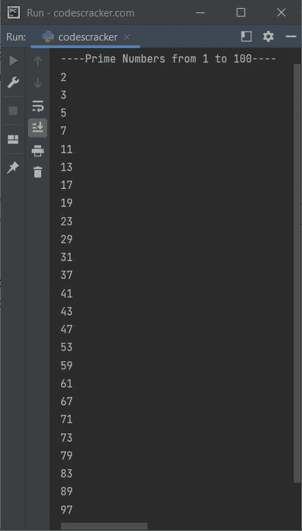
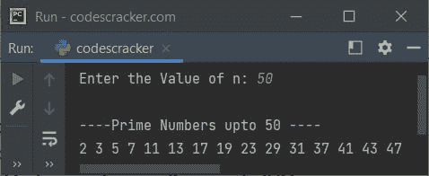
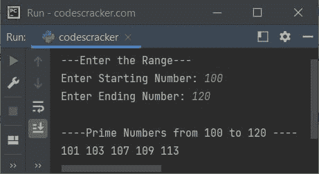

# Python 程序打印质数

> 原文：<https://codescracker.com/python/program/python-program-print-prime-numbers.htm>

在本文中，我在 Python 中包含了多个打印素数的程序。下面是本文涉及的程序列表:

*   用 Python 打印 1 到 100 的质数
*   单行打印从 1 到 100 的质数
*   用 Python 打印最大到 **n** 的质数
*   用 Python 打印给定范围内的质数
*   打印给定范围内的质数，使用 **while** 循环

## 用 Python 打印 1 到 100 的质数

问题是，*写一个 Python 程序，打印 1 到 100 的所有质数。*下面给出的节目是 它的回答:

```
print("----Prime Numbers from 1 to 100----")
start = 2
end = 100
for i in range(start, end+1):
    count = 0
    for j in range(2, i):
        if i%j == 0:
            count = 1
            break
    if count == 0:
        print(i)
```

下面给出的快照显示了上面的 Python 程序产生的示例输出，它打印了从 1 到 100 的所有质数:



因为 **1** 既不是质数，也不是合数。因此，我从 2 开始，而不是从 1 开始。

## 单行打印从 1 到 100 的质数

如果你想在一行中打印从 1 到 100 的所有质数<u>，那么你需要做的唯一替换 ，从上面的程序是，替换下面的语句:</u>

```
print(i)
```

下面给出了声明:

```
print(i, end=" ")
```

现在，在完成上述替换并重新执行之前的程序后，输出将是:

```
----Prime Numbers from 1 to 100----
2 3 5 7 11 13 17 19 23 29 31 37 41 43 47 53 59 61 67 71 73 79 83 89 97 
```

## 用 Python 打印最大到 n 的质数

问题是，*用 Python 写一个程序，打印出最大到 **n** 的质数。 **n** 的值必须是用户在程序运行时收到的 。*下面给出的程序是它的答案:

```
print("Enter the Value of n: ", end="")
n = int(input())

start = 2
print("\n----Prime Numbers upto", n, "----")
for i in range(start, n+1):
    count = 0
    for j in range(2, i):
        if i%j == 0:
            count = 1
            break
    if count == 0:
        print(i, end=" ")
```

上面 Python 程序的运行示例，用户输入 **50** 打印 50 以内的质数，如下面给出的快照 所示:



## 在 Python 中显示给定范围内的质数

这是另一个打印质数的程序，在给定的范围或区间内，由用户在运行时指定:

```
print("---Enter the Range---")
print("Enter Starting Number: ", end="")
start = int(input())
print("Enter Ending Number: ", end="")
end = int(input())

print("\n----Prime Numbers from", start, "to", end, "----")
for i in range(start, end+1):
    count = 0
    for j in range(2, i):
        if i%j == 0:
            count = 1
            break
    if count == 0:
        print(i, end=" ")
```

下面给出的快照显示了上述 Python 程序的示例运行，用户输入 **100** 和 **120** 作为打印从 100 到 120 的所有质数的范围



## 在 Python 中使用 while 循环打印素数

现在让我创建和前面一样的程序，但是这次使用 **while** 循环，而不是循环的

 **```
print("---Enter the Range---")
print("Enter Starting Number: ", end="")
start = int(input())
print("Enter Ending Number: ", end="")
end = int(input())

print("\n----Prime Numbers from", start, "to", end, "----")
i = start
while i < end+1:
    count = 0
    j = 2
    while j < i:
        if i%j == 0:
            count = 1
            break
        j = j+1
    if count == 0:
        print(i, end=" ")
    i = i+1
```

#### 其他语言的相同程序

*   [Java 打印质数](/java/program/java-program-print-prime-numbers.htm)
*   [C 打印质数](/c/program/c-program-print-prime-numbers.htm)
*   [C++打印质数](/cpp/program/cpp-program-print-prime-numbers.htm)

[Python 在线测试](/exam/showtest.php?subid=10)

* * *

* * ***