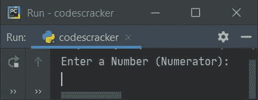
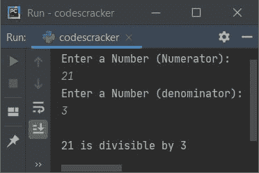
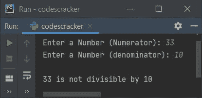
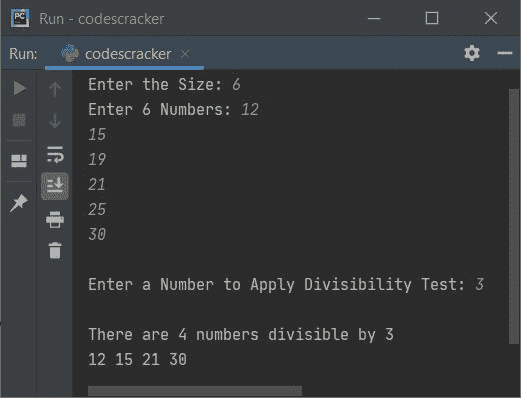
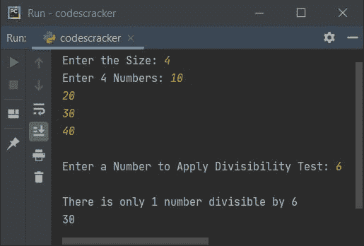
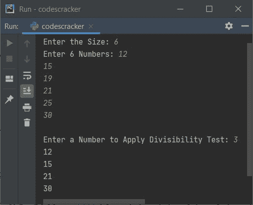

# Python 程序检查一个数是否能被另一个数整除

> 原文：<https://codescracker.com/python/program/python-program-find-numbers-divisible-by-number.htm>

创建本文是为了介绍 Python 中的一些程序，这些程序检查一个数是否能被另一个数整除。两个数字都必须由用户输入。以下是程序列表:

*   检查一个数是否能被另一个数整除
*   多重数整除检验。也就是说，程序从一个数字列表中找到并打印出所有能被特定数字整除的数字
*   使用用户自定义函数的整除性测试程序

## 检查一个数是否能被另一个数整除

这个程序检查一个数字(由用户输入)是否能被另一个数字(也由用户输入)整除。问题是，**写一个 Python 程序进行整除测试**。以下是它的答案:

```
print("Enter a Number (Numerator): ")
numn = int(input())
print("Enter a Number (denominator): ")
numd = int(input())

if numn%numd==0:
  print("\n" +str(numn)+ " is divisible by " +str(numd))
else:
  print("\n" +str(numn)+ " is not divisible by " +str(numd))
```

下面是这个 Python 程序产生的初始输出:



现在提供输入说 **21** 作为数字，按`ENTER`键，然后输入另一个数字说**3**T5，检查这个数字是否能被 21 整除，如下图所示:



**注意-****str()**转换成字符串类型值。

#### 先前程序的修改版本

这是前一个程序的修改版本。这个程序处理无效的输入。**结束**跳过插入自动换行。

```
print("Enter a Number (Numerator): ", end="")
try:
  numn = int(input())
  print("Enter a Number (denominator): ", end="")
  try:
    numd = int(input())
    if numn%numd==0:
      print("\n" +str(numn)+ " is divisible by " +str(numd))
    else:
      print("\n" +str(numn)+ " is not divisible by " +str(numd))
  except ValueError:
    print("\nInvalid Input!")
except ValueError:
  print("\nInvalid Input!")
```

以下是它的示例运行，使用 **33** 和 **10** 作为用户输入:



## 多重数整除检验

现在这个程序一次执行多个数字的整除测试。也就是说，程序接收大小，然后接收给定大小的数字。例如，如果用户输入 **6** 作为尺寸，那么程序进一步要求输入 6 个数字，将所有这些数字存储在一个名为 **nums** 的列表中。并且最后接收最后的输入作为数字，以 应用整除测试，如下面给出的程序所示:

```
print("Enter the Size: ", end="")
tot = int(input())
print("Enter " +str(tot)+ " Numbers: ", end="")
nums = []
for i in range(tot):
  nums.append(int(input()))

print("\nEnter a Number to Apply Divisibility Test: ", end="")
val = int(input())

res = []
for i in range(tot):
  if nums[i]%val==0:
    res.append(nums[i])

reslen = len(res)
if reslen>0:
  if reslen>1:
    print("\nThere are " +str(reslen)+ " numbers divisible by " +str(val))
    for i in range(reslen):
      print(res[i], end=" ")
    print()
  else:
    print("\nThere is only 1 number divisible by " +str(val))
    print(res[0])
else:
  print("\nThere is no any number divisible by " +str(val))
```

以下是用户输入的运行示例， **6** 作为大小， **12，15，19，21，25，30** 作为六个数字，然后 **3** 作为数字，以 检查整除测试，或者检查给定的六个数字被 3 整除多少，如下图所示:



下面是另一个示例运行，使用用户输入的 **4** 作为大小， **10、20、30、40** 作为四个数字， **6** 作为数字来检查其可分性测试:



## 使用函数的整除性测试程序

这个程序做的工作和前一个程序一样。唯一的区别是，这是使用名为 **divTest()** 的用户定义函数创建的。该函数接收两个数字作为参数，如果第二个数字 除以第一个数字，没有留下任何余数(或者余数为 0)，则返回 1:

```
def divTest(x, y):
  if x%y==0:
    return 1

print("Enter the Size: ", end="")
tot = int(input())

print("Enter " +str(tot)+ " Numbers: ", end="")
nums = []
for i in range(tot):
  nums.append(int(input()))

print("\nEnter a Number to Apply Divisibility Test: ", end="")
val = int(input())

for i in range(tot):
  if divTest(nums[i], val) == 1:
    print(nums[i])
```

这是它的示例运行，与前一个程序的第一次示例运行具有相同的用户输入:



[Python 在线测试](/exam/showtest.php?subid=10)

* * *

* * *