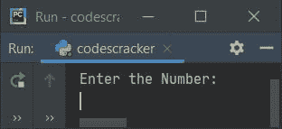
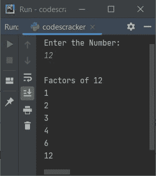
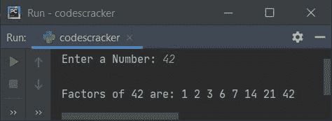
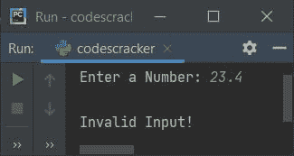

# Python 程序寻找一个数的因子

> 原文：<https://codescracker.com/python/program/python-program-find-factors-of-number.htm>

创建这篇文章是为了介绍 Python 中的一些程序，查找并打印用户在运行时输入的数字的因子。以下是使用的方法列表:

*   在循环中使用**求一个数的因数**
*   使用**进行**循环
*   使用功能

**注-** 一个数的因数表示 **n** 是能整除该数(n)的数。例如 **12** 的因子 为 **1，2，3，4，6，12** 。所有这六个数除以 12，没有任何余数。

## 用 while 循环求一个数的因子

要在 Python 中查找任意数字的因子，您必须要求用户输入一个数字，然后查找并打印它的因子，如下面给出的程序所示。问题是，**写一个 Python 程序，用 while 循环**求一个数的因子。以下是它的答案:

```
print("Enter the Number: ")
num = input()

num = int(num)
print("\nFactors of", num)

i = 1
while i<=num:
    if num%i==0:
        print(i)
    i = i+1
```

下面是这个 Python 程序产生的初始输出:



现在提供输入比如说 **12** 并按`ENTER`键查找并打印 **12** 的所有因子，如下面给出的快照中的 所示:



用户输入 **12** 的上述程序的试运行如下:

*   初始值， **num = "12"** (用户输入)。在 Python 中，使用 **input()** 接收的任何内容都被视为字符串类型值。因此，使用下面的语句:
    `num = int(num)`
    **num**的值被转换为整型值。所以 **num=12** ，而 **i=1**
*   现在, **while 循环** ) **i < =num** 或 **1 < =12** 的条件评估为真，因此 程序流程进入循环内部
*   在循环内部，条件(of **if** ) **num%i==0** 或 **12%1==0** 或 **0==0** 评估为 为真，因此如果的主体和 **i** 的值被打印为给定数字的 因子，则程序流程进入此
***   现在， **i** 的值增加了 1。所以现在 **i=2***   再次评估循环时**的条件。这就是条件 **i < =num** 或 **2<= 12**再次评估为真，因此程序流再次进入循环***   在循环内部，条件(of **if** ) **num%i==0** 或 **12%2==0** 或 **0==0** 再次评估 为真，因此程序流再次进入其主体内部，并且 **i** 的值被打印为 **12** 的另一个 因子*   **i** 的值增加。所以 **i=3** 。现在循环中**的条件再次得到 的评估。这一次条件也评估为真，因此程序流程进入循环内部***   这个过程一直持续到条件评估为假*   这样， **12** (用户给定的数字)的所有因子都被逐个打印出来**

 **#### 先前程序的修改版本

这是前一个程序的修改版本。这个程序使用 **end** 跳过使用 **print()** 插入自动换行符。 **str()** 用于将值转换为字符串类型。 **try-except** 用于处理无效输入。

```
print("Enter a Number: ", end="")
try:
    num = int(input())

    print("\nFactors of " +str(num)+ " are: ", end="")
    i = 1
    while i<=num:
        if num % i == 0:
            print(i, end=" ")
        i = i + 1
    print()
except ValueError:
    print("\nInvalid Input!")
```

下面是用户输入 42 的运行示例:



下面是另一个运行的例子，用户输入无效，比如说 **23.4** :



## 用 for 循环求一个数的因子

该程序的工作与前一个程序相同，但该程序是使用循环的**而不是**循环的**创建的。 我们先来看看节目:**

```
print("Enter a Number: ", end="")
try:
    num = int(input())

    print("\nFactors of " +str(num)+ " are: ", end="")
    for i in range(1, num+1):
        if num % i == 0:
            print(i, end=" ")
    print()
except ValueError:
    print("\nInvalid Input!")
```

在上面的程序中，下面的代码:

```
for i in range(1, num+1):
```

声明它里面的语句，得到执行 **num** 次，值为 **i** 从 1 到 **num** 。例如，如果 **num** 的值是 12，那么循环被评估 12 次，其中 **i** 的值从 1 到 12。

## 用函数求一个数的因子

这个程序是使用名为 **FindFact()** 的用户定义函数创建的。该函数接收用户输入的数字 作为参数，并打印该函数中的所有因子。

```
def FindFact(n):
    for i in range(1, n+1):
        if n % i == 0:
            print(i, end=" ")
    print()

print("Enter a Number: ", end="")
try:
    num = int(input())
    print("\nFactors of " +str(num)+ " are: ", end="")
    FindFact(num)
except ValueError:
    print("\nInvalid Input!")
```

这个程序产生与前一个程序完全相同的输出。

## 用类求一个数的因子

这是最后一个程序，使用 Python 的面向对象特性**类**创建。

```
class CodesCracker:
    def FindFact(self, n):
        for i in range(1, n+1):
            if n % i == 0:
                print(i, end=" ")

print("Enter a Number: ", end="")
try:
    num = int(input())
    print("\nFactors of " +str(num)+ " are: ", end="")
    ob = CodesCracker()
    ob.FindFact(num)
    print()
except ValueError:
    print("\nInvalid Input!")
```

要访问名为 **CodesCracker** 的类的名为 **FindFact()** 的成员函数，需要该类 的对象。因此一个对象 **ob** 被创建为**类 CodesCracker** ，并使用**。(dot)** 运算符， 我已经访问了上面给出的程序中显示的类的成员函数。

[Python 在线测试](/exam/showtest.php?subid=10)

* * *

* * ***