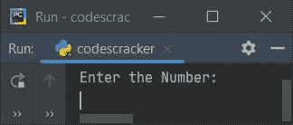
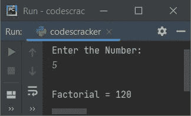
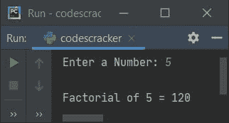

# Python 程序：求一个数的阶乘

> 原文：<https://codescracker.com/python/program/python-program-find-factorial-of-number.htm>

在本文中，我用 Python 创建了一些程序，这些程序在运行时由用户查找并打印给定数字的阶乘。以下是使用的方法列表:

*   使用 **while** 循环求一个数的阶乘
*   使用**进行**循环
*   使用用户定义的函数
*   使用递归
*   使用类

在创建这些程序之前，让我们提醒一下阶乘公式，那就是:

```
n! = (n)*(n-1)*(n-2)*...*3*2*1
```

这里 **n** 表示阶乘要寻找的数。**！**(感叹号)表示 阶乘。所以 **n！**可称为 **n 阶乘**。比如 **5！**可以计算为:

```
5! = 5*4*3*2*1
   = 120
```

## 使用 while 循环查找阶乘

要在 Python 中查找任意数字的阶乘，您必须要求用户输入该数字，然后按照上面给出的公式查找并打印其阶乘，如下面给出的程序所示。

问题是，**写一个 Python 程序，用 while 循环**求给定数字的阶乘。以下是它的答案:

```
print("Enter the Number: ")
num = int(input())

fact = 1
i = 1
while i<=num:
    fact = fact*i
    i = i+1

print("\nFactorial =", fact)
```

下面是这个 Python 程序产生的初始输出:



现在提供输入，比如说 **5** 作为数字，按`ENTER`键找到它的阶乘，如下图所示:



用户输入 **5** 的上述程序的试运行如下:

*   初始值， **num=5** (用户输入)， **fact=1** ， **i=1**
*   现在开始执行**而**循环
*   也就是说，条件 **i < =num** 或 **1 < =5** 评估为真，因此程序流程进入循环内 (在其主体内)
*   在循环内部，**事实*i** 或 **1*1** 或 **1** 被初始化为**事实**。并且 **I**的值增加 1。所以 **i=2**
*   条件 **i < =num** 或 **2 < =5** 再次评估为真，因此**事实*i** 或 **1 * 2**或 **2** 再次被初始化为**事实**。所以**事实=2**
*   并且 **i+1** 或 **2+1** 或 **3** 被初始化为 **i** 。所以 **i=3**
*   再次，条件， **i < =num** 或 **3 < =5** 评估为真，因此程序流再次进入循环内部 并执行其两条语句。这个过程一直持续到条件评估为假
*   这样，在退出循环后，变量 **fact** 保存存储在 **num** 变量中的 数的阶乘值
*   所以只需将事实的值打印为给定数字的阶乘

## 使用 for 循环查找阶乘

该程序与前一个程序做同样的工作，但是在时使用**代替**进行**循环。 **try-except** 是本程序中使用的 ，用于处理用户输入的无效输入。而 **end** 用来跳过插入自动换行符。**

```
print("Enter a Number: ", end="")
try:
    num = int(input())
    fact = 1
    for i in range(1, num+1):
        fact = fact*i
    print("\nFactorial of", num, "=", fact)
except ValueError:
    print("\nInvalid Input!")
```

下面是它的示例运行，用户输入与前面的程序相同:



在上面的程序中，下面的代码:

```
for i in range(1, num+1):
```

用于执行以下语句:

```
fact = fact*i
```

**num** 值为 **i** 从 1 到 **num** 值的次数。

## 用函数求阶乘

这个程序是使用名为 **findFact()** 的用户定义函数创建的。这个函数接收一个值作为它的 参数，然后查找并返回它的阶乘。

```
def findFact(n):
    f = 1
    for i in range(1, n+1):
        f = f*i
    return f

print("Enter a Number: ", end="")
try:
    num = int(input())
    fact = findFact(num)
    print("\nFactorial of", num, "=", fact)
except ValueError:
    print("\nInvalid Input!")
```

这个程序产生与前一个程序相同的输出:

## 使用递归查找阶乘

下面的程序是使用名为 **findFact()** 的递归函数创建的。这个函数调用自己，直到 的参数值等于 **1** 。

```
def findFact(n):
    if n==1:
        return n
    else:
        return n*findFact(n-1)

print("Enter a Number: ", end="")
try:
    num = int(input())
    fact = findFact(num)
    print("\nFactorial of", num, "=", fact)
except ValueError:
    print("\nInvalid Input!")
```

## 使用类查找阶乘

这是最后一个查找并打印用户输入的数字的阶乘的程序，使用名为 **CodesCracker** 的类创建。这个类的一个 对象 **ob** 被创建来使用**点(.)**操作员:

```
class CodesCracker:
    def findFact(self, n):
        f = 1
        for i in range(1, n + 1):
            f = f * i
        return f

print("Enter a Number: ", end="")
num = int(input())

ob = CodesCracker()
print("\nFactorial of", num, "=", ob.findFact(num))
```

#### 其他语言的相同程序

*   [Java 寻找数字的阶乘](/java/program/java-program-find-factorial.htm)
*   [C 求数字](/c/program/c-program-find-factorial.htm)的阶乘
*   [C++求数字](/cpp/program/cpp-program-find-factorial.htm)的阶乘

[Python 在线测试](/exam/showtest.php?subid=10)

* * *

* * *