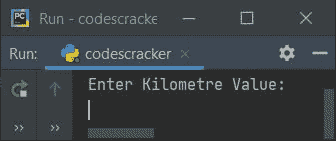
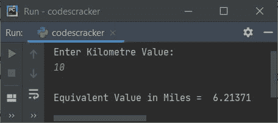
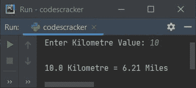

# Python 程序：将公里转换成英里

> 原文：<https://codescracker.com/python/program/python-program-convert-kilometres-to-miles.htm>

在本文中，我们用 Python 创建了一些程序，将用户在运行时输入的公里值转换为以英里为单位的等值。以下是程序列表:

*   公里到英里无功能
*   使用功能
*   使用类

在创建这些程序之前，让我们看看用于转换的公式。

### 公里到英里公式

公里到英里的公式是:

```
M = K * (0.621371)
```

这里的 **M** 表示以**英里**为单位的数值， **K** 表示以**公里**为单位的数值。

## 公里到英里无功能

要在 Python 中将千米转换为英里，您必须要求用户输入以千米为单位的距离值，然后使用上面的公式将该距离转换为英里，如下面给出的程序所示:

```
print("Enter Kilometer Value: ")
km = float(input())

miles = km * (0.621371)
print("\nEquivalent Value in Miles = ", miles)
```

下面是这个 Python 程序产生的初始输出:



键入以公里为单位的值，如 **10** ，按`ENTER`键查找并打印以 英里为单位的等值，如下图所示:



#### 先前程序的修改版本

这个程序使用 **end=** 跳过使用 **print()** 的自动换行符的打印。 **str()** 方法 用于将任何类型的值转换为字符串类型。因为 **+** 运算符用于连接相同类型的值。 和 **{:.2f}** 带**格式()**用于打印作为**格式()**、 参数提供的变量值，最多两位小数。

```
print("Enter Kilometer Value: ", end="")
km = float(input())

miles = km * (0.621371)
print("\n" + str(km) + " Kilometer = " + "{:.2f}".format(miles) + " Miles")
```

这是使用相同用户的示例运行，即从上一个程序的示例运行开始的 **10** :



## 使用函数将公里换算成英里

这个程序是使用名为 **KiloToMile()** 的用户定义函数创建的。该函数将值 (千米)作为其参数，并返回以英里为单位的等值。

```
def KiloToMile(k):
    return k * 0.621371

print("Enter Kilometer Value: ", end="")
km = float(input())

m = KiloToMile(km)
print("\n" + str(km) + " Kilometer = " + "{:.2f}".format(m) + " Miles")
```

## 使用等级的公里到英里

这个程序使用类和对象，以及 Python 面向对象的特性来完成与前一个程序相同的工作。

```
class CodesCracker:
    def KiloToMile(self, k):
        return k * 0.621371

print("Enter Kilometer Value: ", end="")
km = float(input())

ob = CodesCracker()
m = ob.KiloToMile(km)
print("\n" + str(km) + " Kilometer = " + "{:.2f}".format(m) + " Miles")
```

在上面的程序中，名为 **ob** 的对象被创建为 **CodesCracker** 的类，以使用**点(.)**运算符。

[Python 在线测试](/exam/showtest.php?subid=10)

* * *

* * *