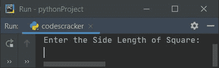
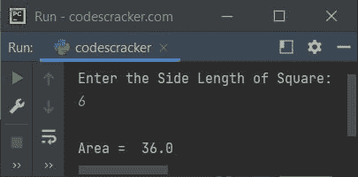
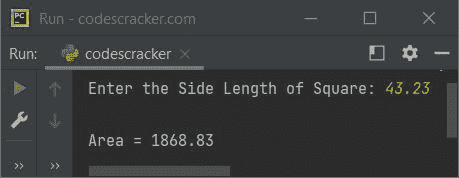

# 求正方形面积的 Python 程序

> 原文：<https://codescracker.com/python/program/python-program-calculate-area-of-square.htm>

创建这篇文章是为了介绍 Python 中的一些程序，根据用户在运行时输入的边长来查找并打印正方形的面积。以下是程序列表:

*   求没有函数的正方形的面积
*   使用用户自定义函数求正方形的面积
*   使用类和对象

### 求正方形面积的公式

要计算正方形的面积，请使用:

```
area = len2
     = len*len
```

这里**面积**表示到*的面积值*，**长度**表示到*的正方形长度值*

## 求正方形的面积

要在 Python 中找到一个正方形的面积，你必须要求用户输入边长。现在使用公式查找并打印面积值，如下面给出的程序所示:

```
print("Enter the Side Length of Square: ")
l = float(input())
a = l*l
print("\nArea = ", a)
```

以下是该程序产生的初始输出:



现在提供输入，比如说 **6** 作为正方形的边长，根据给定的边长值 查找并打印其面积，如下图所示:



## 用函数求正方形的面积

这个程序是使用名为 **areaOfSquare()** 的用户定义函数创建的。该函数以边长 为参数，返回面积值。这个函数的返回值被初始化为 **a** 。现在将 **a** 的值 打印为输出。就是这样:

```
def areaOfSquare(s):
    return s*s

print("Enter the Side Length of Square: ", end="")
l = float(input())
a = areaOfSquare(l)
print("\nArea = {:.2f}".format(a))
```

以下是用户输入的运行示例， **43.23** 为正方形的边长:



## 用类求正方形的面积

这是最后一个使用类和对象(Python 的一个面向对象的特性)查找正方形面积的程序。该程序与使用函数创建的程序没有什么相似之处。唯一的区别是，我们必须通过**点(.)**操作员。

**注意-** 在使用一个对象访问一个类的任何成员函数之前，比如说 **obj** ，必须给它分配 类的属性。因此，通过语句， **obj = CodesCracker()** ，我们已经完成了工作。

```
class CodesCracker:
    def areaOfSquare(self, s):
        return s*s

print("Enter the Side Length of Square: ", end="")
l = float(input())

obj = CodesCracker()
a = obj.areaOfSquare(l)

print("\nArea = {:.2f}".format(a))
```

这个程序产生与前一个程序相同的输出。

#### 其他语言的相同程序

*   [Java 计算正方形的面积](/java/program/java-program-calculate-area-perimeter.htm)
*   [C 计算正方形的面积](/c/program/c-program-calculate-area-perimeter.htm)
*   [C++计算正方形的面积](/cpp/program/cpp-program-calculate-area-perimeter.htm)

[Python 在线测试](/exam/showtest.php?subid=10)

* * *

* * *