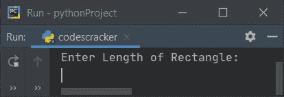
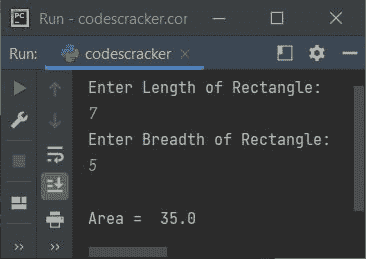
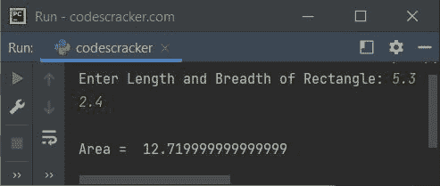
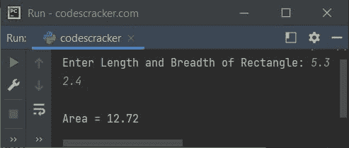

# Python 程序：求矩形面积

> 原文：<https://codescracker.com/python/program/python-program-calculate-area-of-rectangle.htm>

在本文中，我们用 Python 创建了一些程序，根据用户输入的矩形的长度和底边来查找和打印矩形的面积。以下是程序列表:

*   求无函数矩形的面积
*   使用用户自定义函数求矩形面积
*   使用类和对象

### 求矩形面积的公式

要计算矩形的面积，请使用:

```
area = len*bre
```

这里**面积**表示到*面积值* , **长度**表示到*长度值*,**bre**表示矩形的 到*宽度值*。

## 求矩形的面积

要在 Python 中计算矩形的面积，必须要求用户输入矩形的长和宽的值。然后应用该公式，并按照下面给出的程序找到它的面积:

```
print("Enter Length of Rectangle: ")
l = float(input())
print("Enter Breadth of Rectangle: ")
b = float(input())
a = l*b
print("\nArea = ", a)
```

下面是它的运行示例:



现在输入一个矩形的长度和宽度，比如说 **7** 为长度， **5** 为宽度，按 `ENTER`键查找并打印面积值，如下图所示:



## 用函数求矩形的面积

这个程序做的工作和前一个程序一样。但是这个程序使用了一个用户自定义函数 **areaOfRect()** 来求矩形的面积值。

该函数接受两个参数，并返回其乘积。因此，我们将长度(l)和宽度(b)作为它的参数。 **l** 和 **b** 的值被复制到 **x** 和 T6】y 并且 **x*y** 被该函数返回，并赋值给 **a** ，即给定矩形的面积值:

```
def areaOfRect(x, y):
    return x*y

print("Enter Length and Breadth of Rectangle: ", end="")
l = float(input())
b = float(input())
a = areaOfRect(l, b)
print("\nArea = ", a)
```

以下是其示例运行，用户输入 **5.3** 作为矩形的长度， **2.4** 作为矩形的宽度:



要打印最多两位小数的面积值，请替换以下语句:

```
print("\nArea = ", a)
```

下面给出了声明:

```
print("\nArea = {:.2f}".format(a))
```

现在输出看起来像这样:



## 用类求矩形的面积

这是本文的最后一个程序。这个程序使用类和对象，Python 的一个面向对象的特性，来查找和打印矩形的面积。

```
class CodesCracker:
    def areaOfRect(self, x, y):
        return x*y

print("Enter Length and Breadth of Rectangle: ", end="")
l = float(input())
b = float(input())

cobj = CodesCracker()
a = cobj.areaOfRect(l, b)

print("\nArea = {:.2f}".format(a))
```

这个程序产生与前一个程序相似的输出，其值最多只有两位小数。

我们已经使用下面的 语句将类 **CodesCracker** 的所有属性分配给名为 **cobj** 的对象:

```
cobj = CodesCracker()
```

现在通过这个对象，我们可以使用**点(.)** 符。其余的事情就像一个正常的功能。

#### 其他语言的相同程序

*   [Java 计算矩形的面积](/java/program/java-program-calculate-area-perimeter.htm)
*   [C 计算矩形的面积](/c/program/c-program-calculate-area-perimeter.htm)
*   [C++ 计算矩形的面积](/cpp/program/cpp-program-calculate-area-perimeter.htm)

[Python 在线测试](/exam/showtest.php?subid=10)

* * *

* * *