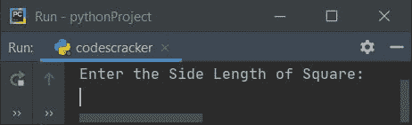

# Python 程序：求正方形周长

> 原文：<https://codescracker.com/python/program/python-program-calculate-perimeter-of-square.htm>

在本文中，我们用 Python 创建了一些程序，根据用户在运行时输入的边长来查找并打印正方形的周长。以下是程序列表:

*   求无函数正方形的周长
*   使用用户定义的函数
*   使用类

在开始这些程序之前，让我们先提醒一下这里使用的公式。

### 求正方形周长的公式

要计算任何正方形的周长，请使用以下公式:

```
per = 4*side
```

这里的**表示周长，**边**表示正方形的边长。**

也就是说，正如你们都知道的，一个正方形的周长可以通过将它的四条边相加，或者将任何一条边乘以 4 来计算。

因此，如果一个正方形的边长为 2 米，那么它的周长将是 **2+2+2+2** 或 **4*2** ， 等于 **16** 。

## 求无函数正方形的周长

要在 Python 中计算正方形的周长，您必须要求用户输入正方形的边长，然后使用上面的公式计算周长，如下面给出的程序所示:

```
print("Enter the Side Length of Square: ")
s = int(input())
p = 4*s
print("\nPerimeter = ", p)
```

下面给出的快照显示了这个 Python 程序产生的初始输出:



现在输入比如说 **5** 作为正方形的边长，按`ENTER`键查找并 打印周长值，如下图所示:


#### 先前程序的修改版本

在这个程序中， **end=** 用于跳过使用 **print()** 的自动换行符。而 **{:.2f}** 是 与 **format()** 一起使用，打印 **p** 的值，最多只保留两位小数。

```
print("Enter the Side Length: ", end="")
s = float(input())
p = 4*s
print("\nPerimeter = {:.2f}".format(p))
```

以下是用户输入 3.4**作为正方形边长的示例:**


## 用函数求正方形的周长

这个程序做的工作和前面的一样，但是使用了名为 **findPerSqr()** 的用户定义函数。这个 函数接收正方形任意边的长度作为参数，并返回面积值。

```
def findPerSqr(x):
    return 4*x

print("Enter the Side Length: ", end="")
s = float(input())

p = findPerSqr(s)
print("\nPerimeter = {:.2f}".format(p))
```

这个程序产生与前一个程序相同的输出。

## 用类求正方形的周长

这是本文的最后一个程序，使用 Python 的面向对象特性**类**创建。 类的成员函数通过其对象来访问。因此，我们创建了一个名为 **ob** 和 的对象，通过这个对象，我们访问了类 **CodesCracker** 的名为 **findPerSqr()** 的成员函数。

```
class CodesCracker:
    def findPerSqr(self, x):
        return 4*x

print("Enter the Side Length: ", end="")
s = float(input())

ob = CodesCracker()
p = ob.findPerSqr(s)
print("\nPerimeter = {:.2f}".format(p))
```

#### 其他语言的相同程序

*   [Java 计算正方形的周长](/java/program/java-program-calculate-area-perimeter.htm)
*   [C 计算正方形的周长](/c/program/c-program-calculate-area-perimeter.htm)
*   [C++计算正方形的周长](/cpp/program/cpp-program-calculate-area-perimeter.htm)

[Python 在线测试](/exam/showtest.php?subid=10)

* * *

* * *