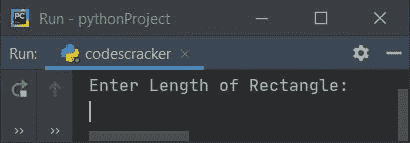
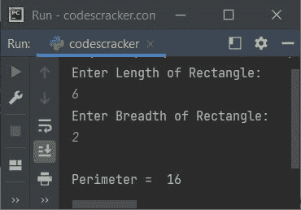
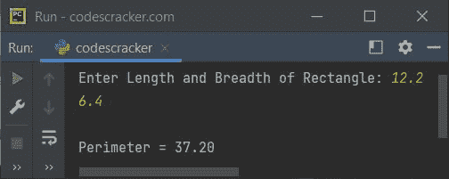

# Python 程序：求矩形周长

> 原文：<https://codescracker.com/python/program/python-program-calculate-perimeter-of-rectangle.htm>

在本文中，我们用 Python 创建了一些程序，根据用户在运行时输入的长度和宽度来查找和打印矩形的周长。以下是完成该任务的方法列表:

*   不使用函数求矩形的周长
*   使用用户定义的函数
*   使用类和对象

在创建这些程序之前，让我提醒您这里使用的公式。

### 求矩形周长的公式

要计算矩形的周长值，请使用以下公式:

```
per = len+bre+len+bre
    = (2*len)+(2*bre)
    = 2*(len+bre)
```

此处**按**表示*周长*，**长度**表示矩形长度， **bre** 表示矩形宽度 。你可以使用这三个公式中的任何一个。第三个更好搭配。

## 不用函数求矩形的周长

要在 Python 中计算矩形的周长，您必须要求用户输入您想要找出其周长的矩形的长和宽的值。问题是，**写一个 Python 程序求 矩形的周长。**下面是它的回答:

```
print("Enter Length of Rectangle: ")
l = int(input())
print("Enter Breadth of Rectangle: ")
b = int(input())
p = 2*(l+b)
print("\nPerimeter = ", p)
```

下面是这个 Python 程序产生的初始输出:



现在输入长度为 **6** ，宽度为 **2** ，按`ENTER`键查找并打印 周长，如下图所示:



#### 先前程序的修改版本

这个程序使用 **end=** 来跳过使用 **print()** 自动打印换行符。 **{:.2f}** 用于打印 **format()** 方法中的值，最多两位小数。

```
print("Enter Length and Breadth of Rectangle: ", end="")
l = float(input())
b = float(input())
print("\nPerimeter = {:.2f}".format(2*(l+b)))
```

以下是用户输入的示例运行，矩形的长度为 **12.2** ，宽度为 **6.4** :



## 用函数求矩形的周长

这个程序使用一个名为 **findPeri()** 的用户自定义函数来完成与上一个程序相同的任务。 该函数有两个参数。第一个参数是指矩形的长度，第二个参数是指矩形的宽度。 该函数返回周长值。因此，周长值被初始化为 **res** 并且 的值被打印为矩形的周长。就是这样。

```
def findPeri(a, b):
    p = 2*(a+b)
    return p

print("Enter Length and Breadth of Rectangle: ", end="")
l = float(input())
b = float(input())

res = findPeri(l, b)
print("\nPerimeter = {:.2f}".format(res))
```

这个程序产生与前一个程序完全相同的输出。

## 用类求矩形的周长

这是最后一个使用类和对象(Python 的一个面向对象的特性)查找矩形周长的程序。

```
class CodesCracker:
    def findPeri(self, a, b):
        p = 2*(a+b)
        return p

print("Enter Length and Breadth of Rectangle: ", end="")
l = float(input())
b = float(input())

ob = CodesCracker()
res = ob.findPeri(l, b)
print("\nPerimeter = {:.2f}".format(res))
```

在上面的程序中，一个对象 **ob** 被创建为类 **CodesCracker()** 。这样它就可以用来访问 类的成员函数，比如说 **findPeri()** 使用**点(。)**运算符。其余的事情类似于一个正常的功能。

#### 其他语言的相同程序

*   [Java 计算矩形的周长](/java/program/java-program-calculate-area-perimeter.htm)
*   [C 计算矩形的周长](/c/program/c-program-calculate-area-perimeter.htm)
*   [C++计算矩形的周长](/cpp/program/cpp-program-calculate-area-perimeter.htm)

[Python 在线测试](/exam/showtest.php?subid=10)

* * *

* * *