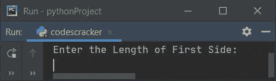
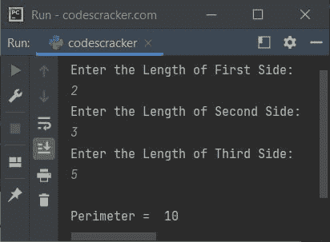
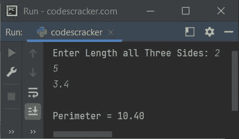
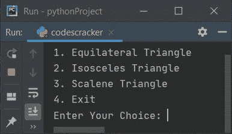
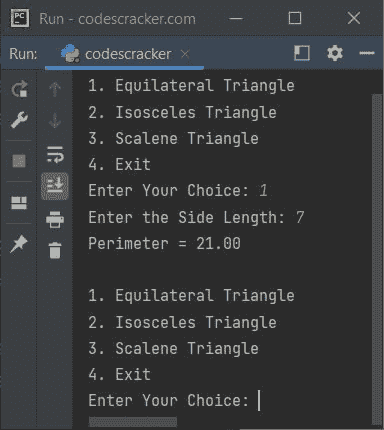

# Python 程序：求三角形周长

> 原文：<https://codescracker.com/python/program/python-program-calculate-perimeter-of-triangle.htm>

在本文中，我们用 Python 创建了一些程序，根据输入值(如所有三条边的长度、底边的长度和高度等)来查找和打印三角形的周长值。由用户在运行时执行。以下是程序列表:

*   求三边三角形的周长
*   求所有类型三角形的周长
*   用函数求三角形的周长
*   使用类

在开始这些程序之前，如果你不知道用于求三角形周长的公式，参考[三角形周长公式](/nonprog/area-perimeter-of-triangle.htm)来得到所有需要的东西。

**注-** 三角形的周长可以计算为其所有三条边的总和，即 **第一条边的长度+第二条边的长度+第三条边的长度**。

## 求三边三角形的周长

这个 Python 程序要求用户输入三角形所有三条边的长度，以找到该三角形的周长值。问题是，**写一个 Python 程序，求并打印三角形的周长。**下面是它的回答:

```
print("Enter the Length of First Side: ")
a = int(input())
print("Enter the Length of Second Side: ")
b = int(input())
print("Enter the Length of Third Side: ")
c = int(input())

p = a+b+c
print("\nPerimeter = ", p)
```

下面是它的运行示例:



以上是最初的输出。现在依次输入所有三条边的长度，说 **2** 为第一条边的长度， T3】3 为第二条边的长度， **5** 为第三条边的长度。按`ENTER`键查找并打印 周长值，如下图所示:



#### 先前程序的修改版本

在这个程序中，使用带有**格式()**的 **{:.2f}** ，我们将 **p** 的值限制为最多只输出 两位小数。并且使用 **print()** 使用**结束**来跳过自动换行符。

```
print("Enter Length all Three Sides: ", end="")
a = float(input())
b = float(input())
c = float(input())

p = a+b+c
print("\nPerimeter = {:.2f}".format(p))
```

以下是用户输入的示例运行， **2，5，3.4** 作为三角形所有三条边的长度:



#### 先前程序的另一个修改版本

这个程序使用链表来存储三角形所有三条边的长度。其余的事情与前面的程序相似。 **append()** 方法用于将元素追加到列表中。

```
print("Enter Length all Three Sides: ", end="")
TriangleSides = []
p = 0
for i in range(3):
    TriangleSides.append(float(input()))
    p = p+TriangleSides[i]

print("\nPerimeter = {:.2f}".format(p))
```

这个程序产生与前一个程序完全相同的输出。

### 求所有类型三角形的周长

**注-** 根据三角形的边长，三角形有三种类型。分别是，**不等边**、 T4、等腰、**等边**三角形。

```
ch = 1
while ch>=1 and ch<=3:
    print("1\. Equilateral Triangle")
    print("2\. Isosceles Triangle")
    print("3\. Scalene Triangle")
    print("4\. Exit")
    print("Enter Your Choice: ", end="")
    ch = int(input())
    if ch==1:
        print("Enter the Side Length: ", end="")
        s = float(input())
        p = 3*s
        print("Perimeter = {:.2f}\n".format(p))
    elif ch==2:
        print("Enter Length of any one Side from Two Equal Sides: ", end="")
        a = float(input())
        print("Enter Length of Third Side: ", end="")
        b = float(input())
        p = (2*a)+b
        print("Perimeter = {:.2f}\n".format(p))
    elif ch==3:
        print("Enter Length of all Three Sides: ", end="")
        a = []
        p = 0
        for i in range(3):
            a.append(float(input()))
            p = p + a[i]
        print("Perimeter = {:.2f}\n".format(p))
    elif ch!=4:
        print("Invalid Input!")
        print("Try again...\n")
        ch = 1
```

下面是它的初始输出:



现在输入 **1** 作为选择，如果你想找到等边三角形的周长。以下是用户选择 为 **1** 和 **7** 为边长的示例运行:



这个过程继续，直到你键入 **4** 作为退出循环的选择。

## 用函数求三角形的周长

这个程序是使用名为 **perOfTriangle()** 的用户自定义函数创建的，该函数根据用户输入的所有三条边的长度返回三角形 的周长值。

```
def perOfTriangle(x, y, z):
    return x+y+z

print("Enter Length all Three Sides: ", end="")
a = float(input())
b = float(input())
c = float(input())

p = perOfTriangle(a, b, c)
print("\nPerimeter = {:.2f}".format(p))
```

## 用类求三角形的周长

这是本文的最后一个程序，使用**类**创建，这是 Python 的一个面向对象的特性，用于 完成与前一个程序相同的工作。让我们来看看这个程序:

```
class CodesCracker:
    def perOfTriangle(self, x, y, z):
        return x+y+z

print("Enter Length all Three Sides: ", end="")
a = float(input())
b = float(input())
c = float(input())

ob = CodesCracker()
p = ob.perOfTriangle(a, b, c)
print("\nPerimeter = {:.2f}".format(p))
```

一个名为 **ob** 的对象被创建为 **CodesCracker** 类的类型，通过 **点(。)**运算符。其余的事情和正常功能差不多。

[Python 在线测试](/exam/showtest.php?subid=10)

* * *

* * *