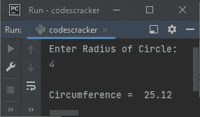

# Python 程序：计算圆的周长

> 原文：<https://codescracker.com/python/program/python-program-calculate-circumference-of-circle.htm>

在本文中，我们用 Python 创建了一些程序，根据用户在运行时输入的半径值来查找和打印圆的周长值。以下是程序列表:

*   求没有函数的圆的周长
*   使用用户定义的函数
*   使用类和对象

在创建这些程序之前，让我提醒您这里使用的公式。

### 求圆周的公式

要根据半径计算圆的周长，请使用以下公式:

```
circum = 2πr
```

这里 **circum** 表示圆周值， **π** 表示 **3.14** ， **r** 表示圆的半径。

## 计算圆的周长

要用 Python 计算一个圆的周长，你必须让用户输入半径，然后找到并打印周长，如下面给出的程序所示。问题是，**写一个 Python 程序，从用户那里接收 半径，打印圆的周长**。以下是它的答案:

```
print("Enter Radius of Circle: ")
r = float(input())
pie = 3.14
c = 2 * pie * r
print("\nCircumference = ", c)
```

以下是该程序产生的初始输出:


现在输入圆的半径值，比如说 **4** ，按`ENTER`键找到并打印周长 ，如下图所示:



## 用函数求圆周

这个程序使用一个名为**findcurp()**的用户自定义函数，根据作为参数传递的值(半径)来查找并返回周长值 。

```
def findCircum(rad):
    return 2 * 3.14 * rad

print("Enter Radius of Circle: ", end="")
r = float(input())

c = findCircum(r)
print("\nCircumference = {:.2f}".format(c))
```

下面是它在用户输入 **2.4** 下的运行示例:


**{:.2f}** 用于将 **c** 的值格式化到小数点后两位，使用 **format()** 方法。

## 用类求圆周

这是最后一个使用类和对象(Python 的一个面向对象的特性)寻找圆周的程序。

```
class CodesCracker:
    def findCircum(self, rad):
        return 2 * 3.14 * rad

print("Enter Radius of Circle: ", end="")
r = float(input())

ob = CodesCracker()
c = ob.findCircum(r)
print("\nCircumference = {:.2f}".format(c))
```

这个程序产生与前一个程序相同的输出。在上面的程序中，一个名为 **ob** 的对象被创建为 **CodesCracker** 类的 。所以这个对象可以用来调用同一个类的任何成员函数(**findcurp()**) 使用**点(。)**运算符。

#### 其他语言的相同程序

*   [Java 计算圆周](/java/program/java-program-calculate-area-circumference.htm)
*   [C 计算圆周](/c/program/c-program-calculate-area-circumference.htm)
*   [C++ 计算圆周](/cpp/program/cpp-program-calculate-area-circumference.htm)

[Python 在线测试](/exam/showtest.php?subid=10)

* * *

* * *