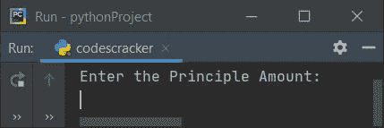
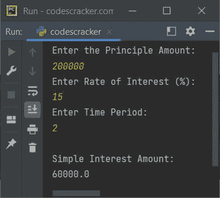
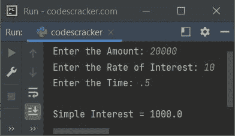

# Python 程序：计算单利

> 原文：<https://codescracker.com/python/program/python-calculate-simple-interest.htm>

在本文中，您将学习并获得 Python 代码，根据用户输入计算并打印单利。以下是使用 Python 的单利程序列表:

*   不使用函数计算单利
*   使用用户定义的函数

但是在浏览这些程序之前，让我们先了解一下用于计算单利的公式。

### 简单利息公式

要计算单利，请使用下面给出的公式:

```
SI = (P*R*T)/100
```

这里 **SI** 表示单利， **P** 表示本金金额(存/贷款金额)， **R** 表示利率(%),**T**表示时间(年)。如果贷款或投资 的期限是以月为单位，那么用 12 乘以 **100** 。也就是说，我们必须输入时间 **T** 年。 因此对于 2 个月，年份将是 **2/12** 或 **1/6** 或 **0.166666666**

## 在 Python 中计算单利

这个程序根据用户在运行时提供本金、利率和年份来计算和打印单利。问题是，**用 Python 写个程序来计算单利**。以下是它的答案:

```
print("Enter the Principle Amount: ")
p = int(input())
print("Enter Rate of Interest (%): ")
r = float(input())
print("Enter Time Period: ")
t = float(input())
si = (p*r*t)/100
print("\nSimple Interest Amount: ")
print(si)
```

下面是它的运行示例:



现在供给输入说 **200000** 为本金， **15** 为利率， **2** 为年。 提供所有输入后，按`ENTER`键查找并打印单利值，如下图所示:



## 使用函数计算单利

这个程序的工作与前面的程序相同，但是使用了一个名为 **calculateSI()** 的用户定义函数。 该函数接受三个参数并返回 **SI** 。因此，我们将用户的所有三个输入作为参数 传递，返回值被分配给 **si** 。在输出上打印出 **si** ，这是简单有趣的答案。

```
def calculateSI(a, b, c):
    return (a*b*c)/100

print(end="Enter the Amount: ")
p = int(input())
print(end="Enter the Rate of Interest: ")
r = float(input())
print(end="Enter the Time: ")
t = float(input())
si = calculateSI(p, r, t)
print("\nSimple Interest = " + str(si))
```

以下是用户输入的示例运行，金额为 **20000** ，利率为 **10** ，时间为 **.5** (1/2 年或 6 个月):



[Python 在线测试](/exam/showtest.php?subid=10)

* * *

* * *