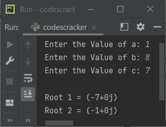
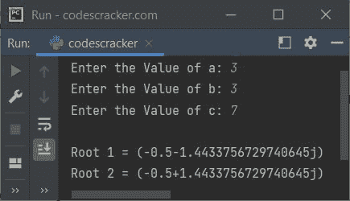
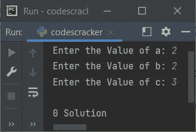

# Python 程序：求解二次方程

> 原文：<https://codescracker.com/python/program/python-program-solve-quadratic-equation.htm>

创建这篇文章是为了介绍一个用 Python 编写的程序，该程序可以找到并打印一个二次方程的解或根。

求一个二次方程 **ax <sup>2</sup> + bx + c = 0** 的根，我们需要先计算方程的 判别式。下面是求判别式的公式:

```
D = b2 - 4ac
```

其中 **D** 指判别式。找到判别式后，根可以计算如下:

```
R = (-b ± D ** 0.5) / (2*a)
```

## Python 求解二次方程

问题是，*写一个 Python 程序，解一个给定的二次方程。*下面给出的节目是它的 回答:

```
import cmath

print("Enter the Value of a: ", end="")
a = int(input())
print("Enter the Value of b: ", end="")
b = int(input())
print("Enter the Value of c: ", end="")
c = int(input())

discriminant = (b**2) - (4*a*c)
solutionOne = (-b-cmath.sqrt(discriminant))/(2*a)
solutionTwo = (-b+cmath.sqrt(discriminant))/(2*a)

print("\nRoot 1 =", solutionOne)
print("Root 2 =", solutionTwo)
```

下面给出的快照显示了上述 Python 程序的示例运行，用户输入 **1** 、 **8** 和 、 **7** 作为来自二次方程 **ax <sup>2</sup> + bx + c** 的 **a** 、 **b** 和 **c** 的值



下面是另一个示例运行，用户输入 **3** 、 **3** 、 **7** 作为 **a** 、 **b** 和 **c** 的值



## Python 找到一个二次方程的多个解

如果判别式的值大于 2，则二次方程有 2 个解。如果判别式的值等于 0，那么二次方程只有 1 个解。而如果判别式的值小于 2，就意味着二次方程有 0 解。

```
print("Enter the Value of a: ", end="")
a = int(input())
print("Enter the Value of b: ", end="")
b = int(input())
print("Enter the Value of c: ", end="")
c = int(input())

discriminant = (b**2) - (4*a*c)
if discriminant > 2:
    print("\n2 Solutions")
elif discriminant == 0:
    print("\n1 Solution")
else:
    print("\n0 Solution")
```

上面的 Python 程序的示例运行使用用户输入的 **2** 、 **2** 、 **3** 作为 a、b 和 c 的值，如下面给出的快照中的 所示:



[Python 在线测试](/exam/showtest.php?subid=10)

* * *

* * *