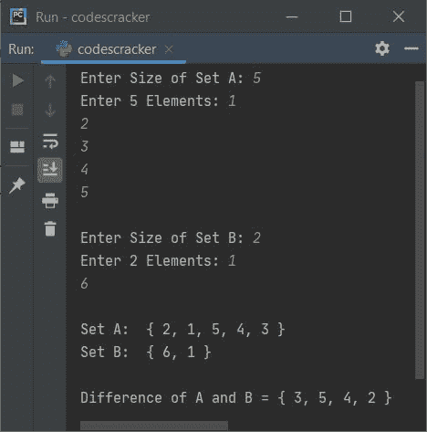

# Python 程序：求集合的并集交集对称差

> 原文：<https://codescracker.com/python/program/python-program-find-different-set-of-operations.htm>

创建这篇文章是为了涵盖 Python 中的一些程序，这些程序查找并打印用户在运行时输入的两个集合的并、交、差、对称差。以下是程序列表:

*   寻找集合的并集
*   寻找集合的交集
*   寻找集合的差异
*   求集合的对称差

## 寻找集合的并集

两个集合(A 和 B)的并集可以计算为，两个集合中的所有元素都不重复任何元素。

```
print("Enter 5 Elements for Set A: ")
setOne = []
for i in range(5):
    setOne.append(input())
setOne = set(setOne)

print("Enter 5 Elements for Set B: ")
setTwo = []
for i in range(5):
    setTwo.append(input())
setTwo = set(setTwo)

print("\nUnion of Two Sets A and B are:")
print(setOne | setTwo)
```

下面是这个 Python 程序产生的初始输出:


现在为第一组(A 组)提供任意五个元素，比如说 **1，2，3，4，5** ，然后为第二组(B 组)再提供五个元素，比如说 6，2，7，4，8 。然后，程序生成显示两个给定集合的并集的输出，如下图所示:


#### 先前程序的修改版本

这是前一个程序的修改版本。这个程序允许用户定义两个集合的大小及其元素。 **end=** 跳过插入自动换行符。

```
print("Enter Size of Set A: ", end="")
try:
    tota = int(input())
    print("Enter", tota, "Elements: ", end="")
    numsOne = []
    for i in range(tota):
        numsOne.append(input())
    setOne = set(numsOne)

    print("\nEnter Size of Set B: ", end="")
    try:
        totb = int(input())
        print("Enter", totb, "Elements: ", end="")
        numsTwo = []
        for i in range(totb):
            numsTwo.append(input())
        setTwo = set(numsTwo)

        unionSet = setOne | setTwo
        print("\nSet A: ", "{", ', '.join(setOne), "}")
        print("Set B: ", "{", ', '.join(setTwo), "}")
        print("\nUnion of A and B =", "{", ', '.join(unionSet), "}")
    except ValueError:
        print("\nInvalid Input!")
except ValueError:
    print("\nInvalid Input!")
```

下面是它的示例运行，用户输入 **3** 作为第一组(组 A)的大小，然后 **1，2，3** 作为三个元素， 和 **4** 作为第二组(组 B)的大小，然后 **1，2，3，4** 作为它的四个元素:


**注意-** 上述程序中的 **join()** 在某种程度上是用来从集合的所有元素中移除 **'** 。

## 寻找集合的交集

两个集合(A 和 B)的交集可以计算为，来自两个集合的所有公共元素。

创建一个 Python 程序，在运行时查找用户给定集合的交集，就像前面查找并集的程序一样。遵循前一个程序，只有两个替换。也就是说，首先替换下面的语句(来自上一个程序):

```
unionSet = setOne | setTwo
```

下面给出了声明:

```
intersectionSet = setOne & setTwo
```

然后替换下面的(第二)语句(来自上面的程序):

```
print("\nUnion of A and B =", "{", ', '.join(unionSet), "}")
```

下面给出了声明:

```
print("\nIntersection of A and B =", "{", ', '.join(intersectionSet), "}")
```

下面是它的示例运行，用户输入与之前程序的示例运行相同:


## 寻找集合的差异

两个集合(A 和 B)的差可以被计算为，所有那些出现在集合 A 中而不在集合 B 中的元素

要找出 Python 中集合的差异，可以像前面一样做类似的事情。也就是说，将 set 程序的 *union 的修改版本中给出的程序中的以下两条语句进行修改。也就是说，替换以下语句:*

```
unionSet = setOne | setTwo
```

使用:

```
diffSet = setOne - setTwo
```

然后替换第二个语句，即:

```
print("\nUnion of A and B =", "{", ', '.join(unionSet), "}")
```

使用:

```
print("\nDifference of A and B =", "{", ', '.join(diffSet), "}")
```

这是用户输入的示例， **5** 作为第一组的大小，然后 **1，2，3，4，5** 作为其五个元素 和 **2** 作为第二组的大小，然后 **1，6** 作为其两个元素:



## 求集合的对称差

两个集合(A 和 B)的对称差可以计算为，来自两个集合的所有唯一元素。

像前面一样，在这种情况下，也用下面的两个语句逐一更改这两个语句:

```
symDiffSet = setOne &Hat; setTwo
print("\nSymmetric Difference of A and B =", "{", ', '.join(symDiffSet), "}")
```

下面是它的示例运行，用户输入 **4** 作为集合 A 的大小，然后 **5、6、7、8** 作为它的四个元素， 和 **3** 作为集合 B 的大小，然后 **1、2、7** 作为它的三个元素:


## 在两个集合上找到所有四个操作

这个程序是前面四个程序的组合版本，它查找并打印两个给定集合的所有四个操作。

```
print("Enter Size of Set A: ", end="")
try:
    tota = int(input())
    print("Enter", tota, "Elements: ", end="")
    numsOne = []
    for i in range(tota):
        numsOne.append(input())
    setOne = set(numsOne)

    print("\nEnter Size of Set B: ", end="")
    try:
        totb = int(input())
        print("Enter", totb, "Elements: ", end="")
        numsTwo = []
        for i in range(totb):
            numsTwo.append(input())
        setTwo = set(numsTwo)

        unionSet = setOne | setTwo
        intersectionSet = setOne amp; setTwo
        diffSet = setOne - setTwo
        symDiffSet = setOne &Hat; setTwo
        print("\nSet A: ", "{", ', '.join(setOne), "}")
        print("Set B: ", "{", ', '.join(setTwo), "}")
        print("\nUnion of A and B =", "{", ', '.join(unionSet), "}")
        print("\nIntersection of A and B =", "{", ', '.join(intersectionSet), "}")
        print("\nDifference of A and B =", "{", ', '.join(diffSet), "}")
        print("\nSymmetric Difference of A and B =", "{", ', '.join(symDiffSet), "}")
    except ValueError:
        print("\nInvalid Input!")
except ValueError:
    print("\nInvalid Input!")
```

下面是它的运行示例:


[Python 在线测试](/exam/showtest.php?subid=10)

* * *

* * *