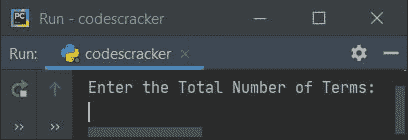
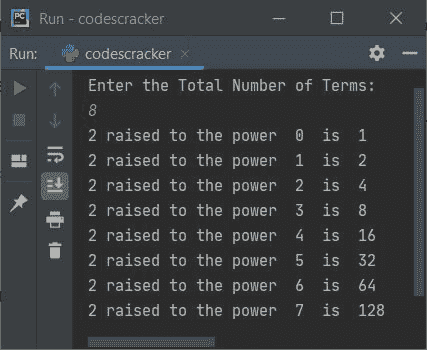
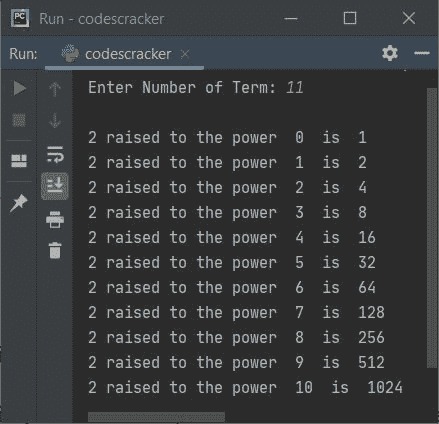

# Python 程序：显示 2 的幂

> 原文：<https://codescracker.com/python/program/python-program-display-powers-of-2.htm>

创建这篇文章是为了介绍 Python 中的一些程序，这些程序在运行时查找并打印用户定义的 2 的任意次方项。以下是使用的方法列表:

*   一个简单的程序，显示 2 的幂直到项。N 的值必须由用户输入
*   使用正常函数显示 2 的幂
*   使用匿名(λ)函数

## 显示 2 的幂，最多 N 项

要在 Python 中显示给定项的 2 的幂，您必须要求用户输入总项数，然后显示从 0 到 **N-1** 的 2 的幂，如下面给出的程序所示:

```
print("Enter the Total Number of Terms: ")
tot = int(input())

for i in range(tot):
    print("2 raised to the power ", i, " is ", 2 ** i)
```

下面是这个 Python 程序产生的初始输出:



现在提供输入，比如说 **8** ，按`ENTER`键查找并打印从 0 开始的 2 到**8**T5 的所有幂项，如下图所示:



**注-**Python 中的 ****** (取幂)运算符用于求幂值。例如**a * * b**T16】评估为**a<sup>b</sup>T9】。所以 **2 ** 3** 返回 **2*2*2** ，即 **8****

如果用户将输入作为 **8** ，那么 8 将被存储在 **tot** 中。所以从上面的程序中，下面的代码(替换了 **tot** 变量的值后):

```
for i in range(8):
```

被创建来执行以下语句(存在于其主体中):

```
print("2 raised to the power ", i, " is ", 2 ** i)
```

八次，其中 **i** 的值从 0 到 7 (8-1)。

## 使用正常函数显示 2 的幂

这个程序做的工作和前面的程序一样，但是使用了一个名为 **MyFun()** 的函数。这个函数 接收一个值作为它的参数，并返回 2 的这个值的幂。

```
def MyFun(x):
    return 2 ** x

print("Enter Number of Term: ", end="")
tot = int(input())

print()
for i in range(tot):
    print("2 raised to the power ", i, " is ", MyFun(i))
```

下面是它的示例运行，使用用户输入的 **11** 作为术语总数:



上面程序中的 **end=** 用于跳过插入自动换行符。

## 使用匿名函数(lambda)显示 2 的幂

这是本文的最后一个程序，使用匿名函数创建。让我们先来看看这个程序:

```
print("Enter Number of Term: ", end="")
tot = int(input())

anoms = lambda x: 2 ** x
print()
for i in range(tot):
    print("2 raised to the power ", i, " is ", anoms(i))
```

这个程序产生与前一个程序相同的输出。在上面的程序中，下面的语句:

```
anoms = lambda x: 2 ** x
```

声明，无论我们稍后将值传递给 **anoms** ，该值都会被复制到 **x** 并且 **2 ** x** 会被返回。即 **anoms(4)** 返回 **2 ** 4** 或 **2 <sup>4</sup> 或 **2*2*2*2** 或 **16** 。**

上述程序也可以这样直接处理:

```
print("Enter Number of Term: ", end="")
tot = int(input())

res = list(map(lambda x: 2 ** x, range(tot)))

print()
for i in range(tot):
    print("2 raised to the power ", i, " is ", res[i])
```

**列表 ()** 用于创建列表。在将 函数应用于给定 iterable 的每一项之后, **map()** 返回结果的迭代器。

[Python 在线测试](/exam/showtest.php?subid=10)

* * *

* * *