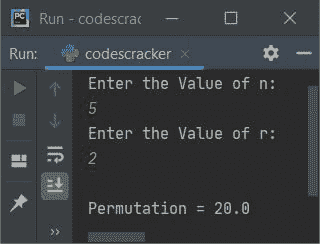

# Python 程序：计算 nCr 和 nPr

> 原文：<https://codescracker.com/python/program/python-program-find-ncr-npr.htm>

本文旨在介绍 Python 中的一些程序，这些程序根据用户在运行时输入的 **n** 和 **r** 的值，查找并打印 **nCr** (组合) 和 **nPr** (排列)的值。以下是节目列表:

*   寻找 nPr(排列)
*   计算 nCr(组合)
*   使用函数查找 nPr 和 nCr

在创建这些程序之前，让我们简单地提醒一下排列组合。

### nPr 和 nCr 公式

**nPr** (排列)公式为:

```
nPr = n!/(n-r)!
```

感叹(！)符号表示阶乘。比如， **5！**可称为 **5 阶乘**，即等于 **120** (5*4*3*2*1)

**nCr** (组合)公式为:

```
nCr = n!/r!(n-r)!
```

**重要**-**nPr**值显示了<u>安排 **r** 事情的方式数**n**T9】</u>

**重要**-**nCr**值显示了从**n**T9】中选择 **r** 事物的<u>数量</u>

## 寻找 nPr(排列)

该程序根据 **n** 和 **r** 的值查找并打印 **nPr** 值。用户必须输入 **n** 和**r**T12】值。问题是，**写个 Python 程序找 nPr** 。以下是它的答案:

```
print("Enter the Value of n: ")
n = int(input())
print("Enter the Value of r: ")
r = int(input())

fact = 1
i = 1
while i<=n:
  fact = i*fact
  i = i+1

numerator = fact          # n!
sub = n - r               # (n-r)
fact = 1
i = 1
while i<=sub:
  fact = i*fact
  i = i+1
denominator = fact        # (n-r)!
perm = numerator/denominator

print("\nPermutation =", perm)
```

下面是它的运行示例:


现在输入如 **5** 作为 **n** 的值，按`ENTER`键，然后输入 **2** 作为 **r** 的值，再次 按`ENTER`键查找并打印 **nPr** 的值(排列)，如下图所示:



在上面的程序中，两个 **while** 循环都用来求阶乘。要了解有关该主题的更多信息，请参考 [寻找一个数字的阶乘](/python/program/python-program-find-factorial-of-number.htm)文章，以获得所需的一切。

#### 先前程序的修改版本

这是前一个程序的修改版本。这个程序使用 **try-except** 处理无效输入。我没有使用 用户定义的代码，而是实现了 **math** 模块中名为 **factorial()** 的预定义函数，以返回作为参数传递给 **math.factorial()** 的数字 的阶乘。 **end** 使用 **print()** 跳过插入自动换行符:

```
import math

print("Enter the Value of n: ", end="")
try:
  n = int(input())
  print("Enter the Value of r: ", end="")
  try:
    r = int(input())

    numerator = math.factorial(n)
    denominator = math.factorial(n-r)
    perm = numerator/denominator

    print("\nPermutation =", perm)
  except ValueError:
    print("\nInvalid Input!")
except ValueError:
  print("\nInvalid Input!")
```

下面是它的示例运行，用户输入 **5** 和 **1** 作为 **n** 和 **r** 的值:


## 计算 nCr(组合)

这个程序的工作方式类似于本文的第一个程序，唯一的不同是，在用于查找 **nCr** 的公式中。

```
print("Enter the Value of n: ", end="")
n = int(input())
print("Enter the Value of r: ", end="")
r = int(input())
fact = i = 1
while i<=n:
  fact = i*fact
  i += 1

numerator = fact
sub = n-r
fact = i = 1

while i<=sub:
  fact = i*fact
  i += 1

denominator = fact
fact = i = 1
while i<=r:
  fact = i*fact
  i += 1

denominator = fact*denominator
comb = numerator/denominator
print("\nCombination (nCr) =", comb)
```

下面是它的示例运行，与前一个程序的示例运行具有相同的用户输入:


## 使用函数查找 nPr 和 nCr

这是最后一个程序，使用一些名为 **fact()** 、 **findperm()** 、 和 **findcomb()** 的用户定义函数创建。 **fact()** 返回作为其参数传递的数字的阶乘值。 **findperm()** 返回 **nPr** 值，而 **findcomb()** 返回 **nCr** 值。

```
def fact(k):
  f = i = 1
  while i<=k:
    f = i*f
    i += 1
  return f

def findperm(x, y):
  num = fact(x)
  den = fact(x - y)
  perm = num / den
  return perm

def findcomb(x, y):
  num = fact(x)
  den = fact(x - y)
  den = fact(y) * den
  comb = num / den
  return comb

print("Enter the Value of n: ", end="")
n = int(input())
print("Enter the Value of r: ", end="")
r = int(input())

print("\nPermutation (nPr) =", findperm(n, r))
print("Combination (nCr) =", findcomb(n, r))
```

以下是其示例运行，用户输入 **16** 和 **3** 作为 **n** 和 **r** 的值:


#### 其他语言的相同程序

*   [Java 计算 nCr 和 nPr](/java/program/java-program-find-ncr-npr.htm)
*   [C 计算 nCr 和 nPr](/c/program/c-program-find-ncr-npr.htm)
*   [C++ 计算 nCr 和 nPr](/cpp/program/cpp-program-find-ncr-npr.htm)

[Python 在线测试](/exam/showtest.php?subid=10)

* * *

* * *