# Python 程序：打印星形，金字塔，数字模式

> 原文：<https://codescracker.com/python/program/python-program-print-star-pyramid-patterns.htm>

在本文中，您将学习并获得 Python 代码，以打印星星(*)、数字、字母的模式。本文中提供了许多模式程序:

*   恒星的半金字塔(*)
*   倒半金字塔形*
*   完整的金字塔*
*   *的倒置全金字塔
*   用户在运行时给定大小的金字塔
*   使用函数打印*图案
*   基于用户选择的打印模式
*   *的模式
*   数字模式
*   字母表的模式

要在 python 中打印星星、数字或字母的金字塔图案，必须使用两个或更多的 [for 循环](/python/python-for-loop.htm)。在大多数程序中，包含两个*用于循环*。 第一个循环对应行，而第二个循环对应列。

## 打印星形金字塔图案(*)

先说星星的金字塔图案(*)。在这个部分中，有 6 个以上的程序。所有的程序都打印星星的金字塔图案，但是以不同的方式。让我们一个一个地看看这些程序。

### 恒星的半金字塔(*)

这个程序打印五行的半金字塔形星号(*)。也就是说，第一排有一颗星，第二排有两颗星，第三排有三颗星，依此类推，直到第五排有五颗星。从第一列或左侧开始的所有星号:

```
print("Half Pyramid Pattern of Stars (*):")
for i in range(5):
    for j in range(i+1):
        print("* ", end="")
    print()
```

下面是上述 python 程序的运行示例，演示了如何使用星号打印图案:

在第一排你将只能看到 1 颗星星，在第二排你将看到 2 颗星星，以此类推，直到第 5 <sup>排</sup>排。 从每行的第一列开始打印星星，如下图所示:

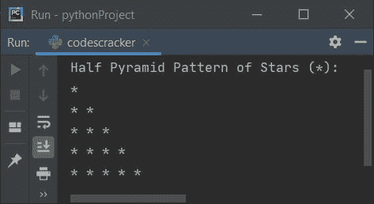

**注意-****range()**函数返回一系列值。默认情况下，该值从 0 开始，递增 1。它在一个指定为函数参数的数字前停止。

例如，下面的代码块:

```
for i in range(5):
    print(i)
```

印刷品:

```
0
1
2
3
4
```

因此在上面的程序中，下面的代码:

```
for i in range(5):
```

用于执行以下代码块:

```
for j in range(i+1):
    print("* ", end="")
print()
```

值为 0 到 4 的五个次数。以下声明:

```
print("* ", end="")
```

也可以写成:

```
print(end="* ")
```

两条语句都在输出中打印一个 ***** 和一个空格。这里我们使用了**结尾**，因为要跳过*换行符* 进行下一次输出。也就是说，语句 **print()** 打印大括号中的内容，在打印大括号中给出的内容后，自动打印一个换行符 。例如，下面的语句:

```
print()
```

是用来打印换行符的，也就是说，执行完这条语句后，下一件事从换行符开始。所以我们用 **end** 来结束分配给它的东西。上述程序中循环的第二个*，即:*

```
for j in range(i+1):
```

用于运行以下语句:

```
print("* ", end="")
```

**i+1** <sup>th</sup> 次数，数值从 **0** 到 **i** 。

### 倒半金字塔形恒星(*)

这个 python 程序打印出的星形(*)图案看起来像一个倒置的半金字塔:

```
print("Inverted Half Pyramid of Stars (*):")
for i in range(5):
    for j in range(i, 5):
        print("* ", end="")
    print()
```

下面是这个 python 程序产生的输出:

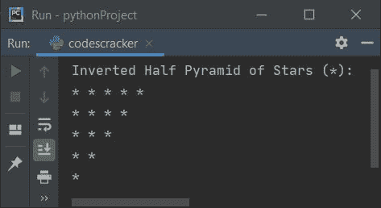

### 完整的恒星金字塔(*)

这个程序打印出看起来像金字塔的星星图案:

```
print("Full Pyramid Pattern of Stars (*): ")
for i in range(5):
    for s in range(-6, -i):
        print(" ", end="")
    for j in range(i+1):
        print("* ", end="")
    print()
```

这是它的样本输出，恒星的金字塔模式:

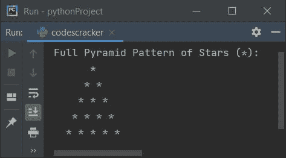

### 倒置的全金字塔形恒星(*)

这是前一个程序的逆程序。也就是说，这个程序打印出一个倒金字塔形的星星:

```
print("Inverted Full Pyramid of Stars (*): ")
for i in range(5):
    for s in range(i):
        print(" ", end="")
    for j in range(i, 5):
        print("* ", end="")
    print()
```

下面给出的快照显示了这个 python 程序产生的示例输出:

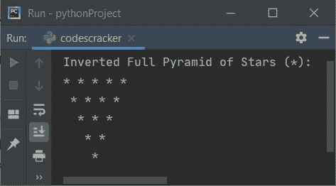

### 打印给定大小的星形金字塔

现在这个程序允许用户定义金字塔的大小。例如，如果用户输入 10 作为输入，则程序打印 10 行或多行的星形金字塔:

```
print("Enter Number of Rows: ")
row = int(input())
print("Star Pyramid of " + str(row) + " Rows or Lines: ")
for i in range(row):
    for s in range(row, i, -1):
        print(end=" ")
    for j in range(i+1):
        print(end="* ")
    print()
```

下面是这个 python 程序产生的初始输出:

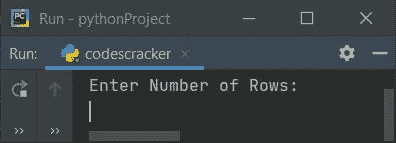

现在提供输入，比如说 **8** 和 print `ENTER`键，看看下面的输出，8 行的星形金字塔:

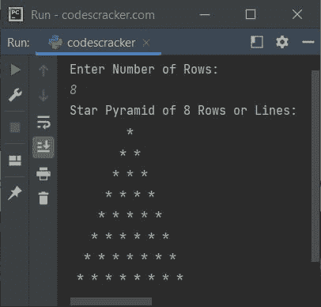

**注意-****str(row)**用于将 **row** 的值(一个整数值)转换为字符串。因为使用 **+** 将字符串和整数相加会产生错误。

### 使用函数的四种金字塔模式

让我们创建一个程序，使用用户定义的函数打印*的所有四个金字塔形状:

```
def halfPyramid():
    for i in range(5):
        for j in range(i+1):
            print(end="* ")
        print()
def invertedHalfPyramid():
    for i in range(5):
        for j in range(i, 5):
            print(end="* ")
        print()
def fullPyramid():
    for i in range(5):
        for s in range(5, i+1, -1):
            print(end=" ")
        for j in range(i + 1):
            print(end="* ")
        print()
def invertedFullPyramid():
    for i in range(5):
        for s in range(i):
            print(end=" ")
        for j in range(i, 5):
            print(end="* ")
        print()
halfPyramid()
print("------------------------")
invertedHalfPyramid()
print("------------------------")
fullPyramid()
print("------------------------")
invertedFullPyramid()
```

在上面的程序中，我们已经定义了所有四个函数对应打印四个金字塔的图案。然后调用所有四个函数逐一完成任务。下面是它的示例输出:

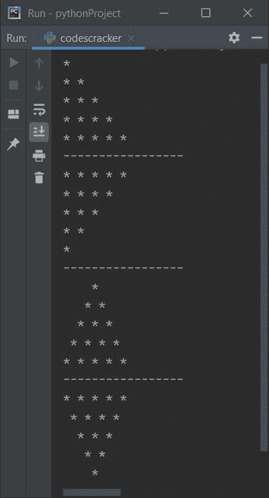

### 基于用户选择的星形金字塔

现在，这是一个菜单驱动的程序，允许用户输入选择打印所需的模式。菜单持续显示，直到用户想要退出。让我们看看程序及其输出，以便更好地理解它:

```
def halfPyramid():
    for i in range(5):
        for j in range(i+1):
            print(end="* ")
        print()
def invertedHalfPyramid():
    for i in range(5):
        for j in range(i, 5):
            print(end="* ")
        print()
def fullPyramid():
    for i in range(5):
        for s in range(5, i+1, -1):
            print(end=" ")
        for j in range(i + 1):
            print(end="* ")
        print()
def invertedFullPyramid():
    for i in range(5):
        for s in range(i):
            print(end=" ")
        for j in range(i, 5):
            print(end="* ")
        print()
while True:
    print("1\. Print Half Pyramid of Stars")
    print("2\. Print Inverted Half Pyramid of Stars")
    print("3\. Print Full Pyramid of Stars")
    print("4\. Print Inverted Full Pyramid of Stars")
    print("5\. Exit")
    print("Enter Your Choice: ", end="")
    choice = int(input())
    if choice==1:
        halfPyramid()
    elif choice==2:
        invertedHalfPyramid()
    elif choice==3:
        fullPyramid()
    elif choice==4:
        invertedFullPyramid()
    elif choice==5:
        print("Exiting...")
        break
    else:
        print("Wrong Choice!")
```

下面是它的初始输出:

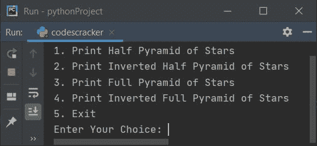

现在输入你的选择，无论你想打印什么。也就是说，键入 1 并按下`ENTER`键打印 恒星的半金字塔，如下图所示:

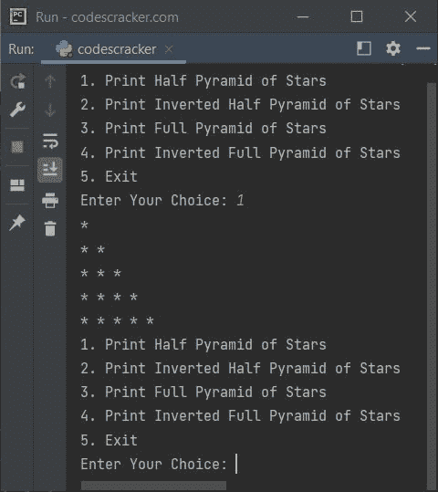

正如您从上面的示例运行中看到的，所有选项再次显示，以再次选择和打印模式。以下是带有所有选项的运行示例:

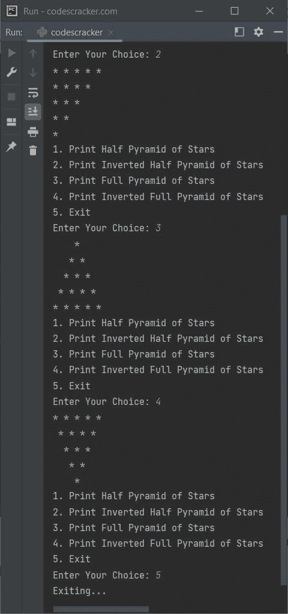

在上面的程序中，当用户输入一个数字 **5** 作为选择，然后使用 **break** 关键字，结束 **while** 循环的执行。

## *的打印模式

这个程序以这种方式打印星星的图案:

*   第一排 1 颗星
*   第二排 3 颗星
*   第三排 5 颗星
*   依此类推，直到
*   第五行有 9 颗星

在每一行中，星星从左侧开始打印:

```
print("Pattern of Stars (*): ")
k = 1
for i in range(5):
    for j in range(k):
        print("* ", end="")
    k = k + 2
    print()
```

下面是它的示例输出:

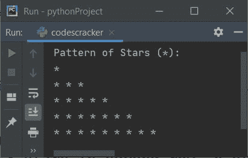

这个程序是前一个程序的反向程序。也就是说，在每一行中，星号从右侧打印:

```
print("Pattern of Stars (*): ")
k = 1
space = 16
for i in range(5):
    for j in range(space):
        print(" ", end="")
    space = space-4
    for j in range(k):
        print("* ", end="")
    k = k + 2
    print()
```

下面给出的快照显示了该程序产生的示例输出:

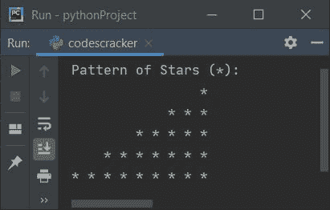

这是另一个关于星形图案的节目。这个程序打印三角形的星星(*):

```
print("Triangle Star (*) Pattern: ")
space = 8
for i in range(5):
    for j in range(space):
        print(" ", end="")
    space = space-2
    for j in range(i+1):
        print("* ", end="")
    print()
```

下面是它的输出示例:

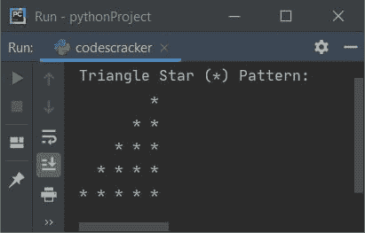

## 打印数字图案

现在让我们打印数字的模式。这个程序打印数字的半金字塔模式:

```
print("Pattern of Numbers: ")
num = 1
for i in range(5):
    for j in range(i+1):
        print(num, end=" ")
        num = num+1
    print()
```

这是它的输出:

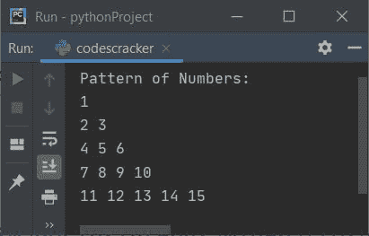

### 打印模式 1 12 123

现在让我们创建另一个类似于上一个程序的程序。程序从每行的 1 开始:

```
print("Pattern of Numbers: ")
num = 1
for i in range(5):
    for j in range(i+1):
        print(num, end=" ")
        num = num+1
    num = 1
    print()
```

下面是它的输出示例:

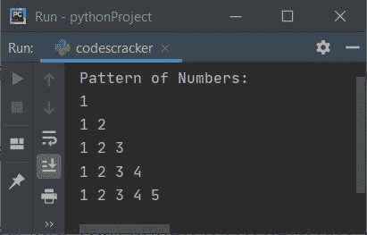

### 打印 12345 1234 123 12 1

现在让我们创建一个程序，打印看起来像一个倒半金字塔的数字模式:

```
print("Pyramid Pattern of Numbers: ")
for i in range(5):
    num = 1
    for j in range(5, i, -1):
        print(num, end=" ")
        num = num + 1
    print()
```

这是它的示例输出，显示了一个倒置的半金字塔数字:

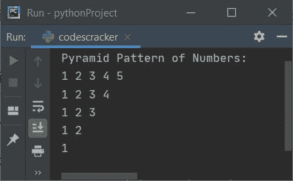

这是关于数字模式的最后一个程序。这个程序从右边打印数字。也就是说，每行从最右侧的 1 开始。让我们先看看程序，然后看看它的输出，以便更好地理解它:

```
print("Inverted Half Pyramid of Numbers: ")
decr = 8
for i in range(5):
    count = 0
    for k in range(decr):
        print(end=" ")
    decr = decr - 2
    for j in range(i+1):
        count = count + 1
    num = count
    for j in range(i+1):
        print(num, end=" ")
        num = num - 1
    print()
```

这是上面的 python 程序产生的输出:

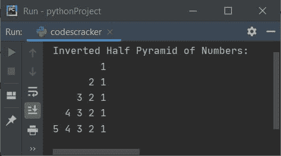

## 字母的印刷图案

这是本文的最后一节。此部分打印字母图案:

```
print("Pattern of Alphabets: ")
val = 65
for i in range(5):
    for j in range(i+1):
        ch = chr(val)
        print(ch, end=" ")
        val = val+1
    print()
```

下面是这个程序的输出:

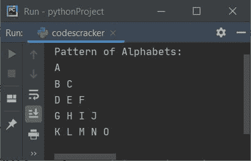

下面是另一个打印半金字塔字母(A，B，C，..):

```
print("Half Pyramid Pattern of Alphabets: ")
val = 65
for i in range(5):
    for j in range(i+1):
        ch = chr(val)
        print(ch, end=" ")
    val = val+1
    print()
```

该程序产生如下图所示的输出:

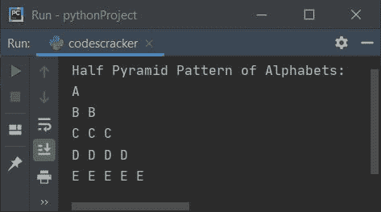

这是最后一个打印倒半金字塔字母的程序:

```
print("Inverted Half Pyramid of Alphabets: ")
decr = 8
for i in range(5):
    count = 0
    for k in range(decr):
        print(end=" ")
    decr = decr - 2
    for j in range(i):
        count = count + 1
    num = count+65
    ch = chr(num)
    for j in range(i+1):
        print(ch, end=" ")
        num = num - 1
        ch = chr(num)
    print()
```

这是它的示例输出，一个倒半金字塔形的字母表:

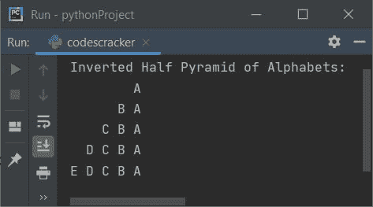

#### 其他语言的相同程序

*   [Java 星形金字塔模式程序](/java/program/java-program-print-star-pyramid-patterns.htm)
*   [C 星金字塔图案程序](/c/program/c-program-print-star-pyramid-patterns.htm)
*   [C++ 星形金字塔模式程序](/cpp/program/cpp-program-print-star-pyramid-patterns.htm)

[Python 在线测试](/exam/showtest.php?subid=10)

* * *

* * *