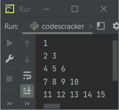
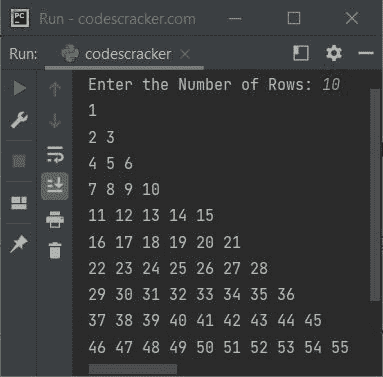

# Python 程序打印弗洛伊德的三角形

> 原文：<https://codescracker.com/python/program/python-program-print-floyd-triangle.htm>

在本文中，我用 Python 编写了一个打印弗洛伊德三角形的程序。弗洛伊德三角形是由自然数组成的直角三角形。

## 用 Python 打印弗洛伊德的三角形

问题是，*写一个 Python 程序打印弗洛伊德的三角形。*下面给出的程序是它的答案:

```
num = 1
for i in range(5):
    for j in range(i+1):
        print(num, end=" ")
        num = num+1
    print()
```

下面给出的快照显示了上面的 Python 程序产生的示例输出，它打印了 Floyd 的 5 行三角形:



## 用 Python 打印弗洛伊德的 n 行三角形

要用 Python 打印 n 行的弗洛伊德三角形，你需要让用户输入他/她想要打印的弗洛伊德三角形的行数或线数 ，如下面给出的程序所示。

```
print("Enter the Number of Rows: ", end="")
row = int(input())

num = 1
for i in range(row):
    for j in range(i+1):
        print(num, end=" ")
        num = num+1
    print()
```

上面程序的示例运行，用户输入 **10** 作为行数，显示在下面给出的快照中:



## 用 Python 中的 while 循环打印弗洛伊德三角形

让我创建和前面一样的程序，使用 **while** 循环，而不是循环的**。**

```
print("Enter the Number of Rows: ", end="")
row = int(input())

num = 1
i = 0
while i < row:
    j = 0
    while j < i+1:
        print(num, end=" ")
        num = num+1
        j = j+1
    print()
    i = i+1
```

#### 其他语言的相同程序

*   [Java 打印弗洛伊德三角形](/java/program/java-program-print-floyd-triangle.htm)
*   [C 打印弗洛伊德三角形](/c/program/c-program-print-floyd-triangle.htm)
*   [C++打印弗洛伊德三角形](/cpp/program/cpp-program-print-floyd-triangle.htm)

[Python 在线测试](/exam/showtest.php?subid=10)

* * *

* * *