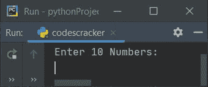
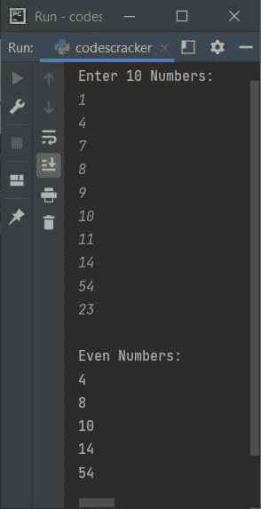
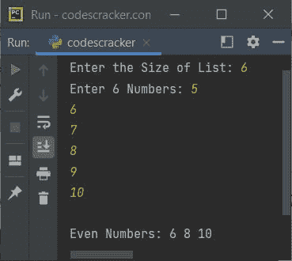
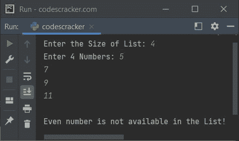

# Python 程序打印列表中的偶数

> 原文：<https://codescracker.com/python/program/python-print-even-numbers-in-list.htm>

创建这篇文章是为了介绍 Python 中的一些程序，这些程序在运行时查找并打印用户给出的列表中的所有偶数。下面是本文涉及的程序列表:

*   打印 10 个元素(数字)列表中的所有偶数
*   打印 n 个数字列表中的所有偶数

## 打印列表中的偶数

问题是，*写一个 Python 程序来打印给定列表中的所有偶数(如果有的话)。下面给出的程序 是这个问题的答案:*

```
numList = []
print("Enter 10 Numbers: ")
for i in range(10):
  numList.insert(i, int(input()))

print("\nEven Numbers:")
for i in range(10):
  if numList[i]%2==0:
    print(numList[i])
```

以下是该程序示例运行的初始输出:



现在输入十个数字，如 **1，4，7，8，9，10，11，14，54，23** ，从给定列表中查找并打印所有偶数 ，如下图所示:



## 打印 n 个数字列表中的所有偶数

这是前一个程序的修改版本。这个程序允许用户定义列表的大小。让我们看看下面给出的程序及其运行示例:

```
arr = list()
chk = 0
print(end="Enter the Size of List: ")
arrSize = int(input())
print(end="Enter " +str(arrSize)+ " Numbers: ")
for i in range(arrSize):
  arr.append(int(input()))
  if arr[i]%2==0:
    chk = 1

if chk==0:
  print("\nEven number is not available in the List!")
else:
  print(end="\nEven Numbers: ")
  for i in range(arrSize):
    if arr[i]%2==0:
      print(end=str(arr[i]) +" ")
  print()
```

以下是用户输入的示例运行，大小为 **6** ，5、6、7、8、9、10 为五个数字:



下面是另一个示例运行，用户输入的 **4** 为大小， **5，7，9，11** 为四个数字:



[Python 在线测试](/exam/showtest.php?subid=10)

* * *

* * *