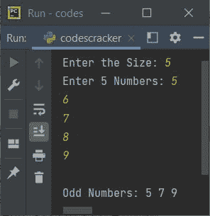

# Python 程序打印列表中的奇数

> 原文：<https://codescracker.com/python/program/python-print-odd-numbers-in-list.htm>

创建本文是为了介绍 Python 中的一些程序，这些程序在运行时查找并打印用户给定列表中所有可用的奇数。以下是程序列表:

*   打印 10 个元素(数字)列表中的所有奇数
*   在 n 个元素的列表中打印所有奇数

## 打印列表中的奇数

问题是，*写一个 Python 程序，查找并打印一个列表中所有可用的奇数。* 下面是它的答案。这个程序接收来自用户的 10 个数字作为输入，然后找到并打印所有那些奇数的数字 作为输出。

```
n = []
print("Enter 10 Numbers: ")
for i in range(10):
  n.insert(i, int(input()))

print("\nOdd Numbers: ")
for i in range(10):
  if n[i]%2!=0:
    print(n[i])
```

这是它的样本运行。这是该程序产生的初始输出:


输入任意十个数字，如 **11、12、13、14、15、16、17、18、19、20** ，从给定的十个数字的 列表中查找并打印奇数，如下图所示:


## 在 n 个元素的列表中打印所有奇数

这个程序允许用户在列表中输入任意数量的数字。收到输入后，程序将从用户在运行时输入的所有数字中查找并打印所有奇数:

```
n = list()
c = 0
print(end="Enter the Size: ")
nTot = int(input())
print(end="Enter " +str(nTot)+ " Numbers: ")
for i in range(nTot):
  n.append(int(input()))
  if n[i]%2!=0:
    c = 1

if c==0:
  print("\nOdd number is not available in the list!")
else:
  print(end="\nOdd Numbers: ")
  for i in range(nTot):
    if n[i]%2!=0:
      print(end=str(n[i]) +" ")
  print()
```

以下是用户输入的示例运行，大小为 **5** ，五个数为 **5，6，7，8，9** :



下面是另一个示例运行，用户输入的 **4** 为大小， **6，8，4，2** 为四个数字:


[Python 在线测试](/exam/showtest.php?subid=10)

* * *

* * *