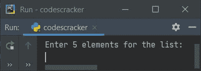
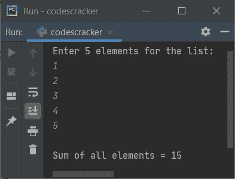
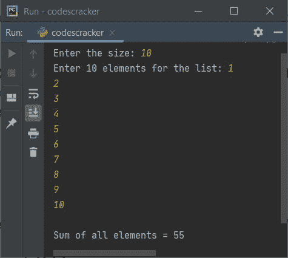
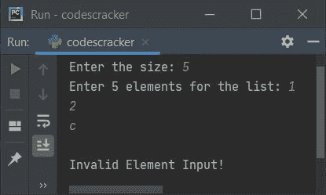

# Python 程序：查找列表中所有元素的总和

> 原文：<https://codescracker.com/python/program/python-sum-all-elements-in-list.htm>

本文介绍了 Python 中的一些程序，这些程序在运行时查找并打印用户给出的列表中所有元素(数字)的总和。下面是本文涉及的程序列表:

*   查找并打印 5 个元素列表中所有元素的总和
*   查找并打印一个列表中所有元素的总和

## 查找列表中所有元素的总和

问题是，*写一个 python 程序来打印一个列表中所有元素的总和*。下面给出的程序是这个问题的答案:

```
nums = []
print("Enter 5 elements for the list: ")
for i in range(5):
    val = int(input())
    nums.append(val)

sum = 0
for i in range(5):
    sum = sum + nums[i]

print("\nSum of all elements =", sum)
```

下面是它的运行示例:



现在提供输入，比如说 **1，2，3，4，5** 作为列表的五个元素，按`ENTER`键 查找并打印所有这五个元素(数字)的总和，如下图所示:



## 打印 n 个元素列表中所有元素的总和

这基本上是以前程序的修改版本。这个程序允许用户在提供元素之前定义列表的大小。在这个程序中，我们在接收列表的元素输入时应用了加法操作，以避免程序中不必要的多个 **for** 循环。

```
nums = list()
sum = 0
print("Enter the size: ", end="")
tot = int(input())
print("Enter", tot, "elements for the list: ", end="")
for i in range(tot):
    nums.append(int(input()))
    sum = sum + nums[i]
print("\nSum of all elements =", sum)
```

以下是提供输入后的示例输出， **10** 为大小， **1，2，3，4，5，6，7，8，9，10** 为十个元素或数字:



#### 先前程序的修改版本

创建这个程序是为了在用户输入无效输入时向他们提供一条消息。使用**试抓** 块，我们已经完成了任务。

```
print("Enter the size: ", end="")
try:
    tot = int(input())
    print("Enter", tot, "elements for the list: ", end="")
    nums = list()
    sum = 0
    for i in range(tot):
        try:
            val = int(input())
            nums.append(val)
            sum = sum + nums[i]
        except ValueError:
            print("\nInvalid Element Input!")
            exit()
    print("\nSum of all elements =", sum)
except ValueError:
    print("\nInvalid Size Input!")
```

如果您提供完全相同或正确的输入值，这个程序将产生与上一个程序相同/相似的输出。否则，如果您提供任何无效输入，如无效元素输入，则程序会产生一个错误，如下图所示:



由于 **c** 不是一个数字，而是一个字符，因此程序产生一个错误，如上面的快照所示。

[Python 在线测试](/exam/showtest.php?subid=10)

* * *

* * *