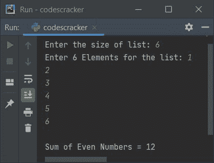

# Python 程序查找列表中奇数和偶数的和

> 原文：<https://codescracker.com/python/program/python-sum-of-odd-even-numbers.htm>

这篇文章讲述了 Python 中的一些程序，这些程序在运行时查找并打印用户给定列表中的偶数和奇数的和。下面是本文涉及的程序列表:

*   在 5 个元素的列表中查找并打印偶数的和
*   在一列 **n** 个元素中找出偶数的和
*   在一列 **n** 个元素中找出奇数的和
*   查找列表中偶数和奇数的和

## 查找列表中偶数的和

问题是，*写一个 Python 程序，找出一个列表中偶数的和。用户必须在运行时接收列表 的元素。*这个问题的答案是下面给出的程序:

```
nums = []
print("Enter 5 elements for the list: ")
for i in range(5):
    val = int(input())
    nums.append(val)

sum = 0

for i in range(5):
    if nums[i]%2 == 0:
        sum = sum + nums[i]

print("\nSum of Even Numbers is", sum)
```

下面是这个 Python 程序产生的初始输出:


现在提供输入，即列表中的任意 5 个元素或数字，比如说 **1，2，3，4，5** ，按 `ENTER`键从给定的 5 个数字中查找并打印所有偶数的总和，如下图所示:


由于 **1、2、3、4、5** 中的 **2** 和 **4** 为偶数，因此 **2+4** 或 **6** 为上述程序产生的输出。

## 打印 n 个元素列表中偶数的和

基本上这是前一个程序的修改版本。因为这个程序让用户定义列表的大小。也就是说，在向列表提供元素之前，允许用户提供大小。

```
nums = []
print("Enter the size of list: ", end="")
tot = int(input())
print("Enter", tot, "Elements for the list: ", end="")
for i in range(tot):
    nums.append(int(input()))

sum = 0
count = 0
for i in range(tot):
    if nums[i]%2 == 0:
        sum = sum + nums[i]
        count = count+1

if count==0:
    print("\nEven number is not found in this list!")
else:
    print("\nSum of Even Numbers =", sum)
```

下面是用户输入的运行示例， **6** 作为大小， **1，2，3，4，5，6** 作为六个元素:



这是另一个运行用户输入的示例， **4** 作为大小， **1，3，5，7** 作为四个元素。 这一次，列表中没有任何偶数:


#### 先前程序的修改版本

创建这个程序是为了在用户输入无效输入时提供手动消息。我们已经使用 **try-except** 块完成了这项工作。

```
nums = []
print("Enter the size of list: ", end="")
try:
    tot = int(input())
    print("Enter", tot, "Elements for the list: ", end="")
    for i in range(tot):
        try:
            nums.append(int(input()))
        except ValueError:
            print("\nInvalid Element Input!")
            exit()
    sum = 0
    count = 0
    for i in range(tot):
        if nums[i]%2 == 0:
            sum = sum + nums[i]
            count = count+1
    if count==0:
        print("\nEven number is not found in this list!")
    else:
        print("\nSum of Even Numbers =", sum)
except ValueError:
    print("\nInvalid Size Input!")
```

#### 上一个程序的简短版本

这是上一个程序的简短版本。要成为一个更好的程序，总是要尽量缩短代码。也就是说，总是创建尽可能短的程序。因为它看起来很酷，很吸引人。

```
nums = []
sum = 0
print("Enter the size of list: ", end="")
tot = int(input())
print("Enter", tot, "Elements for the list: ", end="")
for i in range(tot):
    nums.append(int(input()))
    if nums[i]%2 == 0:
        sum = sum + nums[i]
print("\nSum of Even Numbers =", sum)
```

## 查找列表中奇数的和

这个程序几乎和寻找偶数和的程序一样。你唯一要做的事情，就是改变的状态。也就是把 **==** 换成**！=** 。其余的事情几乎相同。

```
nums = []
print("Enter the size of list: ", end="")
tot = int(input())
print("Enter", tot, "Elements for the list: ", end="")
for i in range(tot):
    nums.append(int(input()))

sum = 0
count = 0
for i in range(tot):
    if nums[i]%2 != 0:
        sum = sum + nums[i]
        count = count+1

if count==0:
    print("\nOdd number is not found in this list!")
else:
    print("\nSum of Odd Numbers =", sum)
```

下面是它的示例运行，其中用户输入 **5** 作为大小， **6，7，8，9，10** 作为六个元素:


### 查找列表中偶数和奇数的和

这个程序是在一个 **n** 数字列表中查找和打印偶数和奇数的程序的组合版本。

```
nums = []
sumeven = 0
counteven = 0
sumodd = 0
countodd = 0

print("Enter the size of list: ", end="")
tot = int(input())
print("Enter", tot, "Elements for the list: ", end="")
for i in range(tot):
    nums.append(int(input()))
    if nums[i]%2 == 0:
        sumeven = sumeven + nums[i]
        counteven = counteven + 1
    else:
        sumodd = sumodd + nums[i]
        countodd = countodd + 1

if counteven==0:
    print("\nEven number is not found in this list!")
else:
    print("\nSum of Even Numbers =", sumeven)
if countodd==0:
    print("Odd number is not found in this list!")
else:
    print("Sum of Odd Numbers =", sumodd)
```

下面是用户输入的运行示例， **6** 作为大小， **10，11，12，13，14，15** 作为六个元素:


[Python 在线测试](/exam/showtest.php?subid=10)

* * *

* * *