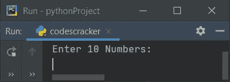
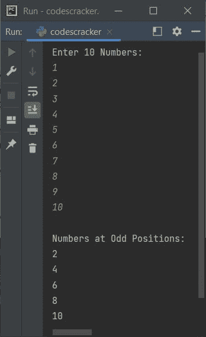
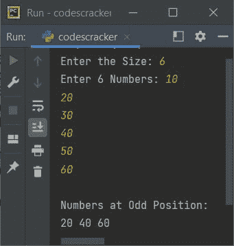
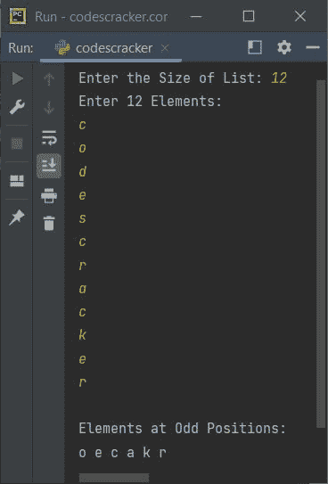

# Python 程序：打印列表中奇数位置的元素

> 原文：<https://codescracker.com/python/program/python-print-element-at-odd-position.htm>

本文介绍了一些 Python 程序，它们在运行时查找并打印用户给定列表中奇数位置(索引)的所有可用元素。下面是本文涉及的程序列表:

*   打印 10 个元素列表中奇数位置或索引处的元素(数字)
*   在 N 个元素的列表中奇数位置打印数字
*   在 N 个元素的列表中奇数位置打印字符

## 在 10 个元素的列表中奇数位置打印数字

问题是，*编写一个 Python 程序，查找并打印出现在 10 个元素列表中奇数位置的所有数字。这里，列表的所有 10 个元素都必须由用户输入。下面给出的程序是这个问题的答案:*

```
arr = []
print("Enter 10 Numbers: ")
for i in range(10):
  arr.insert(i, int(input()))

print("\nNumbers at Odd Positions: ")
for i in range(10):
  if i%2!=0:
    print(arr[i])
```

下面是它的运行示例:



现在提供输入，比如说 1，2，3，4，5，6，7，8，9，10 作为十个数字，查找并打印所有奇数索引号为 的数字。这里索引指的是位置。让我们看看下面给出的快照:



## 在 N 个元素的列表中奇数位置打印数字

基本上这是前一个程序的修改版本。因为这个程序允许用户定义列表的大小及其元素。然后查找并打印奇数索引号处的所有可用元素，如下面给出的程序及其运行示例所示:

```
arr = list()
print(end="Enter the Size: ")
arrTot = int(input())
print(end="Enter " +str(arrTot)+ " Numbers: ")
for i in range(arrTot):
  arr.append(int(input()))

print("\nNumbers at Odd Position: ")
for i in range(arrTot):
  if i%2!=0:
    print(end=str(arr[i]) +" ")
print()
```

以下是用户输入的示例运行，大小为 **6** ，10、20、30、40、50、60 为六个数字:



## 打印 N 个元素列表中奇数位置的字符

这是最后一个程序，它查找并打印 N 个字符列表中奇数位置的所有可用字符。

```
arr = []
print(end="Enter the Size of List: ")
arrSize = int(input())
print("Enter " +str(arrSize)+ " Elements: ")
for i in range(arrSize):
  arr.append(input())

print("\nElements at Odd Positions: ")
for i in range(arrSize):
  if i%2!=0:
    print(end=str(arr[i]) + " ")
print()
```

下面是它的示例运行，使用用户输入的 **12** 作为列表的大小，使用 **c，o，d，e，s，c，r，a，c，k，e，r** 作为列表的十二个元素(字符):



[Python 在线测试](/exam/showtest.php?subid=10)

* * *

* * *