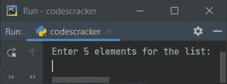
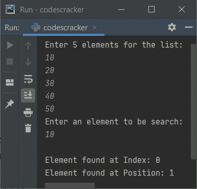
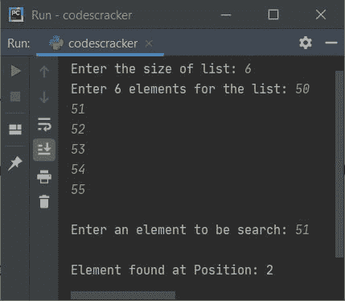
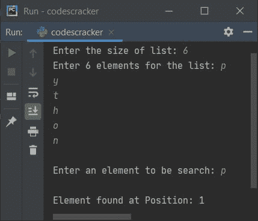
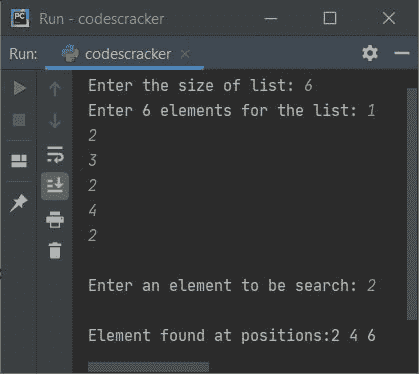
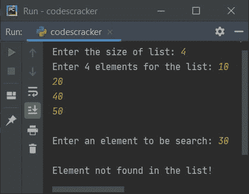
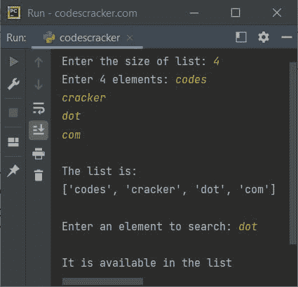

# Python 程序：搜索列表中的元素

> 原文：<https://codescracker.com/python/program/python-search-element-in-list.htm>

本文介绍了一些用 Python 编写的程序，这些程序在列表中搜索元素。在这里，元素和列表都必须由用户在运行时输入。下面是本文涉及的程序列表:

*   在 5 个元素的列表中搜索一个元素
*   在一列 **n** 个元素中搜索一个元素
*   使用运算符中的**,检查给定列表中是否存在某个值**

## 搜索列表中的元素

问题是，*写一个 Python 程序，从给定的列表中搜索给定的元素。下面给出的程序是这个问题的答案:*

```
mylist = []
print("Enter 5 elements for the list: ")
for i in range(5):
    val = int(input())
    mylist.append(val)

print("Enter an element to be search: ")
elem = int(input())

for i in range(5):
    if elem == mylist[i]:
        print("\nElement found at Index:", i)
        print("Element found at Position:", i+1)
```

下面是它的运行示例:



现在提供输入，比如说 **10，20，30，40，50** 作为五个元素， **10** 作为要搜索的元素， 然后按`ENTER`键搜索并打印列表 中给定元素的索引和位置，如下面给出的示例输出所示:



## 在 n 个元素的列表中搜索元素

在修改了之前的程序后，我创建了另一个程序，就是下面给出的程序。这个程序允许用户定义列表的大小以及它的元素和将要从给定列表中搜索的元素。让我们看看下面给出的程序及其运行示例:

```
mylist = list()

print("Enter the size of list: ", end="")
tot = int(input())

print("Enter", tot, "elements for the list: ", end="")
for i in range(tot):
    mylist.append(input())

print("\nEnter an element to be search: ", end="")
elem = input()

for i in range(tot):
    if elem == mylist[i]:
        print("\nElement found at Position:", i+1)
```

以下是用户输入的示例运行，以 **6** 作为大小，以 **50、51、52、53、54、55** 作为六个元素， 和 **51** 作为要搜索的元素:



下面是另一个运行的示例，用户输入 **6** 作为大小， **p，y，t，h，o，n** 作为六个元素， **p** 作为要搜索的元素:



#### 先前程序的修改版本

创建这个程序是为了处理这样的情况:没有找到元素，只找到一个元素，找到重复的元素。

```
mylist = list()

print("Enter the size of list: ", end="")
tot = int(input())

print("Enter", tot, "elements for the list: ", end="")
for i in range(tot):
    mylist.append(input())

print("\nEnter an element to be search: ", end="")
elem = input()

poslist = list()
for i in range(tot):
    if elem == mylist[i]:
        poslist.append(i+1)

if len(poslist) == 0:
    print("\nElement not found in the list!")
elif len(poslist) == 1:
    print("\nElement found at position:", poslist[0])
else:
    print("\nElement found at positions:", end="")
    for i in range(len(poslist)):
        print(poslist[i], end=" ")
```

以下是用户输入的运行示例， **6** 作为大小， **1，2，3，2，4，2** 作为六个元素， **2** 作为要搜索的元素:



下面是另一个运行用户输入的示例， **4** 作为大小， **10，20，40，50** 作为四个元素， **30** 作为要搜索的元素:



## Python 使用 in 运算符检查值是否存在于列表中

要检查特定的元素或项目在 Python 中是否可用，那么使用 [操作符](/python/python-operators.htm)中的**，如下例所示。**

```
my_list = ["one", "two", "three", "four"]
if "two" in my_list:
    print("\n'two' is in the list.")
else:
    print("\n'two' is not in the list.")
```

下面是上面检查列表中是否存在 Python 中的值的示例产生的示例输出。

```
'two' is in the list.
```

现在让我们用一个程序来修改上面的代码，该程序允许用户定义列表的大小及其元素。也允许输入一个元素来检查它是否在给定的列表中，当然是使用操作符 中的**。**

```
print("Enter the size of list: ", end="")
tot = int(input())
print("Enter", tot, "elements: ", end="")
x = []
for i in range(tot):
    x.append(input())

print("\nThe list is:")
print(x)

print("\nEnter an element to search: ", end="")
element = input()
if element in x:
    print("\nIt is available in the list")
else:
    print("\nIt is not available in the list")
```

下面给出的快照显示了示例运行，使用用户输入的 **4** 作为大小，**代码**，**破解**， **点**， **com** 作为四个元素，使用**点**作为元素来检查其在列表中的可用性:



[Python 在线测试](/exam/showtest.php?subid=10)

* * *

* * *