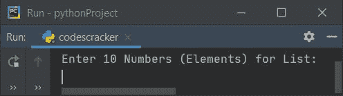
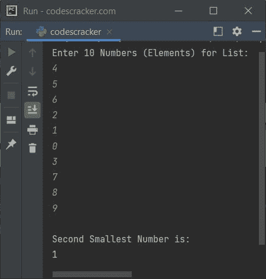
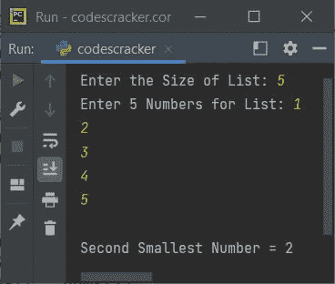

# Python 程序：查找列表中第二小的数字

> 原文：<https://codescracker.com/python/program/python-find-second-smallest-element.htm>

本文涵盖了 Python 中的一些程序，这些程序查找并打印用户输入的列表中第二小的元素或数字。以下是程序列表:

*   在 10 个元素的列表中查找第二小的数字(元素)
*   在 N 个元素列表中找到第二大的元素

## 在 10 个元素的列表中查找第二个最小的数字

问题是，*写一个 Python 程序，用`for`循环*找出一个列表中第二小的数。以下是它的答案:

```
nums = []
print("Enter 10 Numbers (Elements) for List: ")
for i in range(10):
  nums.append(int(input()))

small = nums[0]
for i in range(10):
  if small>nums[i]:
    small = nums[i]

secondSmall = nums[0]
for i in range(10):
  if secondSmall>nums[i]:
    if nums[i]!=small:
      secondSmall=nums[i]

print("\nSecond Smallest Number is: ")
print(secondSmall)
```

下面是它的运行示例:



现在为列表提供任意 10 个元素或数字，如 **4，5，6，2，1，0，3，7，8，9** ，按`ENTER` 键查找并打印列表中第二小的数字:



## 在 N 个元素的列表中查找第二小的数字

这个程序允许用户定义列表的大小及其元素(数字),以便从给定的列表中找到并打印第二小的数字。让我们看看下面给出的程序:

```
nums = []
print(end="Enter the Size of List: ")
listSize = int(input())
print(end="Enter " +str(listSize)+ " Numbers for List: ")
for i in range(listSize):
  nums.append(int(input()))

small = nums[0]
for i in range(listSize):
  if small>nums[i]:
    small = nums[i]

secondSmall = nums[1]
for i in range(listSize):
  if secondSmall>nums[i] and nums[i]!=small:
    secondSmall = nums[i]

if small == secondSmall:
  print("\nSecond Smallest Number doesn't exist!")
else:
  print("\nSecond Smallest Number = " + str(secondSmall))
```

以下是用户输入的示例运行，以 **5** 作为大小，以 **1，2，3，4，5** 作为五个元素或数字:



[Python 在线测试](/exam/showtest.php?subid=10)

* * *

* * *