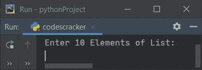
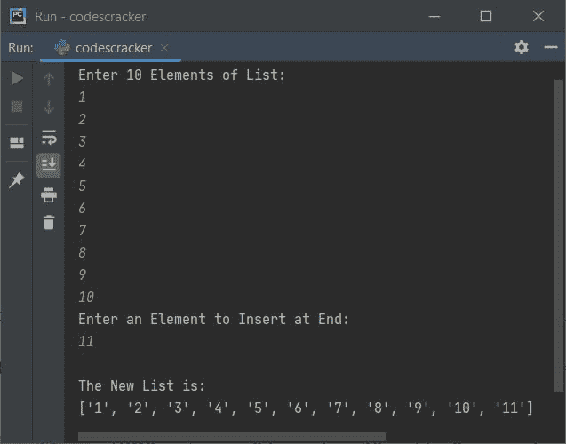
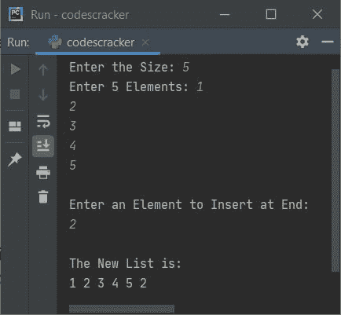
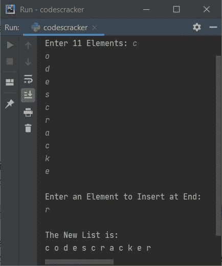
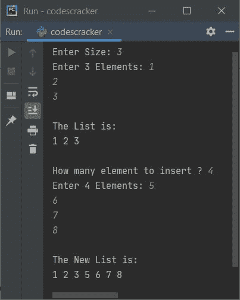
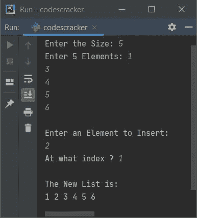
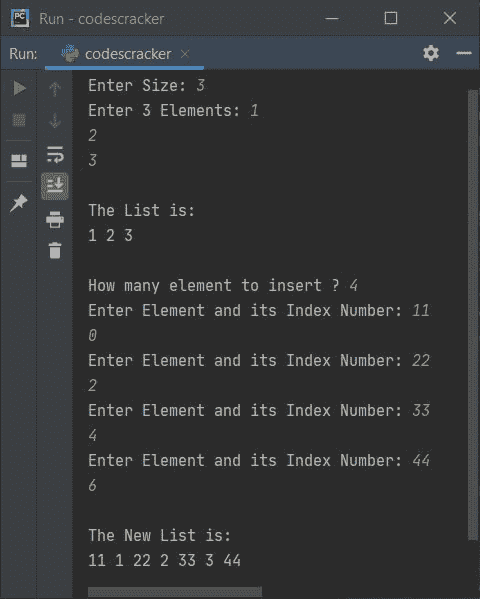

# Python 程序在列表中插入元素

> 原文：<https://codescracker.com/python/program/python-insert-element-in-list.htm>

本文涵盖了 Python 中的一些程序，这些程序在列表的末尾或任何特定的索引(或位置)插入一个(或多个)元素。用户必须在运行时输入元素和列表。以下是程序列表:

*   在列表末尾插入元素
*   在列表末尾插入多个元素
*   在列表中的特定位置插入元素
*   在列表中的某些指定索引处插入多个元素

## 在列表末尾插入元素

这个程序在列表末尾插入一个用户输入的元素。问题是，**写一个 Python 程序来 在列表**中插入一个元素。以下是它的答案:

```
print("Enter 10 Elements of List: ")
nums = []
for i in range(10):
    nums.insert(i, input())
print("Enter an Element to Insert at End: ")
elem = input()
nums.append(elem)
print("\nThe New List is: ")
print(nums)
```

下面是它的运行示例:



现在提供输入，比如说将 **1，2，3，4，5，6，7，8，9，10** 作为十个数字，然后将 **11** 作为一个数字插入列表:



在上面的程序中，下面的语句:

```
nums.insert(i, input())
```

表示输入的值在 **nums** 的第 **i <sup>个</sup>T3】索引处初始化。例如，如果用户 输入 **10** 并且 **i** 的当前值为 2，那么 **10** 被初始化为 **nums[2]** 。由于最初 列表 **nums** 为空，那么您也可以用下面给出的语句替换上面的语句:**

```
nums.append(input())
```

**注意-****append()**方法在列表末尾追加一个元素(作为其参数提供)。

**注意-** 也可以使用 **nums = list()** 定义一个空列表

#### 先前程序的修改版本

这个程序允许用户定义列表的大小。本程序中使用的**结束**，跳过插入一个 自动换行符。 **str()** 将任何类型的值转换为字符串类型。

```
print("Enter the Size: ", end="")
try:
    numsSize = int(input())
    print("Enter " +str(numsSize)+ " Elements: ", end="")
    nums = []
    for i in range(numsSize):
        nums.append(input())
    print("\nEnter an Element to Insert at End: ")
    elem = input()
    nums.append(elem)
    numsSize = numsSize+1
    print("\nThe New List is: ")
    for i in range(numsSize):
        print(end=nums[i] + " ")
    print()
except ValueError:
    print("\nInvalid Input!")
```

下面是用户输入的示例运行，大小为 **5** ，五个元素为 **1，2，3，4，5** ，元素为 **2** 插入到给定列表的末尾:



下面是另一个运行用户输入的示例， **11** 作为大小， **c，o，d，e，s，c，r，a，c，k，e** 作为 11 个元素，然后 **r** 作为元素插入到列表的末尾:



从上面的程序中，下面的语句:

```
print(end=nums[i] + " ")
```

也可以写成:

```
print(nums[i], end=" ")
```

**注意-****try-except**用于处理无效输入。 **try** 的第一条语句，即**numsize = int(input())**被执行，它希望接收用户输入的整数。 但是如果用户输入一个非整数值，那么它会引发一个 **ValueError** ，因此程序流程会转到 **除了 ValueError** 的主体，并打印一条程序员指定的消息。

## 在列表末尾插入多个元素

这个程序允许用户在程序的一次执行中，在一个列表的末尾插入多个(不止一个)元素。让我们先来看看这个程序:

```
print("Enter Size: ", end="")
try:
    tot = int(input())
    print("Enter " +str(tot)+ " Elements: ", end="")
    arr = list()
    for i in range(tot):
        arr.append(input())
    print("\nThe List is:")
    for i in range(len(arr)):
        print(arr[i], end=" ")
    print("\n\nHow many element to insert ? ", end="")
    try:
        toti = int(input())
        print("Enter " +str(toti)+ " Elements: ", end="")
        for i in range(toti):
            arr.append(input())
        print("\nThe New List is:")
        for i in range(len(arr)):
            print(arr[i], end=" ")
        print()
    except ValueError:
        print("\nInvalid Input!")
except ValueError:
    print("\nInvalid Input!")
```

下面是用户输入的示例运行， **3** 作为列表大小， **1，2，3** 作为三个元素，然后 **4** 作为要插入的元素的大小，然后 **5，6，7，8** 作为四个要插入的元素:



使用与上面给出的示例运行中提供的用户输入相同的用户输入对上述程序进行模拟运行，如下所示:

*   当用户输入尺寸，比如说 **3** ，它被存储在 **tot** 变量中。所以 **tot=3**
*   现在使用**进行循环**，下面的语句:
    `arr.append(input())`
    被执行 3 次。因此，使用 **input()** 逐个接收三个值，并将其初始化为 **arr** 。 例如，如果用户输入 **1，2，3** 作为三个元素，那么 **arr = ['1 '，' 2 '，' 3']**
*   使用 **input()** 方法接收的任何内容，默认情况下被视为字符串类型值
*   现在使用另一个**作为**循环，显示名为 **arr** 的列表元素
*   然后使用 **input()** ，从用户处接收另一个值，作为要插入的元素总数
*   例如，如果用户输入 **4** 作为输入，那么 **4** 被初始化为**到**。所以 **toti=4**
*   并使用另一个**进行**循环，语句:
    `arr.append(input())`
    被执行四次
*   这样，另外四个元素被追加到名为 **arr** 的列表中。因为我们在这里使用了 **append()**方法，所以元素被添加到列表的末尾
*   这样，多个元素被插入到列表中

## 在特定索引(位置)插入元素

正如您在本文的第一个程序中看到的， **insert()** 方法用于在指定为第一个参数的特定索引号处插入 一个元素。因此使用 **insert()** 方法， 这个程序在运行时由用户在指定的索引处插入一个元素:

```
nums = []
print(end="Enter the Size: ")
numsSize = int(input())
print(end="Enter " +str(numsSize)+ " Elements: ")
for i in range(numsSize):
    nums.append(input())
print("\nEnter an Element to Insert: ")
elem = input()
print(end="At what index ? ")
pos = int(input())
nums.insert(pos, elem)
numsSize = numsSize+1
print("\nThe New List is: ")
for i in range(numsSize):
    print(end=nums[i] + " ")
print()
```

下面是用户输入的运行示例， **5** 作为列表的大小， **1，3，4，5，6** 作为五个元素， **2** 作为要插入的元素， **1** 作为要存储在列表中的元素的索引:



**注意-** 跟随位置的值，然后使用， **nums.insert((pos+1)，elem)** 语句在给定位置插入 元素。因为索引是从 0 开始的，但一般人们都把第 **0 <sup>个</sup>** 索引元素称为第一个位置的元素。

## 在列表中给定的索引处插入多个元素

这是本文的最后一个程序，它是在一次执行中在一个列表的给定索引处插入多个元素的完整版本。该程序还使用 **try 处理所有类型的无效输入——除了**:

```
print("Enter Size: ", end="")
try:
    tot = int(input())
    print("Enter " +str(tot)+ " Elements: ", end="")
    arr = list()
    for i in range(tot):
        arr.append(input())

    print("\nThe List is:")
    for i in range(len(arr)):
        print(arr[i], end=" ")

    print("\n\nHow many element to insert ? ", end="")
    try:
        toti = int(input())
        arrdele = list()
        arrdeli = list()

        for i in range(toti):
            print("Enter Element and its Index Number: ", end="")
            arrdele.append(input())
            try:
                k = int(input())
                if k > (len(arr) + len(arrdele)):
                    print("\nInvalid Input!")
                    exit()
                arrdeli.append(k)
            except ValueError:
                print("\nInvalid Input!")
                exit()

        for i in range(toti):
            arr.insert(arrdeli[i], arrdele[i])
        print("\nThe New List is:")
        for i in range(len(arr)):
            print(arr[i], end=" ")
        print()

    except ValueError:
        print("\nInvalid Input!")
except ValueError:
    print("\nInvalid Input!")
```

下面是用户输入的示例运行， **3** 作为大小，然后 **1，2，3** 作为它的三个元素， 和 **4** 作为现在要插入到输入列表中的元素数量。然后将 **11** 作为第一个元素，将 T8】0 作为其索引号。再次将 **22** 作为第二个元素， **2** 作为其索引号， 然后 **33** 作为第三个元素， **4** 作为其索引号，最后 **44** 作为元素， **6** 作为其索引号:



#### 上述计划的简要说明

该程序的创建方式是:

*   我已经收到了名为 **arr** 的列表中给定大小的元素，就像之前在上面的程序中所做的那样
*   后来，我使用了两个新的列表，即 **arrdele** 和 **arrdeli**
*   在第一个列表中，我已经存储了所有需要删除的元素。而在第二个列表中，我存储了对应于第一个列表中每个元素的索引号
*   然后使用 **insert()** ，我为这两个列表提供了索引，给出了索引号和元素 以插入到列表 **arr** 中
*   也就是说， **arr.insert(arrdeli[i]，arrdele[i])** 语句说明，名为 **arrdeli** 的列表的第 **I<sup>th</sup>T5】索引处的元素被视为当前索引号的 **arr** 和名为 **arrdele** 的列表的同一索引处的 元素被视为要插入到同一列表中的值。因为我已经在列表 **arrdeli** 中存储了 索引号，而在列表 **arrdele** 中存储了元素**

用户输入与之前的示例运行完全相同的模拟运行如下。这是价值评估演习。输出语句不包括在这次模拟中:

*   tot = 3
*   arr = ['1 '，' 2 '，' 3']
*   toti = 4
*   arrdele[0] = 11
*   arrdeli[0] = 0
*   arrdele[1] = 22
*   阿里德利[1] = 2
*   arrdele[2] = 33
*   阿里德利[2] = 4
*   arrdele[3] = 44
*   阿里德利[3] = 6
*   最后，**阿德雷= [11，22，33，44]** 和**阿德利= [0，2，4，6]**
*   现在插入主代码，即:
    `for i in range(toti): arr.insert(arrdeli[i], arrdele[i])`
    开始执行
*   所以在第一次执行的时候，**I = 0**
    **arr . insert(arr deli[0]，arrdele[0])** 或者 **arr.insert(0，11)** 或者 **arr[0] = '11'** 。这里 **0** 和 T11**11**是两个列表的 **0 <sup>第</sup>个**个索引的元素，即 **arrdeli** 和 **arrdele**
*   所以现在 **arr = ['11 '，' 1 '，' 2 '，' 3']**
*   在第二次执行时，**I = 1**
    **arr . insert(arr deli[1]，arrdele[1])** 或 **arr.insert(2，22)** 或 **arr[2] = '22'**
*   所以现在 **arr = ['11 '，' 1 '，' 22 '，' 2 '，' 3']**
*   在第三次执行时，**I = 2**
    **arr . insert(arr deli[2]，arrdele[2])** 或 **arr.insert(4，33)** 或 **arr[4] = '33'**
*   所以现在 **arr = ['11 '，' 1 '，' 22 '，' 2 '，' 33 '，' 3']**
*   第四次处决也发生了类似的事情
*   通过这种方式，多个元素被插入到一个列表中给定的索引处。

[Python 在线测试](/exam/showtest.php?subid=10)

* * *

* * *