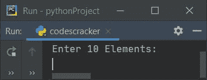
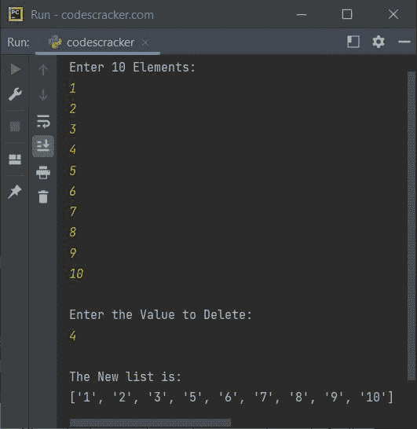
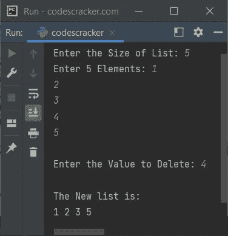
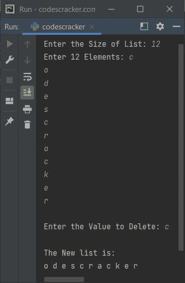
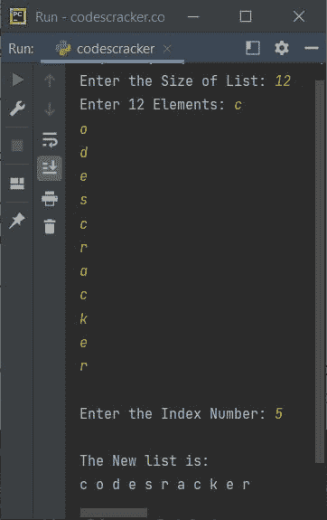
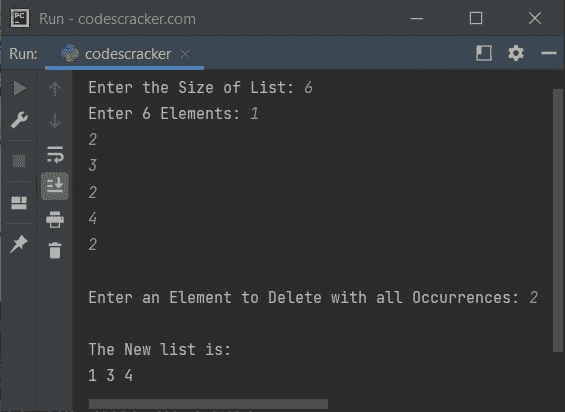
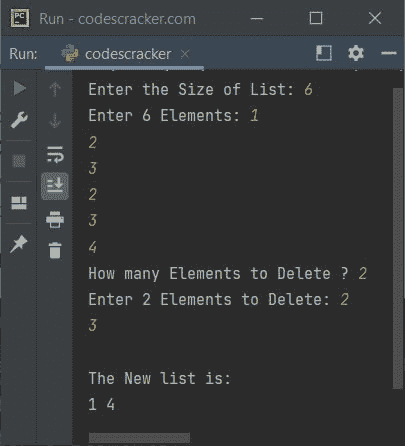

# Python 程序：从列表中删除元素

> 原文：<https://codescracker.com/python/program/python-delete-element-from-list.htm>

在本文中，我用 Python 创建了一些程序，可以从列表中删除一个(或多个)元素。用户必须在运行时输入元素和列表。以下是程序列表:

*   通过值从列表中删除元素
*   通过索引从列表中删除元素
*   从列表中删除所有出现的元素
*   从列表中删除多个元素

## 通过值从列表中删除元素

这个程序通过值从列表(也是由用户输入的)中删除一个元素(由用户输入)。问题是，**写一个 Python 程序从列表**中删除一个元素。以下是它的答案:

```
print("Enter 10 Elements: ")
arr = []
for i in range(10):
    arr.append(input())

print("\nEnter the Value to Delete: ")
val = input()

arr.remove(val)

print("\nThe New list is:")
print(arr)
```

下面是它的运行示例:



现在提供输入，比如说 **1，2，3，4，5，6，7，8，9，10** 作为十个元素，以及一个值，比如说 **4** 到 ，从列表中删除它并打印新的列表，如下图所示:



**注意-****append()**方法在列表的末尾追加一个元素。

**注意-****remove()**方法从一个列表中移除一个元素(通过作为其参数提供的值)。

在上面的程序中，下面的代码:

```
for i in range(10):
```

用于执行以下语句:

```
arr.append(input())
```

十次，值从 0 到 9。因此，在示例 运行中由用户输入的所有十个数字都以这种方式存储在列表 **arr[]** 中:

```
arr = ['1', '2', '3', '4', '5', '6', '7', '8', '9', '10']
```

现在使用下面的语句:

```
arr.remove(val)
```

存储在 **val** 变量中的值从列表 **arr** 中移除。例如，如果 **val** 的值为 4，那么 **4** 将从名为 **arr** 的列表中删除。

### 从给定大小的列表中删除元素

这是前一个程序的修改版本，增加了一个额外的功能。例如，这个程序允许用户定义列表的大小。本程序中使用的**结束**，使用 **print()** 跳过插入自动换行符

```
print(end="Enter the Size of List: ")
tot = int(input())

arr = []
print(end="Enter " +str(tot)+ " Elements: ")
for i in range(tot):
    arr.append(input())

print(end="\nEnter the Value to Delete: ")
val = input()

if val in arr:
    arr.remove(val)
    print("\nThe New list is: ")
    for i in range(tot-1):
        print(end=arr[i]+" ")
else:
    print("\nElement doesn't exist in the List!")
```

下面是用户输入的运行示例， **5** 作为列表的大小， **1，2，3，4，5** 作为列表的五个元素， 然后 **4** 作为要删除的元素:



下面是另一个示例运行，用户输入 12 作为列表的大小， **c，o，d，e，s，c，r，a，c，k，e，r**T6 作为列表的 12 个元素，然后 **c** 作为要从列表中删除的元素:



**注意-** 从这个示例运行中可以看出，<u>第一次出现的 **c** 会从列表</u>中删除。 但是如果用户想删除第二次出现的 **c** ，那么我们必须按照下面给出的程序从列表中通过索引删除一个 元素。

**注意-****str()**方法将任何类型的值转换为字符串类型。

## 按索引从列表中删除元素

方法的作用是通过索引号从列表中删除一个元素。而 **remove()** 方法 用于根据元素的值删除元素。让我们看看下面给出的程序:

```
print(end="Enter the Size of List: ")
tot = int(input())

arr = []
print(end="Enter " +str(tot)+ " Elements: ")
for i in range(tot):
    arr.append(input())

print(end="\nEnter the Index Number: ")
index = int(input())

if index<tot:
    arr.pop(index)
    print("\nThe New list is: ")
    for i in range(tot-1):
        print(end=arr[i]+" ")
else:
    print("\nInvalid Index Number!")
```

下面是它的示例运行，用户输入， **12** 作为大小， **c，o，d，e，s，c，r，a，c，k，e，r** 作为列表的 十二个元素。现在要从列表中删除第二个 **c** ，输入 **5** 作为索引号。因为第二个 ‘c’在第五个索引处可用。索引从 0 开始。



使用与该程序的示例运行中提供的用户输入相同的用户输入对上述程序进行模拟运行，如下所示:

*   初始值， **tot = 12** (用户输入)， **arr =[' c '，' o '，' d '，' e '，' s '，' c '，' r '，' a '，' c '，' k '，' e '，' r']** (也由用户输入)
*   因为索引从 0 开始。也就是说，循环的**通过其接收 list **arr** 的元素 ，从其 **i** 的值从 0 到 9 开始，因此 list 的所有 12 个元素以如下方式存储在 中:**
    *   arr[0] = 'c '
    *   arr[1] = 'o '
    *   arr[2] = 'd '
    *   arr[3] = 'e '
    *   arr[4]= s
    *   arr[5] = 'c '
    *   依此类推，直到
    *   arr[11] = 'r '
*   因此，要删除第 **5 <sup>个</sup>T3】索引处的元素，请输入 5，这将从列表中删除第二个**【c’****
*   当用户输入 **5** 作为要删除的索引号时，则 **index=5**
*   现在条件(if**)**索引< tot** 或 **5 < 12** 评估为真， 因此程序流程进入 if** 的主体内
*   如果在**的**体内，下面的语句:
    `arr.pop(index)`
    从列表中删除该元素，可用索引号**索引**或 **5**
*   现在只需打印新列表作为输出

## 从列表中删除所有出现的元素

现在这个程序通过值删除一个元素的所有出现。例如，如果用户输入 **1，2，3，2，4，2** 作为六个元素，并输入 **2** 作为要删除的元素，那么所有三个 2 都将从列表中删除:

```
print(end="Enter the Size of List: ")
tot = int(input())

arr = []
print(end="Enter " +str(tot)+ " Elements: ")
for i in range(tot):
    arr.append(input())

print(end="\nEnter an Element to Delete with all Occurrences: ")
num = input()

if num in arr:
    while num in arr:
        arr.remove(num)

    print("\nThe New list is: ")
    tot = len(arr)
    for i in range(tot):
        print(end=arr[i] + " ")
else:
    print("\nElement doesn't Found in the List!")
```

下面是它的示例运行，其中用户输入 **6** 作为大小， **1，2，3，2，4，2** 作为六个元素， **2** 作为要删除其所有出现的元素:



在上面的程序中，下面的代码块:

```
while num in arr:
    arr.remove(num)
```

声明在 **while** 中的语句，即 **arr.remove(num)** 被执行，直到 arr 中的 条件 **num 被评估为假。arr** 代码中的 **num 检查**num**T13】的值是否在名为 **arr** 的列表中。如果可用，则条件评估为真，否则评估为假。**

## 从列表中删除多个元素

这个程序允许用户一次从列表中删除多个元素。例如，如果列表的给定元素是 **1，2，3，4，5，6，7，8** ，如果用户想从列表中删除两个元素，那么输入 2 作为要删除的元素的编号 ，然后输入两个值 **3** 和 **6** 来删除这两个元素，如 程序所示，其输出如下:

```
print(end="Enter the Size of List: ")
tot = int(input())

arr = []
print(end="Enter " +str(tot)+ " Elements: ")
for i in range(tot):
    arr.append(input())

print(end="How many Elements to Delete ? ")
noOfElement = int(input())

print(end="Enter " +str(noOfElement)+ " Elements to Delete: ")

delList = []
for i in range(noOfElement):
    delList.append(input())

for i in range(noOfElement):
    if delList[i] in arr:
        while delList[i] in arr:
            arr.remove(delList[i])

print("\nThe New list is: ")
tot = len(arr)
for i in range(tot):
    print(end=arr[i] + " ")
```

以下是用户输入的运行示例:

*   **6** 为列表大小
*   **1，2，3，2，3，4** 作为列表的六个元素
*   **2** 作为要从列表中删除的元素的编号
*   **2，3** 作为两个元素从列表中删除

让我们看看下面给出的运行示例:



**注意-****len()**返回作为其参数传递的事物(列表)的长度

在上面的程序中，我创建了一个名为 **delList** 的列表，它存储了必须从名为 **arr** (也是由用户输入)的列表中删除的元素(由用户输入) 的列表。也就是使用 **delList** 列表的索引，我已经检查了当前元素在名为 **arr** 的原始列表中是否可用。如果可用，则 删除，否则继续检查下一个，直到 **delList** 的最后一个元素

[Python 在线测试](/exam/showtest.php?subid=10)

* * *

* * *