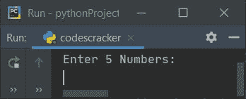
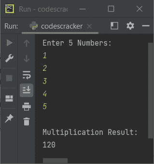
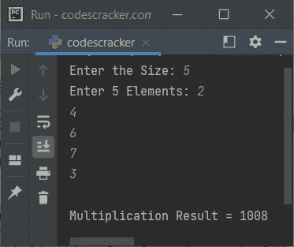
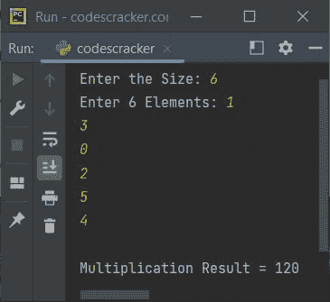
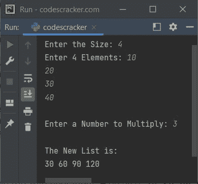
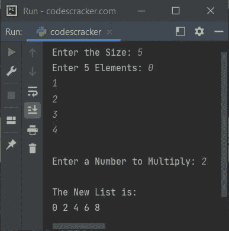

# Python 程序：将列表中的所有数字相乘

> 原文：<https://codescracker.com/python/program/python-multiply-all-elements-in-list.htm>

创建这篇文章是为了介绍 Python 中的一些程序，这些程序以不同的方式将一个列表中的所有数字相乘。以下是程序列表:

*   将 5 个元素(数字)列表中的所有数字相乘
*   将 n 个元素列表中的所有数字相乘
*   将列表中除 0 以外的所有数字相乘
*   将列表中的所有数字与用户给定的数字相乘

## 将列表中的所有数字相乘

问题是，*编写一个 Python 程序，从用户那里接收 5 个数字，并将所有这 5 个数字 相乘*。下面给出的程序是这个问题的答案:

```
nums = []
print("Enter 5 Numbers: ")
for i in range(5):
  nums.append(int(input()))
mul = 1
for i in range(5):
  mul = mul*nums[i]
print("\nMultiplication Result: ")
print(mul)
```

以下是该程序示例运行的初始输出:



现在提供输入，比如说 **1，2，3，4，5** 作为列表中的五个数字，将所有这些元素相乘并打印出 的乘法结果，如下图所示:



## 将 n 个数列表中的所有数相乘

这是前一个程序的修改版本。也就是说，这个程序允许用户定义列表的大小，然后进一步要求输入给定大小的所有数字。例如，如果用户输入 10 作为大小，则程序要求输入 10 个数字，然后将所有 10 个数字相乘，并打印乘法结果，如下所示:

```
nums = list()

print(end="Enter the Size: ")
numsSize = int(input())
print(end="Enter " +str(numsSize)+ " Elements: ")
for i in range(numsSize):
  nums.append(int(input()))

mul = 1
for i in range(numsSize):
  mul = mul*nums[i]
print("\nMultiplication Result = " +str(mul))
```

下面是它的示例运行，用户输入的 **5** 为大小， **2，4，6，7，3** 为五个数字:



## 将列表中除 0 以外的所有数字相乘

如果用户在包含一个或多个零(0)的列表中输入一些数字会怎样？
然后将列表中的所有数字相乘，结果为 0。因此这个程序将除零以外的所有数字 相乘。让我们看看下面给出的程序及其运行示例:

```
nums = list()
mul = 1

print(end="Enter the Size: ")
numsSize = int(input())
print(end="Enter " +str(numsSize)+ " Elements: ")
for i in range(numsSize):
  nums.append(int(input()))
  if nums[i]!=0:
    mul = mul*nums[i]

print("\nMultiplication Result = " +str(mul))
```

下面是用户输入的运行示例， **6** 为大小， **1，3，0，2，5，4** 为六个数字:



## 将列表中的所有数字乘以给定的数字(常数)

这是本文的最后一个程序。<u>本节目与以上所有节目</u>差别不大。因为 这个程序不会把一个列表中的所有数字相乘。相反，该程序将列表 中的所有数字与用户输入的数字相乘。然后在将列表 的每个元素乘以给定的数字后打印新的列表，如程序所示，其示例输出如下:

```
print(end="Enter the Size: ")
numsSize = int(input())

nums = list()
print(end="Enter " +str(numsSize)+ " Elements: ")
for i in range(numsSize):
  nums.append(int(input()))

print(end="\nEnter a Number to Multiply: ")
val = int(input())

newnums = list()
for i in range(numsSize):
  newnums.append(val*nums[i])

print("\nThe New List is:")
for i in range(numsSize):
  print(end=str(newnums[i])+ " ")
print()
```

下面是用户输入的运行示例， **4** 作为大小， **10，20，30，40** 作为四个数字，然后 **3** 作为要相乘的数字:



下面是另一个运行用户输入的示例， **5** 作为大小， **0，1，2，3，4** 作为五个元素， **2** 作为要相乘的数字:



[Python 在线测试](/exam/showtest.php?subid=10)

* * *

* * *