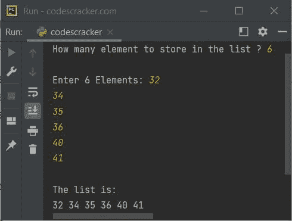

# Python 一维数组(列表)程序

> 原文：<https://codescracker.com/python/program/python-program-one-dimensional-array.htm>

这篇文章包含了 Python 中的多个程序，在一维数组上，基本上是一维列表。下面是 Python 中最简单的一维数组程序:

```
arr = [1, 2, 3, 4, 5]
print(arr)
```

上述程序在 Python 中的一维列表上生成的输出是:

```
[1, 2, 3, 4, 5]
```

现在让我们修改上面的程序，一个接一个地打印数组或列表的所有元素，而不是一次打印整个列表:

```
arr = [1, 2, 3, 4, 5]

for element in arr:
    print(element)
```

这一次，输出将是:

```
1
2
3
4
5
```

这是同一程序的另一个版本，它在同一行打印元素，而不是多行:

```
arr = [1, 2, 3, 4, 5]

for element in arr:
    print(element, end=" ")
```

现在输出将是:

```
1 2 3 4 5 
```

下面是本文的最后一个程序，关于 Python 中的一维数组或列表:

```
print("How many element to store in the list ? ", end="")
n = input()

arr = []
print("\nEnter", n, "Elements: ", end="")
n = int(n)
for i in range(n):
    element = input()
    arr.append(element)

print("\nThe list is:")
for i in range(n):
    print(arr[i], end=" ")
```

下面给出的快照显示了上述程序的示例运行，用户输入的 **6** 为数组或列表大小， 和 **32，34，35，36，40，41** 为六个元素:



#### 其他语言的相同程序

*   [Java 一维数组](/java/program/java-program-one-dimensional-array.htm)
*   [C 一维数组](/c/program/c-program-one-dimensional-array.htm)
*   [C++一维数组](/cpp/program/cpp-program-one-dimensional-array.htm)

[Python 在线测试](/exam/showtest.php?subid=10)

* * *

* * *